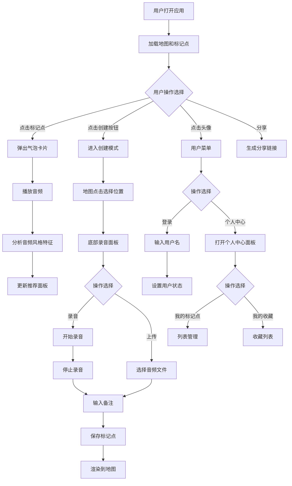

## 1. 产品概述
语音地图（VoiceMap）是一款允许用户在数字地图上创建、分享和探索带声音标记的交互式应用，解决传统地图只能展示静态地理位置信息、缺乏声音层次和情感表达的问题。
- 主要用户：旅行者、本地文化爱好者、内容创作者、普通用户
- 核心价值：将声音与地理位置绑定，创造沉浸式的有声地图探索体验

## 2. 核心特性

### 2.1 用户角色
| 角色 | 注册方式 | 核心权限 |
|------|----------|----------|
| 普通用户 | 输入用户名模拟登录 | 创建标记点、浏览公开标记点、收藏、分享 |

### 2.2 功能模块
1. **主页面**：交互式地图展示、标记点创建、语音播放控制
2. **推荐面板**：基于位置和播放历史的声音推荐、导航功能
3. **用户个人中心**：登录、我的标记点管理、收藏列表、公开/私密设置
4. **分享功能**：生成/解析分享链接、高亮展示被分享标记点

### 2.3 页面详情
| 页面名称 | 模块名称 | 功能描述 |
|-----------|-------------|---------------------|
| 主页面 | 地图渲染模块 | Leaflet暗色调地图、标记点图层、点击创建标记、播放动画效果 |
| 主页面 | 录音面板 | 底部滑入面板、录音/上传音频、备注输入、保存功能 |
| 主页面 | 气泡卡片 | 标记点信息展示、播放/暂停、进度条、音量控制 |
| 主页面 | 推荐面板 | 左侧300px面板、附近标记点推荐、导航按钮 |
| 主页面 | 用户菜单 | 右上角头像、下拉菜单、模拟登录、个人中心入口 |
| 个人中心 | 我的标记点 | 列表展示、删除、公开/私密切换 |
| 个人中心 | 我的收藏 | 收藏列表、取消收藏 |

## 3. 核心流程
用户打开应用 → 浏览地图上的语音标记点 → 点击标记点播放音频 → 系统根据位置和播放风格推荐相似声音 → 用户登录后可创建自己的标记点（录音或上传）→ 管理自己的标记点和收藏 → 生成分享链接分享给他人

## 4. 用户界面设计
### 4.1 设计风格
- 主色调：#1A1A2E（深紫黑）、#0F3460（深海军蓝）、#E94560（珊瑚红）
- 辅助渐变：#E94560 → #FF6B81
- 地图颜色：背景#1A1A2E，水体#16213E，陆地#2A2A4A
- 按钮风格：圆角（12-16px）、悬停放大1.05倍、点击缩小0.95倍、柔和阴影
- 字体：系统无衬线字体，白色为主，强调色#E94560
- 图标风格：简约线条风格，声波图标、星形图标等

### 4.2 页面设计概述
| 页面名称 | 模块名称 | UI元素 |
|-----------|-------------|-------------|
| 主页面 | 地图区域 | 全屏暗色调Leaflet地图、声波标记点图标、浮动创建按钮（渐变+脉动动画） |
| 主页面 | 创建浮动按钮 | 圆形48px、渐变背景#E94560→#FF6B81、脉动光晕动画 |
| 主页面 | 录音底部面板 | 从底部滑入、背景#0F3460、圆角16px、高180px、录音按钮（红色圆点闪烁）、上传按钮、备注输入框 |
| 主页面 | 标记点气泡卡片 | 宽260px、背景#1A1A2E、圆角12px、2px#E94560边框、地点名、备注、播放按钮、进度条、音量滑块 |
| 主页面 | 播放动画 | 播放时按钮周围旋转渐变光晕、地图区域脉冲光晕扩散、声波图标波纹效果 |
| 主页面 | 左侧推荐面板 | 宽300px、背景#0F3460、滑入动画300ms、推荐项（90px高、距离显示、导航按钮） |
| 主页面 | 右上角用户菜单 | 圆形头像36px、下拉菜单、菜单项悬停变#E94560 |
| 主页面 | 个人中心面板 | 从右侧滑入、我的标记点列表（70px/项）、收藏列表、公开/私密开关 |
| 主页面 | 分享高亮 | 被分享标记点红色光圈脉冲动画（20-40px循环，1.5s周期） |

### 4.3 响应式设计
- 桌面端（≥1024px）：地图最小宽1024px，推荐面板固定左侧300px
- 平板端（768-1024px）：推荐面板折叠为底部抽屉式，点击按钮弹出
- 移动端（<768px）：地图占满宽度，所有面板全屏模态从底部滑入，气泡卡片自适应屏幕90%宽度
- 统一过渡动画：300ms，cubic-bezier(0.25, 0.1, 0.25, 1)

## 5. 性能要求
- 地图渲染帧率：≥30fps（移动端）
- 语音播放响应时间：≤150ms（点击到声音输出）
- 推荐计算耗时：≤200ms（500个标记点内）
- 数据存储：localStorage本地持久化
