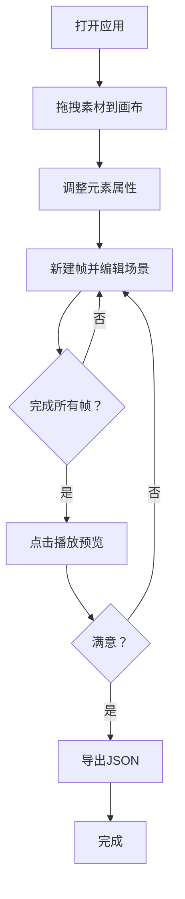

## 1. 产品概述

像素小剧场搬砖是一个基于网格画布的像素动画创作工具，用户通过拖拽预设角色精灵、背景道具和对话气泡组合静态场景帧，再将帧连接成可播放的像素动画故事。
- 目标用户：像素艺术爱好者、独立游戏开发者、社交媒体内容创作者
- 核心价值：以极低门槛让用户快速创作像素风格的动画故事，无需专业绘图技能即可产出趣味内容

## 2. 核心功能

### 2.1 用户角色
| 角色 | 注册方式 | 核心权限 |
|------|----------|----------|
| 普通用户 | 无需注册 | 使用全部编辑、播放、导入导出功能 |

### 2.2 功能模块
1. **编辑页面**：画布编辑区、素材面板、属性面板、时间轴、播放控制、导入导出

### 2.3 页面详情
| 页面名称 | 模块名称 | 功能描述 |
|----------|----------|----------|
| 编辑页面 | 素材面板 | 左侧面板，分类展示6种角色精灵（42x42px）、8种道具（32x32px）、6种表情气泡（64x32px），支持拖拽到画布，选中高亮 |
| 编辑页面 | 画布区 | 中央32x32网格画布（每格16px，总512x512px），接收拖拽放置元素，放置动画0.8→1.0缩放200ms，选中元素虚线边框动画，无元素时显示提示文字 |
| 编辑页面 | 属性面板 | 右侧面板，显示选中元素的坐标、缩放（0.5x-2x）、透明度（0-100%滑块），实时修改属性 |
| 编辑页面 | 时间轴 | 底部帧管理栏，新建帧（自动复制上帧内容）、帧缩略图卡片（64x48px）、拖拽排序、帧间箭头指示、当前帧高亮 |
| 编辑页面 | 播放控制 | 底部中央播放/暂停按钮，5fps播放，帧间200ms交叉淡入淡出，显示播放进度百分比 |
| 编辑页面 | 导入导出 | 右上角导出JSON、导入JSON恢复项目，导入成功弹窗3秒自动消失 |

## 3. 核心流程

用户打开应用 → 从左侧素材面板拖拽精灵/道具/气泡到画布 → 点击画布上的元素在右侧属性面板调整参数 → 在底部时间轴新建帧并编辑多个场景帧 → 点击播放按钮预览动画 → 导出项目为JSON文件或导入已有项目

## 4. 用户界面设计

### 4.1 设计风格
- 主色调：暗色主题背景 #1A1C20，画布背景 #3A3D42，面板背景 #2A2C30 / #1E2024
- 强调色：#F5A623（金色选中态）、#BB86FC（紫色帧标签/进度）、#4A90D9（蓝色按钮/箭头）
- 按钮风格：圆角按钮，hover缩放0.95，点击波纹反馈
- 字体：像素风格 + 现代UI字体，标题16px、正文14px、辅助12px
- 布局风格：三栏布局（左面板220px + 中央画布512px + 右面板200px），底部时间轴80px
- 图标风格：像素化简约线条图标

### 4.2 页面设计概览
| 页面名称 | 模块名称 | UI元素 |
|----------|----------|--------|
| 编辑页面 | 素材面板 | 深色背景#2A2C30，圆角8px，分类Tab（精灵/道具/气泡），精灵卡片42x42px圆角4px，选中边框#F5A623放大1.05倍 |
| 编辑页面 | 画布区 | 32x32网格，格子16px，背景#3A3D42，网格线#555A60 0.5px实线，空画布中央提示文字#555A60 18px |
| 编辑页面 | 属性面板 | 深色背景#1E2024，圆角8px，坐标输入框，缩放滑块0.5-2x，透明度渐变条滑块 |
| 编辑页面 | 时间轴 | 背景#1A1C20，+按钮#4A90D9圆角50% 36x36px，帧卡片64x48px圆角4px标签#BB86FC，箭头#4A90D9 16px，拖拽插入线#F5A623 2px |
| 编辑页面 | 播放控制 | 渐变按钮#4A90D9→#5AA0E9圆角50% 48x48px，点击缩放0.95弹回1.0，进度文字#BB86FC 14px |
| 编辑页面 | 导入导出 | 导出按钮#3A3D42圆角6px hover#4A4E52，导入按钮同风格，成功弹窗#1E2024圆角8px白色文字3秒消失 |

### 4.3 响应式设计
- 桌面优先设计，最小支持1280px宽度
- 画布固定512x512px，面板宽度固定
- 窄屏时面板可折叠为侧边抽屉

### 4.4 3D场景指引
- 不适用，本项目为2D像素风格
