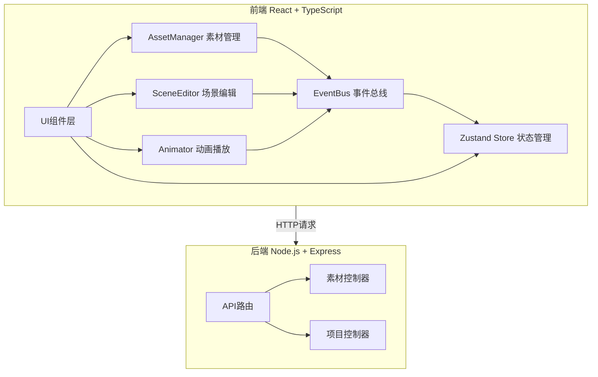
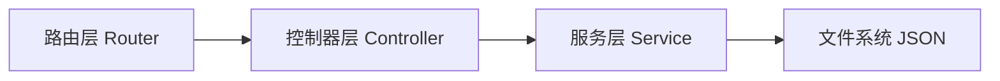
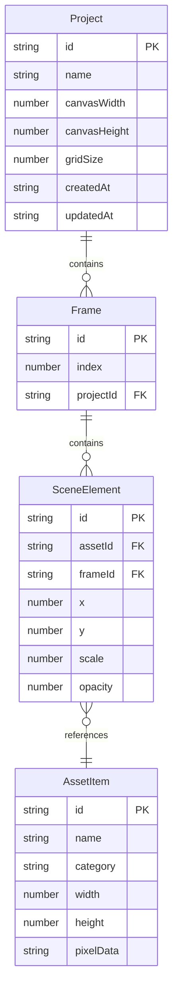
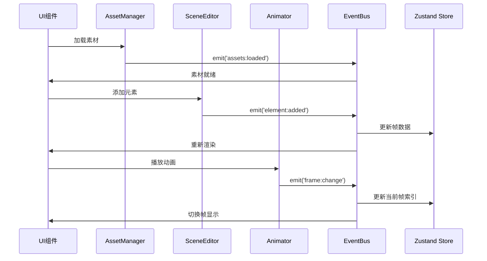

## 1. 架构设计



## 2. 技术说明
- 前端：React@18 + TypeScript + TailwindCSS@3 + Vite
- 初始化工具：vite-init（react-express-ts模板）
- 后端：Express@4 + TypeScript + CORS
- 数据库：无数据库，JSON文件存储 + 内存缓存
- 状态管理：Zustand
- 通信机制：EventBus（发布/订阅模式）

## 3. 路由定义
| 路由 | 用途 |
|------|------|
| / | 主编辑页面，包含画布、面板、时间轴 |

## 4. API定义

```typescript
interface AssetItem {
  id: string;
  name: string;
  category: 'sprite' | 'prop' | 'bubble';
  width: number;
  height: number;
  pixelData: string;
}

interface SceneElement {
  id: string;
  assetId: string;
  x: number;
  y: number;
  scale: number;
  opacity: number;
}

interface Frame {
  id: string;
  index: number;
  elements: SceneElement[];
  thumbnail?: string;
}

interface Project {
  id: string;
  name: string;
  canvasWidth: number;
  canvasHeight: number;
  gridSize: number;
  frames: Frame[];
  createdAt: string;
  updatedAt: string;
}

// GET /api/assets - 获取素材列表
// Response: { sprites: AssetItem[], props: AssetItem[], bubbles: AssetItem[] }

// POST /api/projects - 保存项目
// Request: Project
// Response: { success: boolean, id: string }

// GET /api/projects/:id - 加载项目
// Response: Project
```

## 5. 服务端架构图



## 6. 数据模型

### 6.1 数据模型定义



### 6.2 模块通信机制


