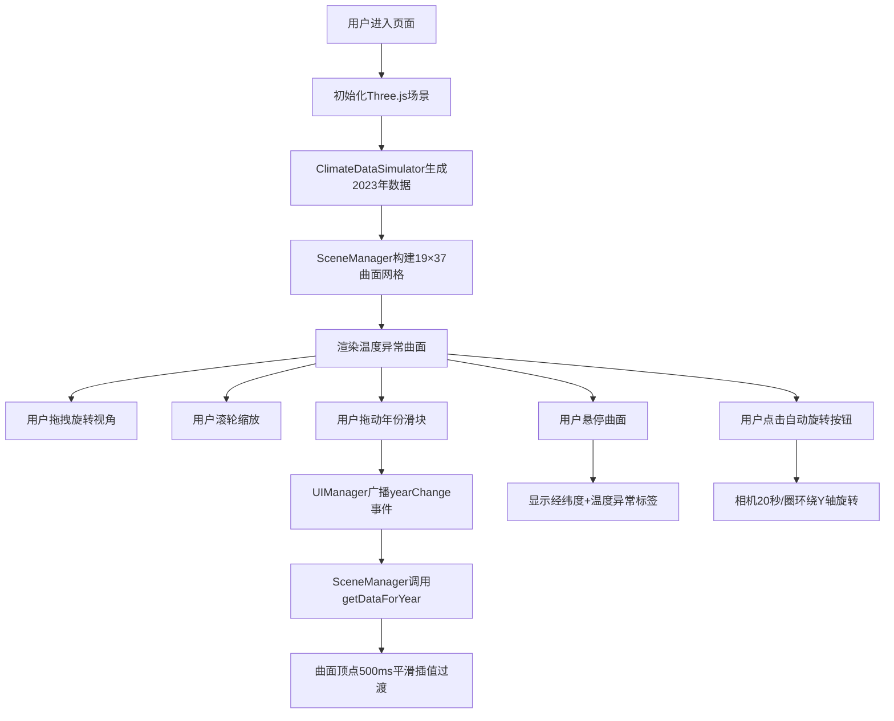

## 1. 产品概述
全球气候变化3D曲面可视化应用，为数据新闻记者和公众提供直观的全球温度异常变化交互展示。通过三维曲面动态呈现1900-2023年全球温度异常值的空间分布，支持交互式探索。
- 目标用户：数据新闻记者、气候研究者、教育工作者、公众
- 产品价值：以沉浸式3D方式让复杂气候数据变得可感知、可探索，提升气候意识

## 2. 核心功能

### 2.1 功能模块
1. **3D曲面展示模块**：经纬网格曲面、温度异常高度映射、颜色渐变编码
2. **年份交互模块**：底部年份滑块、平滑过渡动画、当前年份标签
3. **视觉辅助模块**：温度颜色图例、悬停数据提示、地面辅助网格
4. **视角控制模块**：鼠标拖拽旋转、滚轮缩放、自动旋转切换

### 2.3 页面详情
| 页面名称 | 模块名称 | 功能描述 |
|-----------|-------------|---------------------|
| 主页面 | 3D曲面网格 | 19×37经纬网格点，高度表示温度异常值，蓝红渐变着色 |
| 主页面 | 年份滑块 | 1900-2023步长1的水平滑块，居中80%宽度，实时更新曲面 |
| 主页面 | 颜色图例 | 右侧垂直色带，10个色阶从-3°C到+3°C |
| 主页面 | 悬停标签 | 鼠标悬停显示经纬度和温度异常值，50ms延迟内响应 |
| 主页面 | 自动旋转按钮 | 左上角切换按钮，20秒/圈环绕Y轴旋转 |
| 主页面 | 地面辅助网格 | 淡淡圆形网格，半径50单位，分段20 |

## 3. 核心流程
用户进入页面 → 渲染2023年初始3D曲面 → 拖拽旋转/滚轮缩放观察 → 拖动年份滑块 → 曲面平滑过渡到目标年份数据 → 悬停查看具体数据点 → 点击自动旋转按钮切换模式

## 4. 用户界面设计
### 4.1 设计风格
- **主色调**：深色背景 #0F111A，曲面网格线 #4A6FA5，地面网格 #2A2D3E
- **渐变色谱**：温度从 #1E90FF（蓝，-3°C）过渡到 #FF4500（红，+3°C）
- **容器风格**：半透明圆角面板 #1A1C2E，不透明度0.85，圆角12px
- **按钮风格**：滑块渐变 #4A6FA5 到 #6B9BCF，拖拽时浅白发光
- **字体**：年份标签使用 'Fira Code' 等宽字体，18px，颜色 #D0D0E0；提示标签12px白色

### 4.2 页面设计概述
| 页面名称 | 模块名称 | UI 元素 |
|-----------|-------------|-------------|
| 主页面 | 3D画布 | 全屏Three.js渲染，背景 #0F111A，相机初始 (40,50,60) |
| 主页面 | 顶部控制栏 | 左侧自动旋转按钮，圆形图标，面板容器 |
| 主页面 | 右侧图例区 | 垂直渐变条+温度标注，距顶部200px，紧贴右边缘 |
| 主页面 | 底部控制栏 | 滑块容器80%居中，年份标签+滑块+legend |
| 主页面 | 悬停标签 | 跟随鼠标，白色半透明圆角8px，背景 #00000099 |

### 4.3 响应式
- **桌面端（≥600px）**：颜色图例右侧垂直，滑块80%宽度居中
- **移动端（<600px）**：颜色图例移至底部水平排列，滑块100%宽度，按钮和图例间距自动缩小

### 4.4 3D 场景指导
- **环境氛围**：深色沉浸式空间，突出曲面色彩对比
- **灯光设置**：环境光+方向光组合，确保颜色过渡清晰可见
- **相机设置**：透视投影，初始 (40, 50, 60) 看向原点
- **交互与动画**：OrbitControls 拖拽旋转缩放，500ms 数据过渡插值，20秒/圈自动旋转
- **性能要求**：滑块更新 16ms 内完成，悬停响应 ≤50ms，保持60FPS
