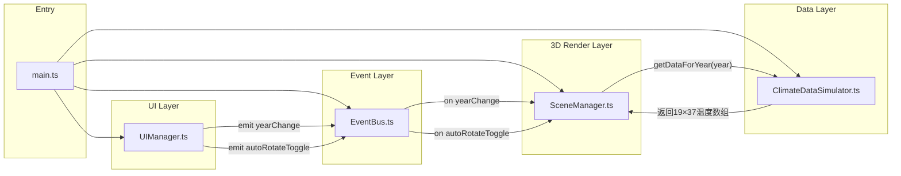

## 1. 架构设计



模块调用关系：
- [main.ts](file:///d:/Pro/tasks/auto198/src/main.ts)：初始化并连接所有模块，创建实例
- [EventBus.ts](file:///d:/Pro/tasks/auto198/src/EventBus.ts)：被 UIManager emit，被 SceneManager on
- [UIManager.ts](file:///d:/Pro/tasks/auto198/src/UIManager.ts)：接收 DOM 事件，通过 EventBus 广播
- [SceneManager.ts](file:///d:/Pro/tasks/auto198/src/SceneManager.ts)：订阅事件，调用 ClimateDataSimulator
- [ClimateDataSimulator.ts](file:///d:/Pro/tasks/auto198/src/ClimateDataSimulator.ts)：纯数据生成模块，无外部依赖

## 2. 技术描述
- **前端框架**：原生 TypeScript + Vite（无 React/Vue，按用户指定要求）
- **3D 引擎**：Three.js（直接使用，非 @react-three/fiber）
- **构建工具**：Vite 5
- **类型系统**：TypeScript 5，严格模式 strict: true
- **样式**：原生 CSS（<style> 内联或单独 CSS 文件）
- **依赖**：three, typescript, vite

## 3. 项目结构

```
d:\Pro\tasks\auto198\
├── package.json
├── vite.config.js
├── tsconfig.json
├── index.html
└── src/
    ├── main.ts                 # 入口，实例化所有模块
    ├── EventBus.ts             # 全局事件总线 on/emit
    ├── ClimateDataSimulator.ts # 气候数据模拟器，带噪声
    ├── SceneManager.ts         # Three.js 场景、网格、动画循环
    ├── UIManager.ts            # 滑块、图例、按钮、悬停标签
    └── styles.css              # 全局样式
```

## 4. 核心数据模型

### 4.1 温度数据格式
```typescript
// 19行（纬度，从-90到90，步长10） × 37列（经度，从-180到180，步长10）
type TemperatureGrid = number[][]; // 每个元素为温度异常值（°C）
```

### 4.2 网格点坐标映射
```typescript
// 纬度索引 i (0..18) → 纬度值 lat = -90 + i*10
// 经度索引 j (0..36) → 经度值 lon = -180 + j*10
// 曲面X = (lon / 180) * X_SCALE（经度展开为平面X轴）
// 曲面Z = (lat / 90)  * Z_SCALE（纬度展开为平面Z轴）
// 曲面Y = temperature * Y_SCALE（高度映射）
```

### 4.3 EventBus 事件定义
```typescript
type EventMap = {
  'yearChange': number;           // 年份变更，携带目标年份
  'autoRotateToggle': boolean;    // 自动旋转开关
  'hoverData': HoverInfo | null;  // 悬停数据（用于UI）
};

interface HoverInfo {
  lon: number;        // 经度
  lat: number;        // 纬度
  temp: number;       // 温度异常值
  screenX: number;    // 鼠标屏幕X
  screenY: number;    // 鼠标屏幕Y
}
```

## 5. 关键算法

### 5.1 温度数据生成（带空间-时间噪声）
```
ClimateDataSimulator.getDataForYear(year):
  1. 计算 yearProgress = (year - 1900) / (2023 - 1900)，值0~1
  2. globalWarmingBase = -0.5 + yearProgress * 3.5  // 全球变暖基线从-0.5升到+3
  3. 对每个网格点(i,j):
     - lat = -90 + i*10
     - lon = -180 + j*10
     - 极地放大效应: polarFactor = 1 + (|lat| / 90) * 0.8
     - 空间噪声: spatialNoise = perlin2(lon*0.05, lat*0.05) * 1.2
     - 年际变率: annualNoise = perlin3(lon*0.02, lat*0.02, year*0.1) * 0.5
     - 厄尔尼诺带: elNino = if |lat|<15 then sin(lon*PI/180*2 + year*0.3) * 0.4 else 0
     - temp = (globalWarmingBase + spatialNoise + annualNoise + elNino) * polarFactor
     - 钳制到 [-3, 3] 范围
  4. 返回 19×37 二维数组
```

### 5.2 颜色映射（蓝→红渐变）
```
mapTemperatureToColor(temp):
  t = clamp((temp + 3) / 6, 0, 1)  // 归一化到0~1
  // 渐变: #1E90FF → 白 → #FF4500
  if t < 0.5:
    ratio = t / 0.5
    R = 30  + (255-30)  * ratio
    G = 144 + (255-144) * ratio
    B = 255 + (255-255) * ratio
  else:
    ratio = (t - 0.5) / 0.5
    R = 255 + (255-255) * ratio
    G = 255 + (69-255)  * ratio
    B = 255 + (0-255)   * ratio
  return new THREE.Color(R/255, G/255, B/255)
```

### 5.3 年份平滑过渡（500ms插值）
```
SceneManager.updateYear(targetYear):
  1. prevData = currentVertexHeights.clone()
  2. targetData = ClimateDataSimulator.getDataForYear(targetYear)
  3. transitionStartTime = performance.now()
  4. transitionDuration = 500ms
  5. 在 requestAnimationFrame 中:
     elapsed = now - transitionStartTime
     progress = easeInOutCubic(clamp(elapsed / 500, 0, 1))
     对每个顶点 k:
       geometry.attributes.position.array[k*3+1] = lerp(prevData[k], targetData[k], progress)
       更新对应顶点颜色
     geometry.attributes.position.needsUpdate = true
     geometry.attributes.color.needsUpdate = true
```

## 6. 性能优化策略

| 瓶颈 | 策略 |
|------|------|
| 数据生成耗时 | ClimateDataSimulator 使用预计算种子+快速伪随机（避免重复计算），必要时对年份数据做 LRU 缓存（容量10） |
| 顶点更新 | 直接操作 BufferGeometry.attributes.position.array，不重建几何体 |
| 颜色更新 | 使用 vertexColors，预计算颜色映射表，避免每帧创建 THREE.Color |
| 滑块高频事件 | UIManager 对滑块 input 事件做 requestAnimationFrame 节流，保证每帧最多一次 update |
| 悬停拾取 | 使用 THREE.Raycaster，仅在鼠标移动且移动距离>2px时触发，避免每帧cast |
| 自动旋转 | 使用 OrbitControls.autoRotate，Three.js 内置高效实现 |
