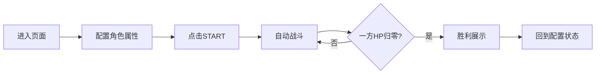

## 1. 产品概述

2D决斗场模拟器是一个基于Canvas 2D渲染的回合制自动战斗模拟工具。用户可自定义剑士与法师的属性和技能，观察不同策略组合下的战斗结果，兼具策略探索性与视觉观赏性。

## 2. 核心功能

### 2.1 功能模块

1. **竞技场舞台**：Canvas渲染的800x600战斗场景，包含网格地面、角色站位点、战斗动画与粒子效果
2. **角色配置面板**：左右双栏分别配置剑士和法师的生命值、攻击力、技能
3. **战斗控制系统**：START按钮启动/重置战斗，回合制自动战斗逻辑
4. **战斗日志面板**：实时记录每回合行动，支持颜色高亮和虚拟列表优化
5. **胜利展示系统**：战斗结束后展示胜利者动画与文案

### 2.2 页面详情

| 页面名称 | 模块名称 | 功能描述 |
|-----------|-------------|---------------------|
| 主页面 | 竞技场舞台 | Canvas 2D渲染战斗场景，网格地面、角色光环、攻击动画、粒子效果、扫描线 |
| 主页面 | 控制面板 | 双栏角色配置（生命值/攻击力滑块、技能下拉选择）、START战斗按钮 |
| 主页面 | 战斗日志 | 右侧面板，实时战斗记录，颜色分类高亮，虚拟列表优化 |

## 3. 核心流程

用户进入页面 → 配置剑士与法师的属性和技能 → 点击START按钮 → 回合制自动战斗开始 → 实时观看战斗动画与日志 → 一方生命值归零 → 胜利展示动画 → 自动回到配置状态

## 4. 用户界面设计

### 4.1 设计风格

- **整体风格**：暗色赛博朋克风格，科技感与未来感
- **主色调**：深灰#2C2C2C / #1E1E1E / #252525为背景基调
- **强调色**：蓝色#00BFFF（剑士/霓虹）、红色#FF4080（法师/霓虹）
- **功能色**：攻击红#FF5252、防御绿#69F0AE、特殊紫#CE93D8
- **按钮风格**：渐变色按钮，圆角8px，悬停亮度提升，按下内阴影
- **字体**：现代无衬线字体，白色#FFFFFF为主文字色
- **动效**：所有交互元素0.2s平滑过渡，光环脉动，扫描线，粒子爆炸

### 4.2 页面设计概述

| 页面名称 | 模块名称 | UI元素 |
|-----------|-------------|-------------|
| 主页面 | 竞技场舞台 | 800x600 Canvas、深灰背景、双线网格、蓝色/红色角色光环、战斗粒子、扫描线效果 |
| 主页面 | 控制面板 | 200px高度、左右双栏布局、滑块控件带实时数值、下拉选择器、START渐变按钮、霓虹悬停效果 |
| 主页面 | 战斗日志 | 280px宽度、磨砂玻璃效果、白色文字、颜色高亮条目、虚拟列表滚动 |

### 4.3 响应性

- 桌面端优先设计，固定尺寸布局
- 舞台区域固定800x600像素
- 整体采用Flex布局居中对齐

### 4.4 动画与动效

- **角色光环**：0.5秒周期脉动，透明度0.3-0.8循环
- **扫描线**：从左到右扫过，频率0.8Hz
- **剑士攻击**：前冲动画 + 白色剑光弧线0.3秒
- **法师攻击**：法杖蓄力0.5秒 + 彩色弹丸飞行0.8秒 + 粒子爆炸
- **胜利展示**：角色放大1.5倍 + 缓慢旋转 + 闪烁彩色文案
- **交互过渡**：所有按钮、滑块、下拉菜单0.2s平滑过渡
