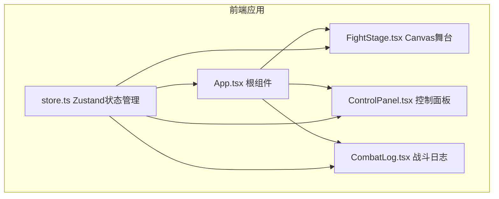

## 1. 架构设计



## 2. 技术描述

- **前端框架**：React 18 + TypeScript
- **构建工具**：Vite + @vitejs/plugin-react
- **状态管理**：Zustand
- **渲染技术**：Canvas 2D API
- **唯一ID**：uuid
- **初始化工具**：vite-init

## 3. 核心模块

### 3.1 状态管理 (store.ts)

| 状态 | 类型 | 说明 |
|------|------|------|
| swordsman | Character | 剑士角色状态 |
| mage | Character | 法师角色状态 |
| isFighting | boolean | 是否正在战斗 |
| round | number | 当前回合数 |
| logs | LogEntry[] | 战斗日志数组 |
| winner | string \| null | 胜利者 |

### 3.2 Action 定义

| Action | 说明 |
|--------|------|
| setSwordsmanStats | 更新剑士属性 |
| setMageStats | 更新法师属性 |
| startFight | 开始战斗 |
| resetFight | 重置战斗 |
| recordLog | 记录战斗日志 |
| endFight | 结束战斗 |

## 4. 数据模型

### 4.1 Character 角色

```typescript
interface Character {
  name: string;
  type: 'swordsman' | 'mage';
  maxHp: number;
  currentHp: number;
  attack: number;
  skill: string;
  color: string;
  position: { x: number; y: number };
  attackCooldown: number;
  isAttacking: boolean;
}
```

### 4.2 LogEntry 日志条目

```typescript
interface LogEntry {
  id: string;
  round: number;
  message: string;
  type: 'attack' | 'defense' | 'special' | 'system';
  timestamp: number;
}
```

### 4.3 Skill 技能

```typescript
interface Skill {
  name: string;
  type: 'attack' | 'defense' | 'special';
  damageModifier: number;
  defenseModifier: number;
  description: string;
  color: string;
}
```

## 5. 性能优化

- **Canvas渲染**：使用requestAnimationFrame，保持50+FPS
- **粒子系统**：限制同时绘制粒子数不超过100个
- **虚拟列表**：战斗日志只渲染可见的20条DOM元素
- **日志清理**：超过30条自动清理最旧条目
- **状态订阅**：Zustand选择性订阅避免不必要重渲染

## 6. 文件结构

```
src/
├── App.tsx          # 根组件，布局容器
├── FightStage.tsx   # Canvas战斗舞台
├── ControlPanel.tsx # 角色配置控制面板
├── CombatLog.tsx    # 战斗日志面板
└── store.ts         # Zustand状态管理
```
