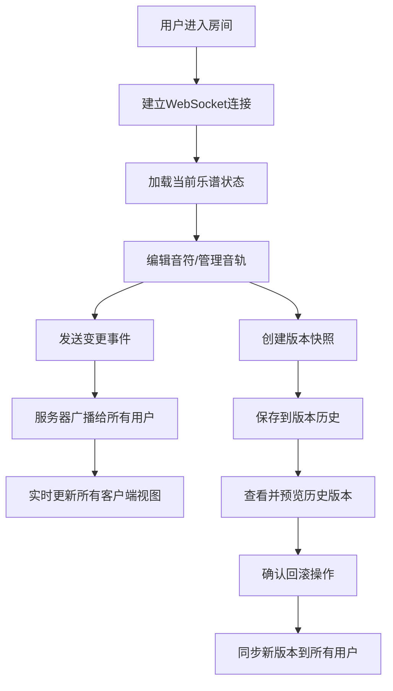

## 1. 产品概述

协作式音乐创作应用 - 支持远程团队在虚拟房间中共同编辑实时乐谱的协作工具。解决远程音乐创作时缺乏直观、即时的可视化协作工具，以及乐谱版本同步混乱的问题。

- 核心目标：提供多人实时协作的乐谱编辑体验，支持音轨混合、播放控制和版本管理
- 目标用户：音乐制作人、作曲家、乐队成员、音乐教育工作者

## 2. 核心功能

### 2.1 用户角色
| 角色 | 注册方式 | 核心权限 |
|------|---------|---------|
| 协作用户 | 房间链接加入 | 编辑乐谱、管理音轨、播放控制、创建版本快照、恢复历史版本 |

### 2.2 功能模块
1. **协作页面**：实时乐谱编辑器、音轨控制面板、播放控制区、用户管理区、版本历史面板
2. **版本历史页面**：房间版本快照列表、版本预览与回滚

### 2.3 页面详情
| 页面名称 | 模块名称 | 功能描述 |
|---------|---------|---------|
| 协作页面 | 乐谱编辑器 | 五线谱渲染、音符添加/移动/删除、用户光标同步、音符动画、实时WebSocket同步 |
| 协作页面 | 音轨面板 | 可折叠侧边栏、音轨列表、名称编辑、音量调节、静音控制 |
| 协作页面 | 播放控制 | 播放/暂停、从头播放、BPM调节、播放进度高亮条 |
| 协作页面 | 用户管理 | 房间名称显示、在线用户列表、房间分享、Toast提示 |
| 协作页面 | 版本历史 | 时间线快照列表、版本预览、恢复确认对话框 |
| 版本历史页面 | 版本列表 | 房间所有版本快照、预览与回滚操作 |

## 3. 核心流程

用户打开应用自动加入房间，通过WebSocket建立实时连接。用户可在五线谱上编辑音符，所有操作实时同步给其他在线用户。用户可管理音轨、调整播放参数并预览乐谱。系统定期或手动保存版本快照，用户可查看历史版本并回滚到任意快照。

## 4. 用户界面设计

### 4.1 设计风格
- 主色调：紫色 #6C63FF，强调色：黄色 #FFD93D
- 深色主题：主背景 #1E1E2E，次要背景 #2A2A3E
- 文字：主文字 #E0E0E0，辅助文字 #8A8A9A
- 按钮：圆角设计，悬停时有缩放和颜色变化反馈
- 字体：Fira Code（乐谱编辑区等宽字体），系统默认UI字体
- 布局：左右分栏 + 底部面板，卡片式组件设计
- 图标：Lucide React图标库

### 4.2 页面设计概述
| 页面名称 | 模块名称 | UI元素 |
|---------|---------|---------|
| 协作页面 | 乐谱编辑器 | 深色背景五线谱（#4A4A5A线条）、彩色音符（全音符#FF6B6B、二分#4ECDC4、四分#45B7D1、八分#96CEB4）、用户光标光晕、播放高亮条 |
| 协作页面 | 音轨面板 | 可折叠侧边栏（240px宽，#2A2A3E背景）、圆角8px、顶部2px边框#3D3D5C、音量滑块（4px轨道#3A3A4A，12px滑块#6C63FF）、静音按钮（24px圆形） |
| 协作页面 | 播放控制 | 播放按钮（40px圆形渐变#6C63FF到#7B73FF）、从头播放（32px圆形）、BPM调节器（加减按钮步进5，范围60-180） |
| 协作页面 | 用户管理 | 房间名称标签（白色16px，#2A2A3E背景，圆角6px）、用户头像列表（32px圆形，用户颜色背景，首字母显示）、分享按钮（36px圆形） |
| 协作页面 | 版本历史 | 时间线卡片（160px×80px，#2A2A3E背景，左侧4px紫色条）、预览覆盖层（#00000080半透明）、恢复/关闭按钮 |

### 4.3 响应式设计
- 桌面优先设计，适配屏幕宽度1024px到1920px
- 当宽度小于1200px时，音轨面板折叠为50px宽的图标栏，点击滑出完整面板
- 所有交互元素带有平滑过渡动画（transition: all 0.2s ease）

### 4.4 动画与微交互
- 音符新增/修改：淡入淡出动画（300ms）
- 按钮悬停：颜色变化 + 缩放效果
- 播放按钮按压：缩放0.95反馈
- 分享按钮：悬停背景色过渡200ms
- Toast提示：底部中央弹出，3秒自动消失
- 用户光标：彩色圆形光晕（12px直径 + 5px半透明光环）
