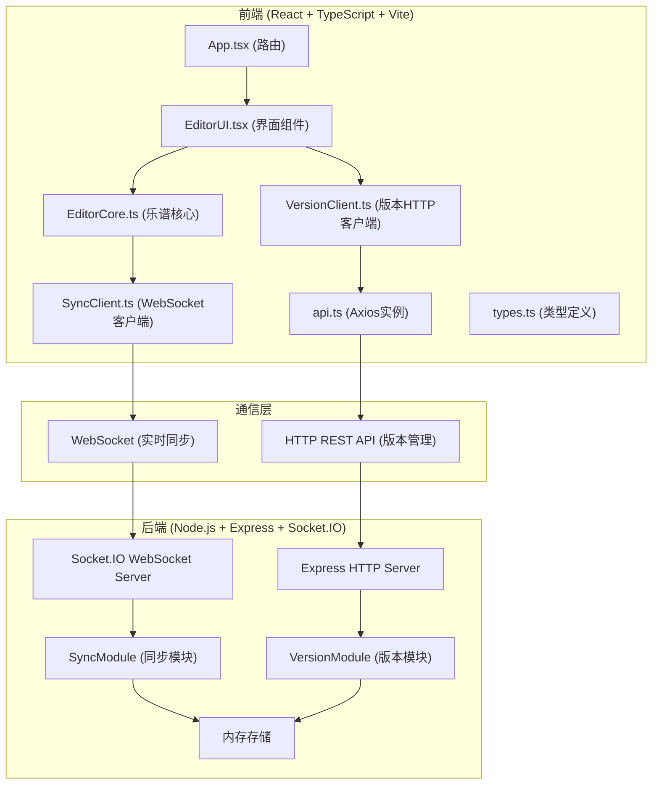
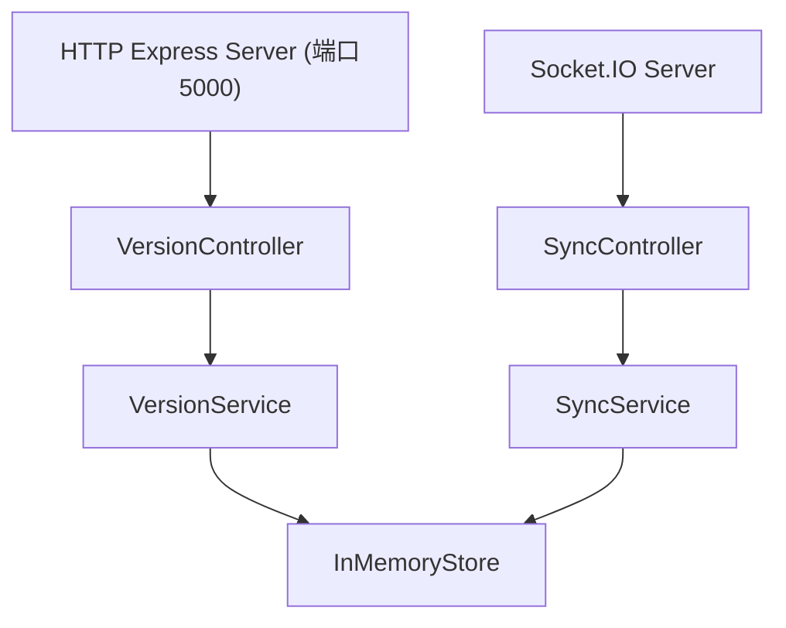
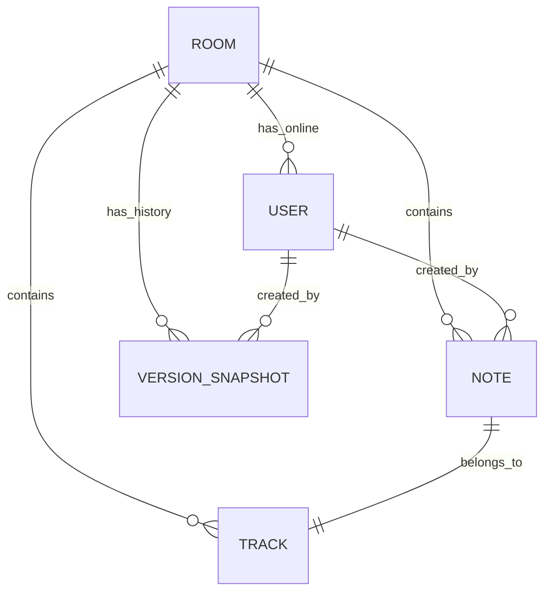

## 1. 架构设计



## 2. 技术描述

- 前端：React@18 + TypeScript@5 + Vite@5 + Zustand@4 + Axios@1 + Socket.IO-Client@4
- 后端：Node.js + Express@4 + Socket.IO@4
- 状态管理：Zustand
- 实时通信：Socket.IO
- 构建工具：Vite（开发端口3000，代理/api到后端5000端口）
- 数据库：内存存储（用于演示），版本历史缓存在服务端

## 3. 路由定义

| 路由 | 用途 |
|------|------|
| / | 协作页面（主编辑器） |
| /version/:roomId | 版本历史页面 |

## 4. API 定义

### 4.1 WebSocket事件
| 事件名 | 方向 | 数据结构 | 说明 |
|--------|------|---------|------|
| join_room | C→S | { roomId, userId, userName } | 用户加入房间 |
| user_joined | S→C | { userId, userName, color, cursor } | 新用户加入通知 |
| user_left | S→C | { userId } | 用户离开通知 |
| cursor_move | C→S | { userId, x, y } | 鼠标位置更新 |
| cursor_update | S→C | { userId, x, y } | 广播鼠标位置 |
| note_add | C→S | { note: Note } | 新增音符 |
| note_added | S→C | { note: Note, userId } | 广播新增音符 |
| note_move | C→S | { noteId, x, y } | 移动音符 |
| note_moved | S→C | { noteId, x, y, userId } | 广播移动音符 |
| note_delete | C→S | { noteId } | 删除音符 |
| note_deleted | S→C | { noteId, userId } | 广播删除音符 |
| room_state | S→C | { notes: Note[], users: User[], tracks: Track[] } | 初始房间状态 |
| track_update | C→S | { track: Track } | 更新音轨 |
| track_updated | S→C | { track: Track, userId } | 广播音轨更新 |

### 4.2 REST API
| 方法 | 路径 | 请求体 | 响应 | 说明 |
|------|------|--------|------|------|
| GET | /api/versions/:roomId | - | { versions: VersionSnapshot[] } | 获取房间版本列表 |
| POST | /api/versions | { roomId, userId, snapshot, name? } | { version: VersionSnapshot } | 创建版本快照 |
| DELETE | /api/versions/:id | - | { success: boolean } | 删除版本 |
| POST | /api/versions/:id/restore | { roomId } | { version: VersionSnapshot, notes: Note[] } | 恢复到指定版本 |

## 5. 服务端架构



## 6. 数据模型

### 6.1 实体关系


### 6.2 类型定义
```typescript
// 音符类型
type NoteType = 'whole' | 'half' | 'quarter' | 'eighth';

interface Note {
  id: string;
  type: NoteType;
  x: number;        // 时间轴位置 (像素)
  y: number;        // 音高位置 (像素)
  trackId: string;
  measure: number;  // 小节
  beat: number;     // 拍子
  createdAt: number;
  userId?: string;
}

// 音轨
interface Track {
  id: string;
  name: string;
  volume: number;   // -24 到 +6 (dB)
  muted: boolean;
  color: string;
}

// 用户
interface User {
  id: string;
  name: string;
  color: string;
  cursor?: { x: number; y: number };
}

// 房间状态
interface RoomState {
  roomId: string;
  notes: Note[];
  tracks: Track[];
  users: User[];
  bpm: number;
}

// 版本快照
interface VersionSnapshot {
  id: string;
  roomId: string;
  userId: string;
  userName: string;
  createdAt: number;
  snapshot: {
    notes: Note[];
    tracks: Track[];
    bpm: number;
  };
}
```

## 7. 项目文件结构

```
.
├── package.json
├── index.html
├── vite.config.js
├── tsconfig.json
├── src/
│   ├── App.tsx                 # 根组件与路由
│   ├── types.ts                # 全局类型定义
│   ├── services/
│   │   └── api.ts              # Axios HTTP客户端
│   └── modules/
│       ├── editor/
│       │   ├── EditorCore.ts   # 乐谱编辑器核心逻辑
│       │   └── EditorUI.ts     # 编辑器UI组件
│       ├── sync/
│       │   └── SyncClient.ts   # WebSocket同步客户端
│       └── version/
│           └── VersionClient.ts # 版本管理HTTP客户端
├── api/                        # 后端服务
│   ├── index.ts                # Express + Socket.IO服务入口
│   └── modules/
│       ├── sync/
│       │   └── SyncModule.ts   # 实时同步模块
│       └── version/
│           └── VersionModule.ts # 版本管理模块
```
