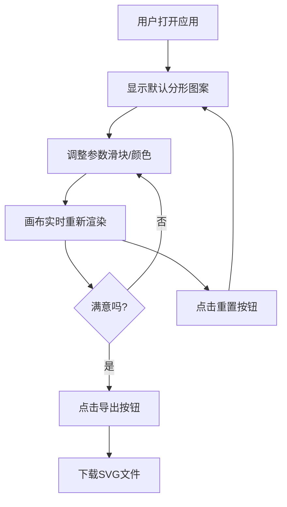

## 1. 产品概述

多边形分形图案生成器是一个面向设计团队的交互式图形工具，允许用户通过调整参数快速生成独特的多边形分形图案，可用于海报、网页背景等设计场景。

- **核心价值**：帮助设计师快速生成品牌色板匹配的分形图案，提升设计效率
- **目标用户**：设计团队成员、视觉设计师、UI设计师
- **市场价值**：提供简单易用的参数化设计工具，降低分形图案生成的技术门槛

## 2. 核心功能

### 2.1 用户角色

| 角色 | 注册方式 | 核心权限 |
|------|----------|----------|
| 普通用户 | 无需注册 | 使用所有生成和导出功能 |

### 2.2 功能模块

1. **控制面板**：层数滑块、旋转角度滑块、缩放比例滑块、颜色选择器
2. **画布预览**：实时渲染六边形分形图案
3. **导出功能**：SVG格式导出下载
4. **重置功能**：一键恢复默认参数

### 2.3 页面详情

| 页面名称 | 模块名称 | 功能描述 |
|----------|----------|----------|
| 主页面 | 控制面板 | 参数调整（层数、旋转、缩放、颜色渐变） |
| 主页面 | 画布区域 | 640x640px实时预览，平滑过渡动画 |
| 主页面 | 操作按钮 | 导出SVG、重置参数 |

## 3. 核心流程

用户打开应用 → 查看默认分形图案 → 调整参数（滑块/颜色选择器）→ 实时预览变化 → 满意后导出SVG文件 / 重置参数

## 4. 用户界面设计

### 4.1 设计风格
- **主色调**：深色科技感（#0D1117 背景，#1E1E2E 面板）
- **强调色**：#61AFEF（滑块）、#238636（导出按钮）、#30363D（重置按钮）
- **文字颜色**：#C9D1D9（浅色文字）
- **按钮样式**：圆角8px，悬停有颜色变化
- **字体**：monospace系列（Fira Code / JetBrains Mono）
- **布局风格**：左右分栏，控制面板固定宽度320px，画布自适应

### 4.2 页面设计概述

| 页面名称 | 模块名称 | UI元素 |
|----------|----------|--------|
| 主页面 | 控制面板 | 滑块（轨道#3A3D42，按钮#61AFEF）、圆形颜色选择器、标签文字14px |
| 主页面 | 画布区域 | 640x640px黑色画布，居中显示，CSS过渡动画150ms |
| 主页面 | 底部按钮 | 导出（绿色#238636）、重置（灰色#30363D） |

### 4.3 响应式
- **桌面端**：左右布局（控制面板320px + 画布区域）
- **移动端（<768px）**：上下布局（控制面板顶部100%宽度 + 画布区域占剩余高度）
- **触控优化**：滑块和按钮尺寸适合触控操作

### 4.4 视觉细节
- 控制面板圆角16px，内边距24px，控件间距16px
- 颜色选择器：圆形按钮直径36px，下拉色板背景#161B22，圆角8px
- 画布过渡动画：CSS transition duration 150ms
- 半透明度0.7的多边形填充，产生层次叠加效果
