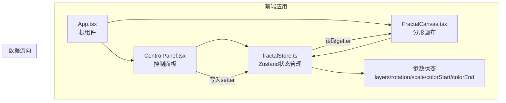

## 1. 架构设计



## 2. 技术描述

- **前端框架**：React@18 + TypeScript@5
- **构建工具**：Vite@5 + @vitejs/plugin-react
- **状态管理**：Zustand@4
- **绘图技术**：Canvas API（实时渲染）+ SVG（导出）
- **样式方案**：原生CSS（CSS变量 + CSS Modules）

## 3. 目录结构

```
d:\Pro\tasks\auto203\
├── index.html                 # 入口HTML
├── package.json               # 依赖配置
├── vite.config.js             # Vite配置
├── tsconfig.json              # TypeScript配置（严格模式）
└── src/
    ├── App.tsx                # 根组件
    ├── store/
    │   └── fractalStore.ts    # Zustand全局状态
    ├── components/
    │   ├── FractalCanvas.tsx  # 分形画布组件
    │   └── ControlPanel.tsx   # 控制面板组件
    └── utils/
        └── fractalUtils.ts    # 分形计算工具函数
```

## 4. 文件调用关系

1. **index.html** → 加载 **src/App.tsx** 根组件
2. **App.tsx** → 引入 **ControlPanel** 和 **FractalCanvas** 组件，从 **fractalStore** 读取状态
3. **ControlPanel.tsx** → 调用 **fractalStore** 的setter方法更新参数
4. **FractalCanvas.tsx** → 从 **fractalStore** 读取参数，使用Canvas API绘制递归六边形，调用 **fractalUtils.ts** 中的计算函数
5. **fractalStore.ts** → 管理全局状态，提供getter和setter

## 5. 数据模型

### 5.1 状态定义

```typescript
interface FractalState {
  layers: number;           // 层数，默认6，范围2-10
  rotation: number;         // 旋转角度，默认0，范围0-360
  scale: number;            // 缩放比例，默认0.8，范围0.1-1.0
  colorStart: string;       // 起始颜色，默认#FF6B6B
  colorEnd: string;         // 结束颜色，默认#4ECDC4
  setLayers: (n: number) => void;
  setRotation: (n: number) => void;
  setScale: (n: number) => void;
  setColorStart: (c: string) => void;
  setColorEnd: (c: string) => void;
  reset: () => void;
}
```

### 5.2 核心算法

- **递归多边形绘制**：从最外层开始，每层缩小scale比例，旋转rotation角度
- **颜色插值**：根据层数在colorStart和colorEnd之间进行RGB线性插值
- **SVG导出**：将Canvas绘制逻辑转换为SVG元素字符串，生成下载文件

## 6. 性能约束

- 重新渲染时间 ≤ 50ms（基于1000个六边形测试）
- 使用requestAnimationFrame优化渲染
- 避免不必要的重绘，通过Zustand selector精准订阅状态变化
