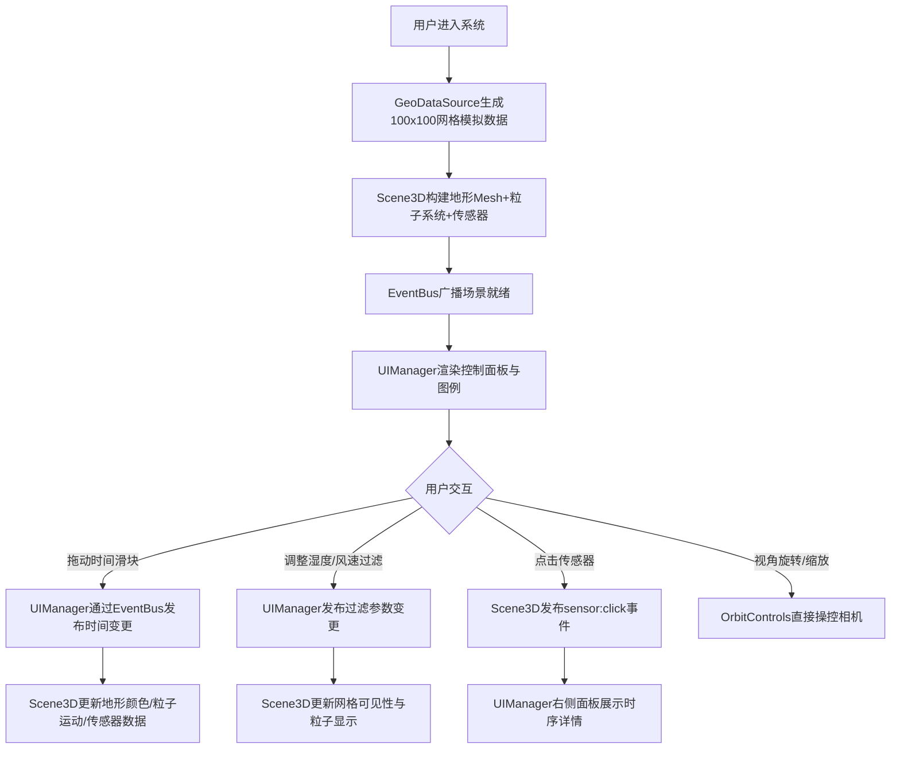

## 1. 产品概述

城市热岛效应3D时空可视化系统，面向气候研究中心科研人员，通过三维化呈现多源气象传感器的温度、湿度和风速数据，辅助分析城市不同区域的热力分布与气流走向规律。

- 核心价值：将抽象的气象数据转化为直观可交互的3D视觉呈现，提升科研分析效率
- 目标用户：气候研究员、城市规划师、环境科学研究者

## 2. 核心特性

### 2.1 功能模块

1. **3D地形热力渲染模块**：100x100网格起伏地形，温度色阶映射（蓝10°C→红45°C）
2. **动态粒子风场模块**：2000个空气质点粒子，风速驱动运动轨迹，温度关联着色
3. **传感器交互模块**：50个传感器探头，悬停放大+标签，点击查看时序详情
4. **参数筛选控制模块**：时间滑块（T0/T1/T2）、湿度范围滑块、风速分级过滤
5. **可视化辅助模块**：色温图例、视角重置、截图导出

### 2.2 页面详情

| 页面名称 | 模块名称 | 功能描述 |
|---------|---------|---------|
| 主可视化页面 | 3D场景容器 | Three.js渲染视口，OrbitControls视角操控，暗色背景#0D1117 |
| 主可视化页面 | 左侧控制面板 | 260px宽，参数筛选区（湿度滑块+风速选择器）+信息区，自适应折叠 |
| 主可视化页面 | 右侧信息面板 | 320px宽，传感器详细数据展示（温度、湿度、风速、气压时间序列） |
| 主可视化页面 | 底部时间轴 | 70%视口宽度水平滑块，切换3个时间点数据 |
| 主可视化页面 | 左上角色温图例 | 垂直渐变带（#0000FF→#FF0000），10°C~45°C刻度标注 |
| 主可视化页面 | 右上角工具栏 | 重置视角按钮、截图导出按钮 |

## 3. 核心流程

## 4. 用户界面设计

### 4.1 设计风格

- **主色调**：深黑蓝#0D1117背景，面板#161B22，边框#30363D
- **强调色**：温度渐变#0000FF→#FF0000，交互元素#00BFFF（滑块/高亮）
- **字体**：白色#E6EDF3（14px标题），次要#8B949E（12px）
- **圆角**：8px统一圆角
- **动效**：hover时0.2s ease-out不透明度过渡（0.8→1.0）

### 4.2 页面设计概览

| 页面区域 | UI元素 | 设计细节 |
|---------|-------|---------|
| 3D主视口 | 地形曲面+粒子场+传感器球 | 半透明白色网格线（0.2透明度），网格单元1单位，高度-5~15 |
| 左侧控制面板 | 湿度滑块（0-100%）、风速选择器（三级） | 两栏布局160px+100px，<1280px折叠为图标 |
| 右侧信息面板 | 温度/湿度/风速/气压时间序列卡片 | 距顶部80px，展示3个历史时刻，<1280px折叠 |
| 底部时间轴 | 水平滑块70%宽×6px高 | 轨道#333，滑块圆形18px直径#00BFFF |
| 左上角色温图例 | 20px×200px垂直渐变条 | 带数值刻度标注 |
| 右上角工具栏 | 重置视角（眼睛图标）、截图按钮 | 圆形36px，背景#2A2A3A，边框#555，hover#3A3A5A |

### 4.3 响应式策略

- 桌面优先：适配1920×1080与1440×900
- 窄屏折叠：视口宽度<1280px时，左右面板折叠为悬浮抽屉触发按钮
- 触控优化：滑块支持触控拖动，3D场景支持双指缩放与旋转

### 4.4 3D场景指引

- **环境光照**：AmbientLight（0.4强度）+ DirectionalLight（0.8强度，45°俯角），营造科学可视化氛围
- **相机设置**：PerspectiveCamera（fov 60，近0.1，远1000），初始位置(80, 60, 80)，看向原点
- **交互**：OrbitControls启用阻尼（0.08），禁用平移，限制极角0.1~π/2-0.1
- **粒子系统**：Points + BufferGeometry，每帧更新位置，轨迹线使用LineSegments长度3单位
- **性能约束**：场景切换响应≤50ms，粒子帧率≥45fps
