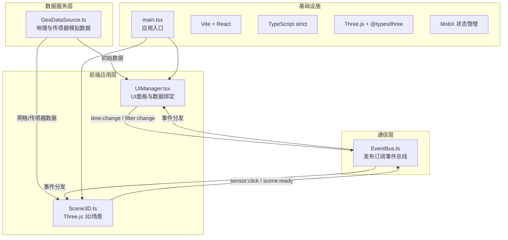
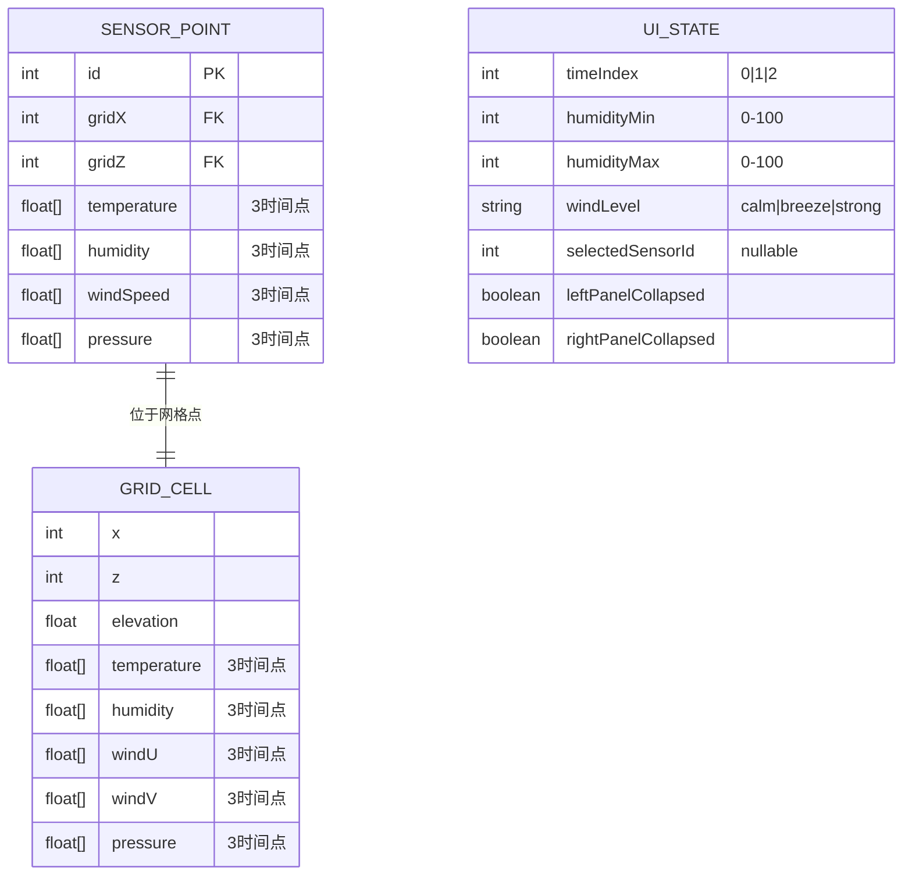

## 1. 架构设计



## 2. 技术说明

- **前端框架**：React 18 + TypeScript（strict模式）
- **构建工具**：Vite 5 + @vitejs/plugin-react
- **3D引擎**：Three.js r160 + @types/three
- **状态管理**：MobX（响应式UI状态）
- **路径别名**：`@/*` → `src/*`

## 3. 路由定义

| 路由 | 用途 |
|-----|-----|
| / | 主可视化页面（唯一页面，单页应用） |

## 4. 模块职责与数据流向

### 4.1 EventBus.ts — 全局事件总线
```typescript
type EventMap = {
  'scene:ready': void;
  'time:change': number; // 0,1,2 对应 T0,T1,T2
  'filter:change': { humidityRange: [number, number]; windLevel: 'calm'|'breeze'|'strong' };
  'sensor:click': SensorPoint;
  'sensor:hover': { point: SensorPoint; hovering: boolean };
  'camera:reset': void;
  'screenshot:export': void;
};
```
- 发布/订阅模式，类型安全的事件映射
- Scene3D与UIManager通过EventBus解耦通信

### 4.2 GeoDataSource.ts — 地理数据源
```typescript
export interface GridCell {
  x: number; z: number;
  elevation: number;       // -5 ~ 15
  temperature: number[];   // [T0,T1,T2], 10~45°C
  humidity: number[];      // [T0,T1,T2], 0~100%
  windU: number[];         // [T0,T1,T2], 水平风速分量
  windV: number[];         // [T0,T1,T2], 垂直风速分量
  pressure: number[];      // [T0,T1,T2], 气压
}
export interface SensorPoint {
  id: number; gridX: number; gridZ: number;
  temperature: number[]; humidity: number[];
  windSpeed: number[]; pressure: number[];
}
```
- 生成100×100=10,000网格点，使用柏林噪声模拟地形起伏与温度梯度
- 生成50个随机分布的传感器点位
- 提供3个时间点（T0/T1/T2）的模拟数据

### 4.3 Scene3D.ts — 三维场景核心
```typescript
class Scene3D {
  constructor(container: HTMLElement, dataSource: GeoDataSource, eventBus: EventBus);
  setTimeIndex(idx: number): void;
  setFilter(humidityRange: [number, number], windLevel: WindLevel): void;
  resetCamera(): void;
  exportScreenshot(): string; // dataURL
  dispose(): void;
}
```
- 构建PlaneGeometry变形为起伏地形Mesh，顶点颜色映射温度色阶
- 创建2000粒子Points系统，每帧基于风速向量更新位置
- 分布50个黄色Sphere传感器，Raycaster实现悬停/点击检测
- 通过EventBus发送`sensor:click`、`sensor:hover`事件

### 4.4 UIManager.tsx — UI管理模块
```typescript
const UIManager: FC<{ eventBus: EventBus; dataSource: GeoDataSource }>
```
- 左面板：湿度范围双滑块、风速分段Select
- 右面板：选中传感器的温度/湿度/风速/气压时序卡片
- 底部：T0/T1/T2时间轴滑块（70%宽）
- 左上角色温图例渐变条
- 右上角重置视角+截图按钮
- 通过MobX observable管理UI状态（选中传感器、时间索引、过滤参数）

## 5. 数据模型



## 6. 性能优化策略

1. **Geometry复用**：地形使用单个BufferGeometry，时间切换仅更新color attribute而非重建Mesh（≤50ms目标）
2. **粒子批处理**：2000粒子使用Points + BufferAttribute，每帧在CPU更新position数组后单次GPU上传
3. **Raycaster优化**：仅对传感器Mesh数组执行拾取，地形不参与鼠标拾取
4. **渲染节流**：OrbitControls change事件触发的重绘使用requestAnimationFrame合并
5. **MobX精细观测**：UI组件仅订阅实际使用的observable字段，避免不必要重渲染
