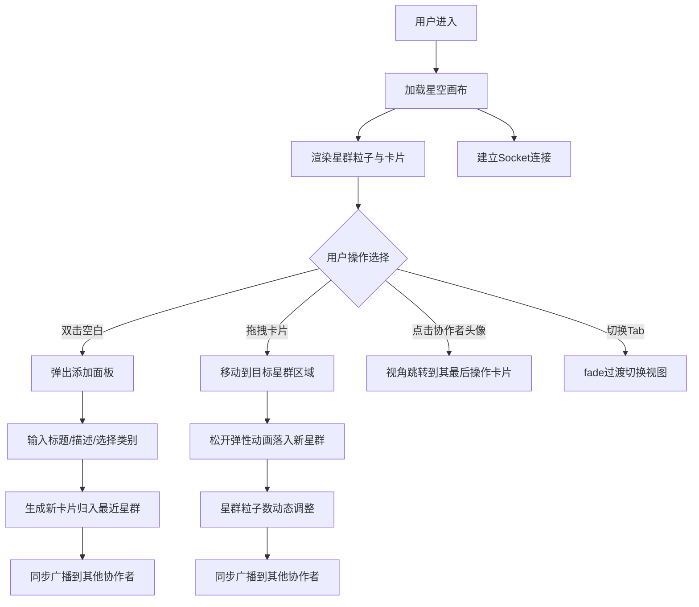

## 1. 产品概述

灵感星盘是一款协作式创意灵感收集工具，团队成员可在虚拟星空画布上自由添加与排列想法卡片，通过可视化的星群聚合与连线，激发跨领域创意碰撞。

- 解决问题：传统头脑风暴缺乏空间感和关联性，难以直观展示创意网络
- 目标用户：产品团队、设计团队、跨职能协作小组
- 核心价值：将抽象灵感转化为可触碰、可移动、可关联的星空视觉体验

## 2. 核心功能

### 2.1 用户角色
| 角色 | 注册方式 | 核心权限 |
|------|---------|---------|
| 协作用户 | 自动分配匿名身份 | 添加卡片、拖拽卡片、查看他人操作、视角跳转 |

### 2.2 功能模块
1. **星空画布**：无限滚动、星群粒子渲染、灵感卡片展示、星群连线绘制
2. **灵感管理**：卡片添加、卡片分类、星群归属、动态粒子调整
3. **实时协作**：协作者在线状态、操作同步、最后操作卡片缩略图、视角跳转
4. **视图切换**：我的星盘/共享星盘Tab切换

### 2.3 页面详情
| 页面名称 | 模块名称 | 功能描述 |
|---------|---------|---------|
| 主界面 | 星空画布 | 深空背景#0B0F19，无限滚动，展示星群与卡片 |
| 主界面 | 星群渲染 | 每星群直径约160px，渐变发光粒子，技术#4A90D9→#1C3D6B，设计#E94E77→#8B2252，运营#F5A623→#B37C14 |
| 主界面 | 灵感卡片 | 圆形60px，半透明白色rgba(255,255,255,0.08)，悬停放大至70px显示摘要 |
| 主界面 | 星群连线 | 半透明淡蓝色虚线1px，#6CA6CD，透明度0.4，随位置自动重绘 |
| 主界面 | 添加面板 | 双击空白处弹出，从底部滑入300ms ease-out，背景#1A1F35圆角16px，毛玻璃backdrop-filter:blur(12px) |
| 主界面 | 协作面板 | 宽240px，背景#121826圆角12px，从右边缘滑入，显示头像与在线状态 |
| 主界面 | Tab切换栏 | 背景#1E2638圆角10px，下划线300ms cubic-bezier滑动，画布fade 400ms过渡 |

## 3. 核心流程

用户进入应用 → 加载星空画布与已有星群/卡片 → 浏览或操作：
- 双击空白 → 弹出添加面板 → 填写信息 → 生成卡片并归入最近星群
- 拖拽卡片 → 移动到目标星群 → 松开后弹性动画落入 → 粒子数动态调整
- 查看协作面板 → 点击协作者头像 → 视角平滑跳转到其最后操作的卡片
- 切换Tab → fade过渡切换视图

## 4. 用户界面设计

### 4.1 设计风格
- 主色调：深空蓝#0B0F19背景，三种星群渐变配色
- 辅助色：协作蓝#4A90D9，连线淡蓝#6CA6CD
- 字体：现代无衬线字体，营造科技感太空氛围
- 卡片风格：圆形玻璃拟态，半透明叠加发光边框
- 动效风格：弹性物理动画、平滑过渡、呼吸效果

### 4.2 页面设计概览
| 页面名称 | 模块名称 | UI元素 |
|---------|---------|--------|
| 主界面 | 星空画布 | 深空背景+星星粒子层+星群+卡片+连线 |
| 主界面 | 卡片悬停 | 缩放放大(60→70px)、摘要文字淡入、发光边框增强 |
| 主界面 | 添加面板 | 从底部滑入、毛玻璃、圆角16px、表单输入+类别选择器 |
| 主界面 | 协作面板 | 从右滑入、头像列表(边框#4A90D9 2px)+在线指示点(绿色8px)+卡片缩略图(呼吸缩放) |
| 主界面 | Tab栏 | 圆角胶囊、选中下划线滑动过渡、背景#1E2638 |

### 4.3 响应式设计
- 桌面端优先设计(1280px+)
- 移动端适配：协作面板改为底部抽屉，Tab栏适配小屏
- 触摸优化：长按触发卡片拖拽，双击改为双指轻点

### 4.4 性能要求
- 拖拽帧率：稳定55FPS以上
- 拖拽响应延迟：低于40ms
- 粒子渲染优化：requestAnimationFrame批量绘制，离屏canvas预渲染粒子
