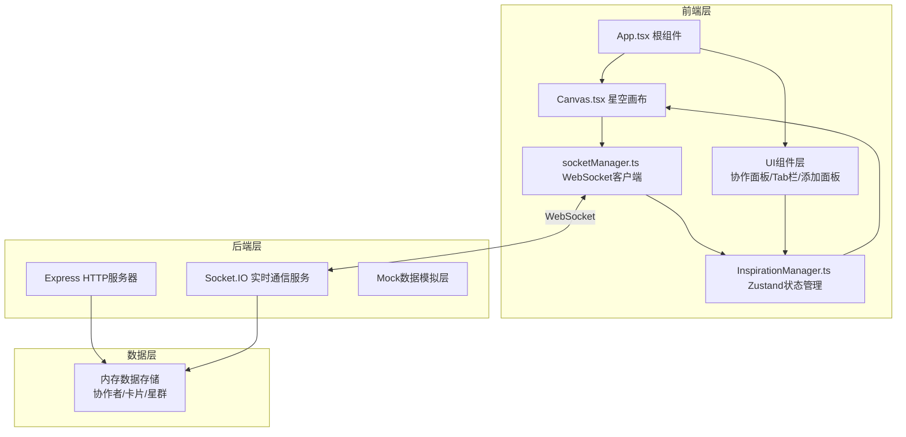
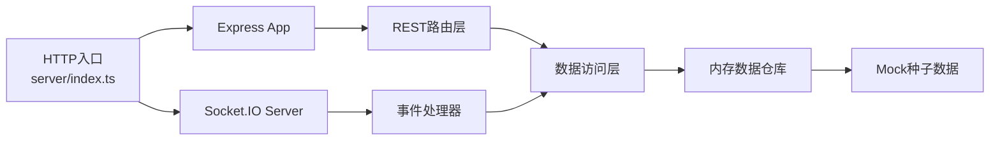
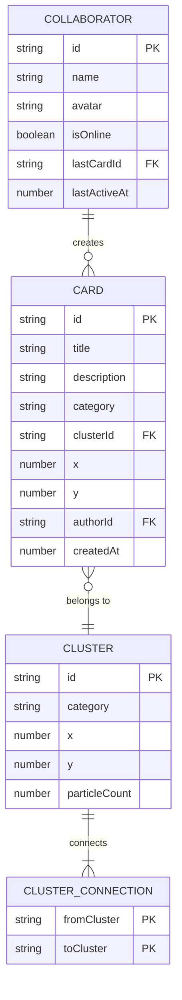

## 1. 架构设计



## 2. 技术描述

- **前端框架**：React 18 + TypeScript (严格模式)
- **构建工具**：Vite + @vitejs/plugin-react
- **状态管理**：Zustand
- **实时通信**：socket.io-client
- **后端服务**：Express.js + Socket.IO
- **后端语言**：TypeScript (ts-node运行)

## 3. 路由定义
| 路由 | 用途 |
|------|------|
| / | 主页面 - 星空画布与所有交互组件 |
| GET /api/collaborators | 获取协作者列表 |
| GET /api/cards | 获取所有灵感卡片 |
| GET /api/clusters | 获取星群数据 |

## 4. API定义

### 类型定义
```typescript
interface Card {
  id: string;
  title: string;
  description: string;
  category: 'tech' | 'design' | 'operation';
  clusterId: string | null;
  x: number;
  y: number;
  authorId: string;
  createdAt: number;
}

interface Cluster {
  id: string;
  category: 'tech' | 'design' | 'operation';
  x: number;
  y: number;
  particleCount: number;
  targetParticleCount: number;
}

interface Collaborator {
  id: string;
  name: string;
  avatar: string;
  isOnline: boolean;
  lastCardId: string | null;
  lastActiveAt: number;
}

interface ClusterConnection {
  from: string;
  to: string;
}
```

### Socket事件
| 事件名 | 方向 | 数据 |
|--------|------|------|
| 'collaborator:join' | Client→Server | {name, avatar} |
| 'collaborator:list' | Server→Client | Collaborator[] |
| 'card:create' | Client→Server | CardCreateData |
| 'card:created' | Server→Client | Card |
| 'card:move' | Client→Server | {cardId, x, y, clusterId} |
| 'card:moved' | Server→Client | {cardId, x, y, clusterId, userId} |
| 'card:recluster' | Client→Server | {cardId, oldClusterId, newClusterId} |
| 'card:reclustered' | Server→Client | {cardId, ...clusterChanges} |

## 5. 服务器架构图



## 6. 数据模型

### 6.1 数据模型ER图


### 6.2 初始Mock数据
- 3个初始星群（技术/设计/运营），位置均匀分布于画布
- 每星群5-6张示例卡片
- 3-4名模拟协作者，不同在线状态
- 星群间关联连线：技术-设计，设计-运营
