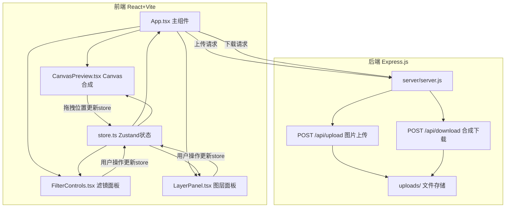
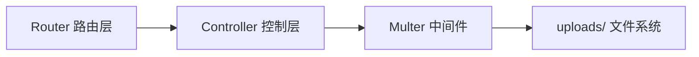
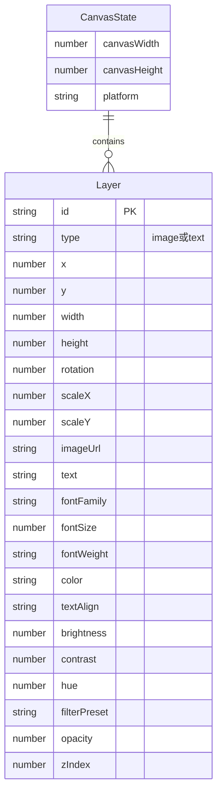

## 1. 架构设计



## 2. 技术说明
- 前端：React@18 + TypeScript + Vite + Zustand + TailwindCSS
- 初始化工具：vite-init（react-express-ts模板）
- 后端：Express@4 + Multer（文件上传）+ CORS
- 数据库：无（前端状态管理即可满足需求）
- Canvas 2D API 用于图层合成渲染

## 3. 路由定义
| 路由 | 用途 |
|------|------|
| / | 主编辑页面（单页应用） |

## 4. API定义

### 4.1 图片上传
```
POST /api/upload
Content-Type: multipart/form-data
Request: file (jpg/png/zip)
Response: { url: string, filename: string }
```

### 4.2 合成图片下载
```
POST /api/download
Content-Type: application/json
Request: { imageData: string (base64), filename: string }
Response: 文件流 (image/png)
```

## 5. 服务端架构图



## 6. 数据模型

### 6.1 数据模型定义



### 6.2 数据定义语言

无需数据库DDL，Zustand store中管理所有状态：

```typescript
interface Layer {
  id: string;
  type: 'image' | 'text';
  x: number;
  y: number;
  width: number;
  height: number;
  rotation: number;
  scaleX: number;
  scaleY: number;
  imageUrl?: string;
  text?: string;
  fontFamily?: string;
  fontSize?: number;
  fontWeight?: string;
  color?: string;
  textAlign?: 'left' | 'center' | 'right';
  brightness: number;
  contrast: number;
  hue: number;
  filterPreset: string;
  opacity: number;
  zIndex: number;
}

interface CanvasStore {
  layers: Layer[];
  selectedLayerId: string | null;
  canvasWidth: number;
  canvasHeight: number;
  platform: 'taobao' | 'jingdong' | 'pinduoduo';
  addLayer: (layer: Layer) => void;
  removeLayer: (id: string) => void;
  updateLayer: (id: string, updates: Partial<Layer>) => void;
  reorderLayers: (fromIndex: number, toIndex: number) => void;
  setSelectedLayer: (id: string | null) => void;
  setCanvasSize: (platform: string) => void;
}
```
