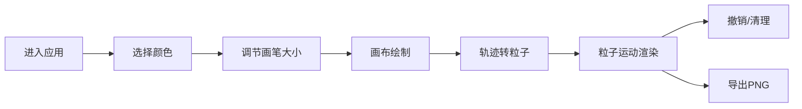

## 1. 产品概述

动态流体粒子画应用，通过将手绘轨迹转化为流动的彩色粒子流，解决数字绘画缺乏自然流动感和触感反馈的问题。用户用手指或鼠标画出线条，线条自动转化为流动的彩色粒子，粒子沿路径运动并留下渐变尾迹，最终形成一幅持续演变的动态画作。

- 核心价值：提供沉浸式的数字绘画体验，将静态笔触转化为动态粒子流，增强创作的视觉表现力和触感反馈
- 目标用户：数字艺术爱好者、创意设计师、普通用户

## 2. 核心功能

### 2.1 功能模块

1. **画布主界面**：全屏画布、粒子渲染、轨迹输入
2. **左侧控制面板**：色板选择、画笔大小调节
3. **右上角操作区**：清理画布、撤销操作
4. **导出功能**：右下角导出按钮，保存为PNG

### 2.2 页面详情

| 页面名称 | 模块名称 | 功能描述 |
|-----------|-------------|---------------------|
| 主画布页 | 全屏画布 | 支持触控和鼠标输入，背景#0D0D0D，粒子叠加发光效果 |
| 主画布页 | 色板组件 | 8种预设颜色，点击选择，带选中光晕动画 |
| 主画布页 | 画笔控制 | 滑块调节画笔大小(5-30px)，实时显示当前值 |
| 主画布页 | 操作按钮 | 清理画布(渐变消失动画)、撤销(轨迹飞回动画) |
| 主画布页 | 导出功能 | 导出1920x1080 PNG图片，含粒子尾迹 |

## 3. 核心流程

用户进入应用 → 看到全屏画布和UI面板 → 选择颜色和画笔大小 → 在画布上滑动绘制 → 轨迹转化为粒子流 → 粒子自动运动并留下尾迹 → 可撤销或清理 → 导出作品

## 4. 用户界面设计

### 4.1 设计风格

- **主色调**：深色背景#0D0D0D，控制面板#1A1A1A
- **强调色**：8种鲜艳粒子色(#FF6B6B、#4ECDC4、#45B7D1、#96CEB4、#F5A623、#D9534F、#7B68EE、#FFD700)
- **按钮风格**：圆角按钮，悬停过渡动画0.2s ease-out
- **字体**：系统无衬线字体，12px-14px
- **布局**：固定定位悬浮UI面板，不遮挡创作区域
- **视觉效果**：粒子发光(shadowBlur)、色板pulse动画、操作过渡动画

### 4.2 页面设计概述

| 页面名称 | 模块名称 | UI元素 |
|-----------|-------------|-------------|
| 主画布页 | 色板 | 垂直排列60px宽，8个36x36px色块，2px边框，选中白色光晕 |
| 主画布页 | 画笔滑块 | 轨道4px高180px宽，滑块16px直径，值显示在上方10px |
| 主画布页 | 操作按钮 | 40px直径圆形，半透明白色背景，垃圾桶/回退箭头图标 |
| 主画布页 | 导出按钮 | 120x40px，紫色渐变背景，圆角20px |

### 4.3 响应式设计

- 桌面端优先，适配平板和手机
- 触控交互优化，支持多指触控
- UI面板位置在小屏幕上自动调整
- Canvas自适应窗口大小

### 4.4 性能要求

- 60FPS动画帧率
- 每帧粒子更新耗时≤8ms
- 最多同时2000个粒子
- 使用requestAnimationFrame驱动
- Canvas globalCompositeOperation='lighter'实现发光叠加
