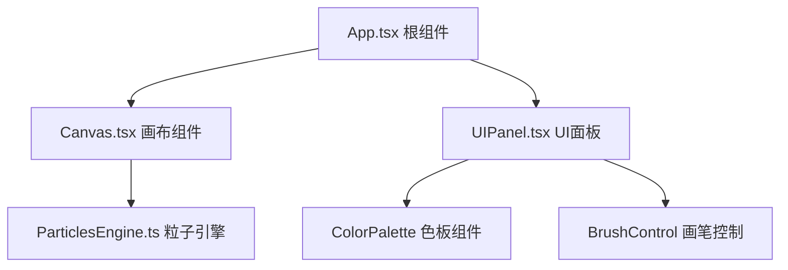

## 1. 架构设计



## 2. 技术描述

- **前端**：React 18 + TypeScript + Vite
- **状态管理**：React useState/useRef（粒子数据直接操作数组，不存state）
- **渲染**：HTML5 Canvas 2D API
- **动画**：requestAnimationFrame
- **图标**：lucide-react

## 3. 核心模块说明

### 3.1 ParticlesEngine.ts - 粒子引擎

```typescript
interface Particle {
  x: number;
  y: number;
  vx: number;
  vy: number;
  size: number;
  color: string;
  targetColor: string;
  colorProgress: number;
  mass: number;
  damping: number;
  age: number;
  maxAge: number;
  trail: { x: number; y: number; age: number }[];
  strokeId: number;
}

interface Stroke {
  id: number;
  particles: Particle[];
  startPoint: { x: number; y: number };
}

class ParticlesEngine {
  particles: Particle[];
  strokes: Stroke[];
  maxParticles: number;
  gravity: number;
  
  addParticle(x, y, vx, vy, color, size, strokeId);
  update(deltaTime);
  render(ctx);
  clear();
  undoStroke();
}
```

### 3.2 Canvas.tsx - 画布组件

- 管理canvas元素和DPR适配
- 绑定鼠标/触控事件
- requestAnimationFrame动画循环
- 每帧更新粒子并渲染
- 导出离屏canvas为PNG

### 3.3 UIPanel.tsx - UI面板

- ColorPalette：8色垂直色板，点击选择
- BrushControl：滑块调节画笔大小
- 状态提升到App.tsx

## 4. 文件结构

```
/
├── package.json
├── index.html
├── tsconfig.json
├── vite.config.js
└── src/
    ├── App.tsx
    ├── Canvas.tsx
    ├── UIPanel.tsx
    └── ParticlesEngine.ts
```

## 5. 关键技术点

1. **粒子更新**：每帧30次更新速率，位置 += 速度 * dt，速度 *= 阻尼，速度 += 重力
2. **颜色渐变**：每0.5秒向附近色板颜色插值
3. **尾迹渲染**：保存15px历史位置，圆形渐变绘制，1.5秒淡出
4. **边界碰撞**：检测边界，速度反向 * 恢复系数0.6
5. **粒子发光**：shadowBlur随粒子大小动态变化，最大20px
6. **撤销动画**：粒子位置从当前向起点插值，1秒内完成
7. **性能优化**：粒子数据用数组直接操作，不触发React重渲染
