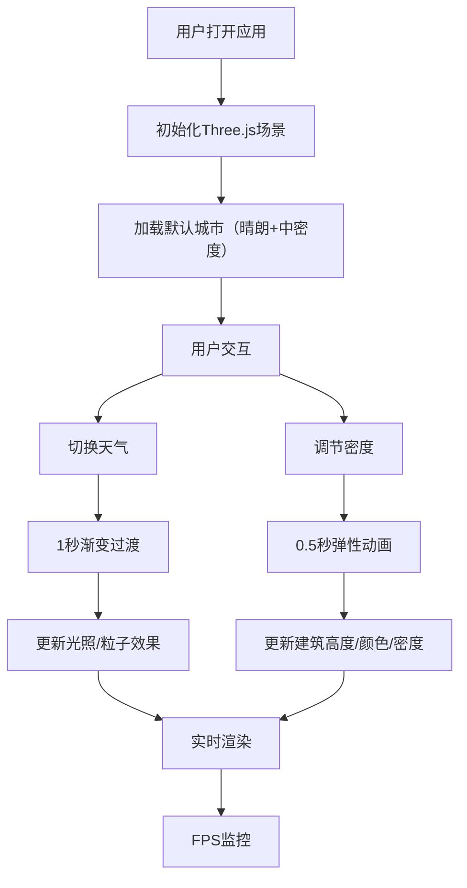

## 1. 产品概述

城市天际线动态模拟器是一个基于 Web 的三维交互应用，用户可通过调整天气和密度参数实时观察城市建筑群的动态光影效果。面向建筑可视化爱好者和数字艺术创作者，提供沉浸式的城市景观体验。

- 核心价值：实时三维城市可视化，天气与密度参数动态调节，沉浸式光影效果展示

## 2. 核心功能

### 2.1 功能模块

1. **三维城市场景：80栋建筑的城市网格，动态阴影，鼠标交互控制
2. **天气控制系统：晴朗/多云/暴雨/黄昏四种模式，粒子效果，光照动态过渡
3. **密度调节系统：低密度郊区/中密度城区/高密度CBD，建筑弹性动画
4. **UI控制面板：天气选择器，密度滑块，帧率监控
5. **事件总线：SceneManager与UIPanel通信

### 2.3 页面详情

| 页面名称 | 模块名称 | 功能描述 |
|----------|----------|----------|
| 主页面 | 三维场景容器 | Three.js渲染城市，鼠标拖拽旋转视角，滚轮缩放 |
| 主页面 | UI控制面板 | 左下角半透明玻璃效果面板，天气下拉选择，密度滑块调节 |
| 主页面 | FPS监控器 | 右上角实时帧率显示，低于30fps红色闪烁告警 |

## 3. 核心流程

用户打开应用 → 默认显示默认天气晴朗、中密度城市 → 用户切换天气 → 1秒渐变过渡到新天气效果 → 用户调节密度滑块 → 建筑高度弹性动画变化 → 实时显示FPS

## 4. 用户界面设计

### 4.1 设计风格

- 主色调：深色背景 #1A202C，建筑冷色渐变
- 强调色：蓝色 #63B3ED（滑块按钮）
- 建筑颜色梯度：暖色 #A0AEC0 到 冷色 #1A202C
- 毛玻璃面板：rgba(255,255,255,0.1) + backdrop-filter blur(10px)
- 圆角：面板12px，下拉6px
- 字体：白色文字，14px标签文字
- 整体风格：深色高对比，科技感，暗色调协调

### 4.2 页面设计概览

| 页面名称 | 模块名称 | UI元素 |
|----------|----------|--------|
| 主页面 | 三维场景 | 100x100地面网格，80栋建筑，动态阴影，天空背景 |
| 主页面 | UI面板 | 左下角280px宽，毛玻璃，12px间距控件间距 |
| 主页面 | 天气选择器 | 下拉菜单，深色背景 #2D3748，白色文字，圆角6px |
| 主页面 | 密度滑块 | 4px轨道 #4A5568，16px按钮 #63B3ED，暖色到冷色渐变条 |
| 主页面 | FPS显示 | 右上角，14px白色字体，半透明黑底圆角矩形，低于30fps红色闪烁 |

### 4.3 响应式

桌面端优先，UI面板固定定位，三维场景自适应窗口大小。

### 4.4 3D场景指引

- 环境：深色天空背景，随天气变化
- 光照：方向光+环境光，随天气动态调整
- 相机：初始位置(80, 60, 80)，看向原点，OrbitControls控制
- 阴影：1024x1024阴影贴图，软硬度随天气变化
- 粒子：晴朗无、多云稀疏白色粒子、暴雨蓝色粒子拖尾、黄昏橙红雾气
- 性能：100栋建筑+暴雨粒子≥30fps
