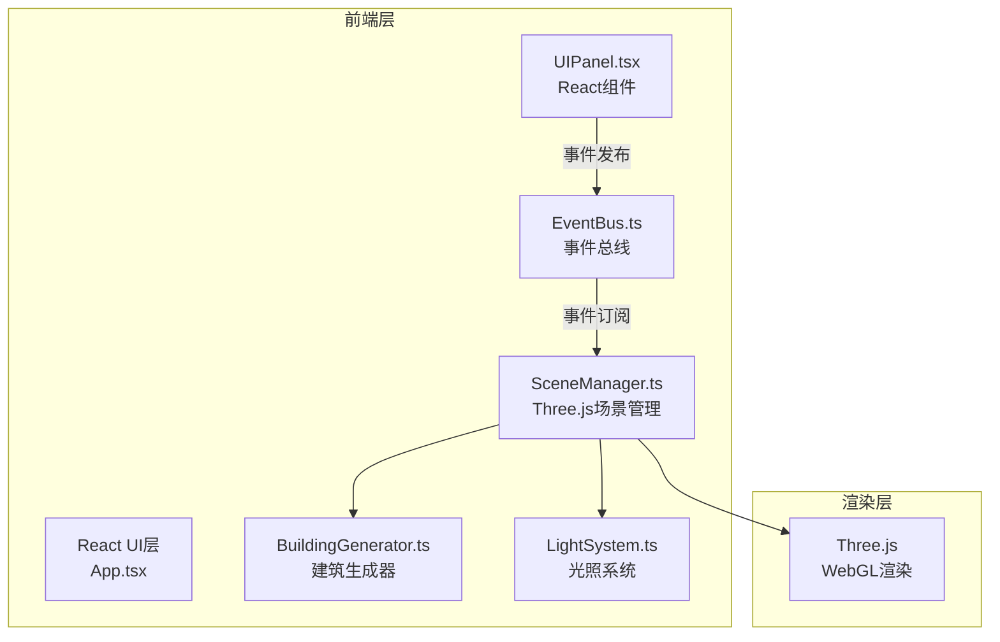

## 1. 架构设计



## 2. 技术说明

- 前端框架：React 18 + TypeScript
- 构建工具：Vite
- 三维渲染：Three.js
- 状态通信：自定义 EventBus（发布-订阅模式
- CSS方案：原生CSS + CSS Modules/内联样式

## 3. 文件结构

```
.
├── package.json
├── index.html
├── vite.config.js
├── tsconfig.json
└── src/
    ├── App.tsx              # 根组件
    ├── core/
    │   └── EventBus.ts     # 事件总线
    ├── scene/
    │   ├── SceneManager.ts    # 场景管理器
    │   ├── BuildingGenerator.ts # 建筑生成器
    │   └── LightSystem.ts    # 光照系统
    └── ui/
        └── UIPanel.tsx      # UI控制面板
```

## 4. 事件定义

### 4.1 事件类型

| 事件类型 | 数据 | 说明 |
|----------|------|------|
| WEATHER_CHANGE | { weather: 'sunny' \| 'cloudy' \| 'rain' \| 'dusk' } | 天气变化事件 |
| DENSITY_CHANGE | { density: number (0-100) | 密度变化事件 |
| FPS_UPDATE | { fps: number } | 帧率更新事件 |

### 4.2 天气配置

**天气参数

| 天气 | 环境光强度 | 环境光颜色 | 阴影软硬度 | 粒子效果 |
|------|-----------|-----------|-----------|----------|
| sunny | 1.0 | 白色 | 锐利 | 无 |
| cloudy | 0.6 | 浅灰蓝色 | 柔和 | 稀疏白色粒子 |
| rain | 0.3 | 深灰蓝 | 几乎消失 | 密集蓝色粒子带拖尾 |
| dusk | 0.5 | 橙红色 | 拉长偏红 | 橙红雾气 |

### 4.3 密度配置

| 密度范围 | 类型 | 高度范围 | 颜色范围 | 建筑间距 |
|--------|------|---------|---------|---------|
| 0-33 | 低密度郊区 | 10-40 | #A0AEC0 - #CBD5E0 | 较远 |
| 34-66 | 中密度城区 | 30-80 | #718096 - #4A5568 | 适中 |
| 67-100 | 高密度CBD | 60-120 | #2D3748 - #1A202C | 密集 |

## 5. 核心模块说明

### 5.1 EventBus

- 单例模式
- on/off/emit 方法
- 类型安全的事件类型定义

### 5.2 SceneManager

- 初始化Three.js场景、相机、渲染器
- 管理建筑网格对象
- 监听天气和密度变化
- 处理鼠标交互（OrbitControls）
- 动画循环与帧率统计

### 5.3 BuildingGenerator

- 根据密度参数生成建筑数据
- 建筑底面4-20单位宽
- 高度随机
- 屋顶装饰小方块
- 输出建筑网格数组

### 5.4 LightSystem

- 管理方向光和环境光
- 根据天气动态调整光照参数
- 1秒渐变过渡动画
- 阴影参数调整

### 5.5 UIPanel

- React函数组件
- 天气下拉选择器
- 密度滑块（0-100）
- FPS显示
- 通过EventBus发布事件
