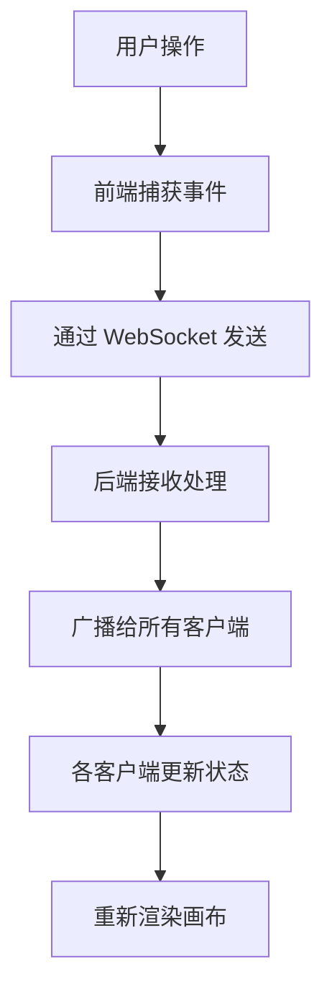

## 1. 产品概述

灵感波纹是一款异步创意协作应用，团队成员在实时生成的波纹画布上通过放置不同颜色和大小的波纹节点来表达想法，节点按类别自动形成涟漪圈，用户点击节点可展开详细讨论，所有编辑操作通过 WebSocket 实时同步给协作者。

- 核心价值：让创意灵感以可视化波纹的形式在团队中传播，提升远程协作的沉浸感和创造力
- 目标用户：创意团队、产品团队、设计团队、技术团队
- 核心场景：头脑风暴、需求讨论、创意发散、异步协作

## 2. 核心功能

### 2.1 用户角色
| 角色 | 登录方式 | 核心权限 |
|------|----------|----------|
| 协作用户 | 直接进入 | 创建节点、编辑节点、发送消息、@提及他人 |

### 2.2 功能模块
1. **波纹画布**：无限滚动画布、同心圆涟漪背景、节点展示、连线展示
2. **节点交互**：创建节点、拖拽节点、悬停效果、选中详情、弹性动画
3. **讨论面板**：消息列表、消息输入、富文本格式、@提及
4. **通知系统**：@提及通知、弹窗展示、自动消失
5. **画布操作**：拖拽平移、缩放控制、触摸手势
6. **实时同步**：WebSocket 连接、节点同步、消息同步

### 2.3 页面详情
| 页面名称 | 模块名称 | 功能描述 |
|-----------|-------------|---------------------|
| 主页面 | 波纹画布 | 深蓝渐变背景、同心圆涟漪动画、节点和连线渲染 |
| 主页面 | 节点交互 | 双击创建、拖拽移动、悬停放大、点击选中 |
| 主页面 | 侧边详情面板 | 节点标题、讨论区、消息输入、@提及 |
| 主页面 | 通知弹窗 | @提及通知、右上角显示、自动消失 |
| 主页面 | 画布控制 | 拖拽平移、滚轮/双指缩放、缩放动画 |

## 3. 核心流程

### 3.1 主流程
用户进入应用 → 看到波纹画布和已有节点 → 双击画布创建新节点 → 输入标题和选择类别 → 节点弹性出现并连线 → 点击节点查看详情 → 在讨论区发送消息 → @提及其他成员 → 被@者收到通知

### 3.2 实时同步流程

## 4. 用户界面设计

### 4.1 设计风格
- **主题**：深色主题，科技感与创意感结合
- **主色调**：深蓝渐变背景（#0B0F19 → #1B2838）
- **节点颜色**：
  - 技术类：#6C63FF 到 #3F3D99
  - 设计类：#FF6584 到 #B34A5E
  - 运营类：#FFC107 到 #B38600
- **涟漪颜色**：#4A90D9 到 #50E3C2 渐变
- **圆角设计**：所有交互元素使用圆角
- **动画时长**：0.2 - 0.5 秒，流畅自然

### 4.2 页面设计概述
| 页面名称 | 模块名称 | UI 元素 |
|-----------|-------------|----------|
| 主页面 | 波纹画布 | 深蓝渐变背景、同心圆涟漪、节点圆形带阴影、连线半透明 |
| 主页面 | 节点状态 | 常态圆形、悬停放大1.15倍、显示标签文字 |
| 主页面 | 侧边面板 | 右侧320px宽、#1E293B背景、12px圆角、阴影边框 |
| 主页面 | 消息展示 | 头像圆形32px、用户名灰色、消息内容浅灰 |
| 主页面 | 输入框 | 高度自适应、#334155背景、8px圆角 |
| 主页面 | 通知弹窗 | 右上角300x60px、3秒自动消失 |

### 4.3 响应式
- 桌面端优先，支持触摸设备
- 画布支持鼠标和触摸手势操作
- 侧边面板在移动端可适配

### 4.4 性能要求
- 支持 200+ 节点和 400+ 连线同时存在
- 交互操作保持 30fps 以上
- 使用 Canvas 渲染保证性能
