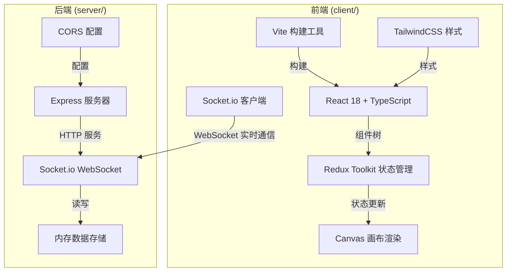

## 1. 架构设计



## 2. 技术描述

- **前端**：React 18 + TypeScript + Redux Toolkit + Vite + TailwindCSS
- **状态管理**：Redux Toolkit（按用户指定要求）
- **实时通信**：Socket.io
- **画布渲染**：HTML5 Canvas
- **后端**：Express 4 + Socket.io
- **数据存储**：内存数组（演示用途）
- **构建工具**：Vite
- **端口配置**：前端默认端口，后端 3001

## 3. 目录结构

```
auto213/
├── server/                # 后端模块
│   ├── package.json       # 后端依赖配置
│   ├── index.js           # Express 服务器入口
│   └── socketHandler.js   # WebSocket 事件处理
└── client/                # 前端模块
    ├── package.json       # 前端依赖配置
    ├── index.html         # 入口页面
    ├── vite.config.ts     # Vite 配置
    ├── tsconfig.json      # TypeScript 配置
    ├── tailwind.config.js # Tailwind 配置
    ├── postcss.config.js  # PostCSS 配置
    └── src/
        ├── App.tsx        # 根组件
        ├── store.ts       # Redux Store
        └── components/
            ├── Canvas.tsx       # 波纹画布组件
            ├── SidePanel.tsx    # 侧边详情面板
            └── Notification.tsx # 通知弹窗组件
```

## 4. 数据模型

### 4.1 节点 (Node)
| 字段 | 类型 | 说明 |
|------|------|------|
| id | string | 唯一标识 |
| x | number | X 坐标 |
| y | number | Y 坐标 |
| title | string | 节点标题 |
| category | 'tech' \| 'design' \| 'operation' | 节点类别 |
| size | number | 节点直径（40-80px） |
| createdAt | number | 创建时间戳 |

### 4.2 连线 (Edge)
| 字段 | 类型 | 说明 |
|------|------|------|
| id | string | 唯一标识 |
| source | string | 源节点 ID |
| target | string | 目标节点 ID |
| intimacy | number | 亲密度（影响线宽和透明度） |
| dashed | boolean | 是否为虚线 |

### 4.3 消息 (Message)
| 字段 | 类型 | 说明 |
|------|------|------|
| id | string | 唯一标识 |
| nodeId | string | 所属节点 ID |
| userId | string | 发送用户 ID |
| userName | string | 用户名 |
| avatar | string | 头像 URL |
| content | string | 消息内容 |
| timestamp | number | 时间戳 |
| mentions | string[] | @提及的用户 ID 列表 |

### 4.4 通知 (Notification)
| 字段 | 类型 | 说明 |
|------|------|------|
| id | string | 唯一标识 |
| type | 'mention' | 通知类型 |
| message | string | 通知内容 |
| fromUser | string | 发送者名称 |
| timestamp | number | 时间戳 |

## 5. WebSocket 事件定义

### 5.1 服务端 → 客户端
| 事件名 | 数据 | 说明 |
|--------|------|------|
| 'init' | { nodes, edges } | 初始数据同步 |
| 'nodeCreated' | Node | 节点创建通知 |
| 'nodeUpdated' | Node | 节点位置更新 |
| 'nodeDeleted' | string | 节点删除通知 |
| 'messageReceived' | Message | 新消息通知 |
| 'mention' | Notification | @提及通知 |

### 5.2 客户端 → 服务端
| 事件名 | 数据 | 说明 |
|--------|------|------|
| 'createNode' | { x, y, title, category, size } | 创建节点 |
| 'updateNodePosition' | { id, x, y } | 更新节点位置 |
| 'deleteNode' | string | 删除节点 |
| 'sendMessage' | { nodeId, content, userId, userName, mentions } | 发送消息 |
| 'mention' | { targetUserId, message, fromUser } | @提及 |

## 6. Redux State 结构

```typescript
interface RootState {
  nodes: Node[];
  edges: Edge[];
  selectedNodeId: string | null;
  messages: Record<string, Message[]>; // nodeId -> messages
  notifications: Notification[];
  canvas: {
    offsetX: number;
    offsetY: number;
    scale: number;
  };
  user: {
    id: string;
    name: string;
    avatar: string;
  };
}
```

## 7. 性能优化策略

1. **Canvas 分层渲染**：背景涟漪、连线、节点分层绘制，减少重绘区域
2. **requestAnimationFrame 动画循环**：统一的渲染循环，保证帧率稳定
3. **离屏渲染**：静态元素缓存到离屏 Canvas
4. **事件节流**：拖拽、缩放等高频事件节流处理
5. **脏矩形优化**：只重绘变化区域
6. **对象池复用**：避免频繁创建和销毁对象
7. **连线简化**：远处连线降低绘制精度

## 8. 启动方式

### 后端
```bash
cd server
npm install
npm start
```

### 前端
```bash
cd client
npm install
npm run dev
```
