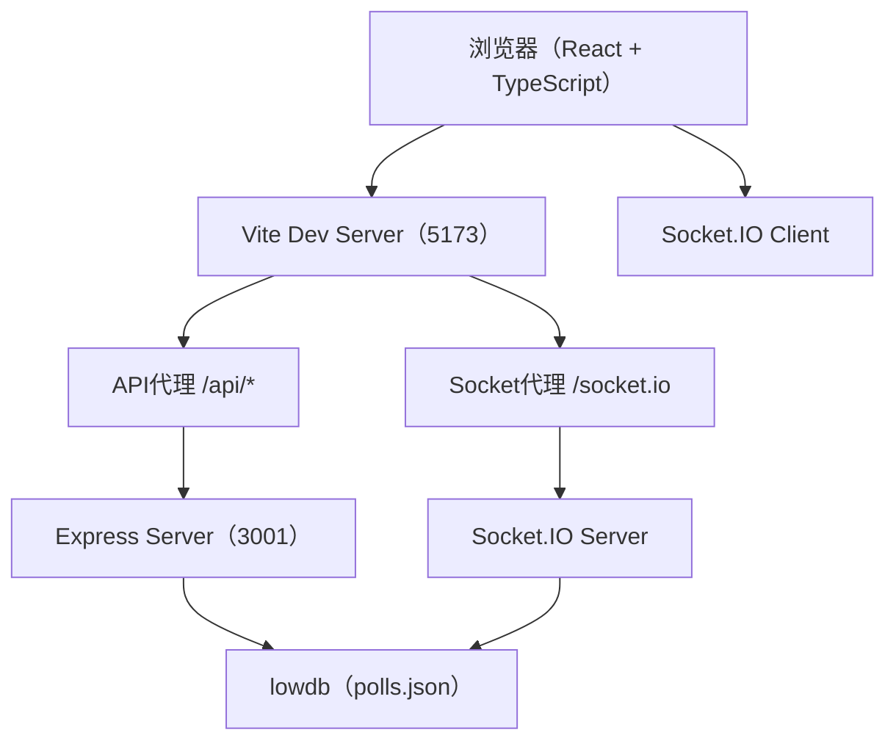
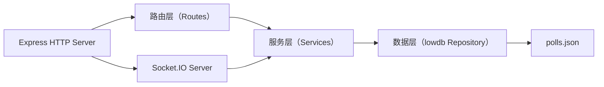
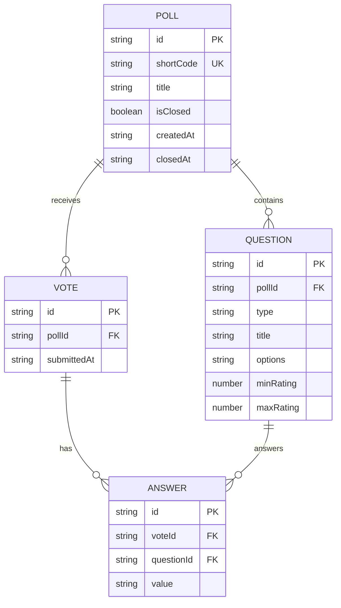

## 1. 架构设计



## 2. 技术说明

- **前端**：React 18 + TypeScript + Vite
- **UI组件库**：Ant Design（antd）+ @ant-design/icons
- **图表库**：Recharts
- **状态管理**：Zustand
- **实时通信**：Socket.IO-client
- **后端**：Express.js + Socket.IO
- **数据持久化**：lowdb（JSON文件数据库）
- **构建工具**：Vite

## 3. 路由定义

| 路由 | 用途 |
|------|------|
| / | 仪表盘页面 - 展示所有投票卡片网格 |
| /create | 创建投票页面 - 拖拽排序、添加题目 |
| /poll/:id | 投票详情页面 - 左侧题目列表、右侧实时图表 |
| /vote/:shortCode | 投票参与页面 - 填写并提交投票 |

## 4. API定义

### 4.1 类型定义

```typescript
type QuestionType = 'single' | 'multiple' | 'rating';

interface Question {
  id: string;
  type: QuestionType;
  title: string;
  options?: string[]; // 单选/多选题的选项
  minRating?: number; // 评分题最小分
  maxRating?: number; // 评分题最大分
}

interface VoteAnswer {
  questionId: string;
  value: string | string[] | number; // 单选:string, 多选:string[], 评分:number
}

interface VoteSubmission {
  pollId: string;
  answers: VoteAnswer[];
  submittedAt: string;
}

interface Poll {
  id: string;
  shortCode: string;
  title: string;
  questions: Question[];
  isClosed: boolean;
  createdAt: string;
  closedAt?: string;
  votes: VoteSubmission[];
}
```

### 4.2 REST API端点

| 方法 | 路径 | 说明 | 请求体 | 响应 |
|------|------|------|--------|------|
| GET | /api/polls | 获取所有投票列表 | - | Poll[]（不含votes详情，仅统计数量） |
| GET | /api/polls/:id | 获取单个投票详情（含结果） | - | Poll |
| POST | /api/polls | 创建新投票 | { title, questions } | Poll（含生成的shortCode） |
| POST | /api/polls/:id/close | 关闭投票 | - | Poll |
| POST | /api/polls/:id/questions | 动态添加题目 | Question | Poll |
| GET | /api/polls/:shortCode/exists | 检查短码是否有效 | - | { exists, pollId, isClosed } |
| GET | /api/polls/:id/export | 导出投票结果CSV | - | CSV文件下载 |
| POST | /api/votes | 提交投票 | VoteSubmission | { success } |

### 4.3 WebSocket事件

| 事件名 | 方向 | 数据 | 说明 |
|--------|------|------|------|
| newVote | Client → Server | VoteSubmission | 客户端提交新投票 |
| pollUpdate | Server → Client | { pollId, poll } | 服务器广播投票更新 |

## 5. 服务端架构



### 模块说明

- **路由层**：处理HTTP请求，参数校验，返回响应
- **服务层**：业务逻辑处理，生成短码，计算统计数据
- **数据层**：封装lowdb操作，CRUD接口
- **Socket.IO**：实时广播投票更新

## 6. 数据模型

### 6.1 数据模型ER图



### 6.2 lowdb JSON结构

```json
{
  "polls": [
    {
      "id": "uuid-string",
      "shortCode": "A3F2B1",
      "title": "投票标题",
      "questions": [
        {
          "id": "q-uuid",
          "type": "single",
          "title": "题目标题",
          "options": ["选项A", "选项B", "选项C"]
        }
      ],
      "isClosed": false,
      "createdAt": "2026-06-17T09:00:00.000Z",
      "closedAt": null,
      "votes": [
        {
          "id": "v-uuid",
          "submittedAt": "2026-06-17T09:05:00.000Z",
          "answers": [
            { "questionId": "q-uuid", "value": "选项A" }
          ]
        }
      ]
    }
  ]
}
```

## 7. 文件组织

```
auto22/
├── package.json
├── vite.config.js
├── tsconfig.json
├── index.html
├── server.js
├── polls.json              (自动生成)
└── src/
    ├── main.tsx
    ├── App.tsx
    ├── pollStore.ts
    └── components/
        ├── Sidebar.tsx
        ├── Dashboard.tsx
        ├── PollDetail.tsx
        ├── PollForm.tsx
        ├── VotePage.tsx
        ├── ChartPanel.tsx
        └── ThankYouPage.tsx
```
