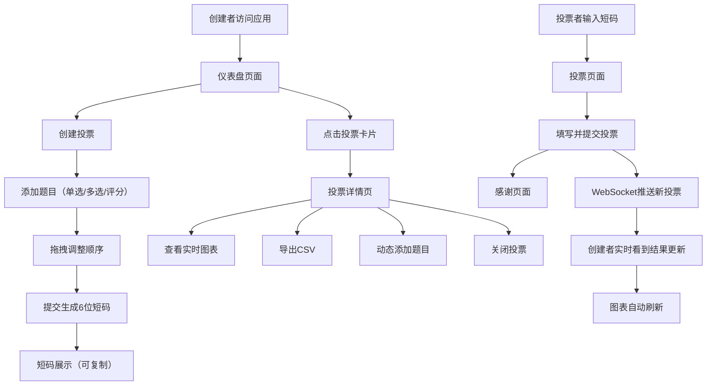

## 1. 产品概述

轻量级投票问卷应用，帮助小团队和活动策划者在浏览器中快速创建、分发和收集匿名投票或问卷调查，并实时查看可视化结果趋势。解决传统在线表单工具配置复杂、结果反馈延迟、无法在活动场景下动态调整的问题。

- 核心目标用户：小团队组织者、活动策划者、会议主持人
- 产品价值：极简配置、实时反馈、动态调整、可视化展示

## 2. 核心功能

### 2.1 用户角色

| 角色 | 注册方式 | 核心权限 |
|------|----------|----------|
| 创建者 | 无需注册（浏览器本地） | 创建投票、管理投票、查看实时结果、导出数据、关闭投票、动态添加题目 |
| 投票者 | 无需注册 | 通过短码访问投票、提交投票 |

### 2.2 功能模块

1. **仪表盘页面**：投票卡片网格展示、参与人数统计、快速创建入口
2. **创建投票页面**：拖拽排序题目、单选/多选/评分题型、生成6位短码
3. **投票详情页面**：题目列表、实时图表、最后更新时间、CSV导出、关闭投票、动态添加题目
4. **投票参与页面**：短码输入、投票表单、进度条、提交感谢页

### 2.3 页面详情

| 页面名称 | 模块名称 | 功能描述 |
|----------|----------|----------|
| 仪表盘 | 卡片网格 | 展示所有投票卡片（标题、参与人数、创建时间），响应式布局，点击进入详情 |
| 仪表盘 | 创建按钮 | 顶部操作按钮，点击跳转至创建投票页面 |
| 创建投票 | 题目表单 | 支持三种题型（单选、多选、评分1-10），拖拽排序调整顺序 |
| 创建投票 | 题目卡片 | 白色背景、8px圆角、1px边框、悬停阴影变化、拖拽时下移10px显示虚线占位 |
| 创建投票 | 短码展示 | 绿色#4CAF50背景、白色粗体文字、6px圆角、点击可复制 |
| 投票详情 | 左侧题目列表 | 显示所有题目 |
| 投票详情 | 右侧图表区 | 单选横向条形图、多选堆叠条形图、评分趋势折线图、自动刷新 |
| 投票详情 | 导出按钮 | 右上角灰色背景按钮，下载CSV格式数据 |
| 投票详情 | 操作区 | 添加题目、关闭投票 |
| 投票参与 | 短码输入 | 输入6位短码进入对应投票 |
| 投票参与 | 表单提交 | 蓝色#2196F3进度条，0.3s动画 |
| 投票参与 | 感谢页面 | 1s淡入动画、旋转绿色勾（0.5s旋转） |
| 投票参与 | 已结束提示 | 红色#F44336背景、白色文字、居中显示"投票已结束" |

## 3. 核心流程

创建者在仪表盘点击创建投票，添加题目并通过拖拽调整顺序，提交后系统生成6位短码。投票者通过短码访问投票页面并提交，数据通过WebSocket实时推送至创建者的仪表盘和详情页。创建者可在进行中动态添加题目或关闭投票，投票结束后数据保留30天。

## 4. 用户界面设计

### 4.1 设计风格

- **主色**：#3F51B5（靛蓝色）
- **辅色**：#FF4081（粉红色）
- **背景色**：#F5F5F5
- **按钮样式**：圆角20px，悬停和点击涟漪动效
- **字体**：Material Design风格，使用系统默认字体
- **布局**：左侧固定侧边栏（240px）+ 右侧内容区
- **图标**：Ant Design图标库
- **动效**：卡片和图表渐入0.5s，按钮涟漪，进度条动画，图表数据动画

### 4.2 页面设计概述

| 页面名称 | 模块名称 | UI元素 |
|----------|----------|--------|
| 仪表盘 | 顶部导航 | #3F51B5背景，56px高度，页面标题和操作按钮 |
| 仪表盘 | 卡片网格 | 每列最小宽280px，响应式适配，渐入动效 |
| 仪表盘 | 投票卡片 | 白色背景、圆角8px、边框#E0E0E0、悬停阴影 |
| 侧边栏 | Logo | 紫色#673AB7圆角矩形，应用缩写 |
| 侧边栏 | 投票列表 | 每项48px高，悬停背景#ECEFF1，选中蓝色竖条+#E8EAF6底色 |
| 创建投票 | 短码区 | 绿色#4CAF50背景，白色粗体，6px圆角，点击复制 |
| 创建投票 | 题目卡片 | 白色#FFFFFF，圆角8px，边框#E0E0E0，阴影过渡0.2s |
| 投票详情 | 单选图表 | 横向条形图#FF9800渐变，最大条形#FF5722标记，1s动画 |
| 投票详情 | 多选图表 | 堆叠条形图，四色循环：#4CAF50/#2196F3/#FF9800/#9C27B0 |
| 投票详情 | 评分图表 | 折线图#E91E63，圆点3px，1.5s从左向右绘制 |
| 投票详情 | 更新时间 | 灰色12px文字，右下角显示 |
| 投票参与 | 进度条 | 主色#2196F3，0.3s动画 |
| 投票参与 | 感谢页 | 1s淡入，旋转绿色勾0.5s |

### 4.3 响应式

- 桌面端优先（Desktop-first）
- 屏幕宽度<768px时：侧边栏变为底部导航栏（56px高度，图标+文字）
- 卡片网格自适应列数
- 投票详情页左右布局在小屏幕变为上下布局

### 4.4 性能要求

- 仪表盘同时展示100份投票卡片，初始加载≤2秒
- 实时结果页收到新投票后，图表重新渲染≤300ms
- 投票结束后数据保留30天，自动清理
