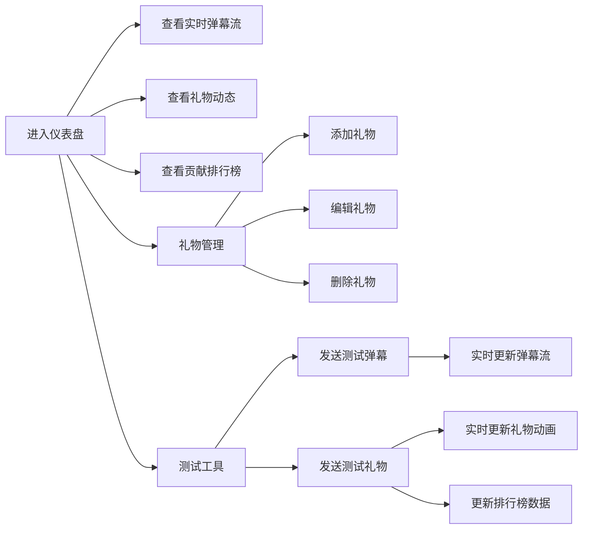

## 1. 产品概述

直播实时互动仪表盘是一款面向小型直播团队的浏览器端管理工具，解决直播过程中礼物特效反馈延迟、弹幕与数据看板脱节、无法快速了解核心观众贡献的问题。通过统一的实时数据看板，帮助直播运营团队高效管理礼物、监控弹幕互动、追踪观众贡献排行，提升直播运营效率和观众体验。

## 2. 核心功能

### 2.1 用户角色

| 角色 | 使用方式 | 核心权限 |
|------|----------|----------|
| 直播运营人员 | 浏览器访问 | 礼物管理、实时数据监控、模拟测试 |

### 2.2 功能模块

1. **礼物管理模块**：虚拟礼物的增删改查，礼物卡片展示，侧边表单编辑
2. **实时弹幕流模块**：弹幕滚动展示，头像昵称时间显示
3. **礼物动态模块**：礼物动画展示，送礼者信息和数量显示
4. **观众贡献排行榜**：今日/本周/全部切换，排名展示，贡献金币统计
5. **测试工具模块**：模拟发送弹幕和礼物，即时更新数据

### 2.3 页面详情

| 页面名称 | 模块名称 | 功能描述 |
|---------|----------|----------|
| 主看板 | 礼物管理面板 | 礼物卡片网格展示，支持增删改操作 |
| 主看板 | 弹幕流面板 | 实时弹幕滚动列表，自动滚动到底部 |
| 主看板 | 礼物动态面板 | 礼物滑入动画，金色闪光效果 |
| 主看板 | 贡献排行榜 | Tab切换时间范围，排名样式区分 |
| 主看板 | 测试工具 | 浮动按钮触发模态框，模拟发送功能 |

## 3. 核心流程

用户进入仪表盘后，可以同时查看弹幕流、礼物动态和排行榜数据。通过右下角浮动按钮打开测试工具，模拟发送弹幕或礼物后，前端立即更新对应区域的展示。管理员可通过礼物管理面板维护虚拟礼物配置。排行榜数据每5秒自动刷新。

## 4. 用户界面设计

### 4.1 设计风格

- **主色调**：深色模式，背景 #1E1E2E，卡片背景 #2D2D44
- **强调色**：#FF6B00（橙色）用于按钮和关键数据
- **文字颜色**：主色 #E0E0E0，深灰 #212121
- **卡片样式**：圆角 12px，悬浮时阴影扩大至 12px，过渡 0.2秒
- **圆角系统**：卡片 12px，弹幕 8px，模态框 16px
- **动画曲线**：cubic-bezier(0.25, 0.46, 0.45, 0.94)

### 4.2 页面设计概览

| 页面名称 | 模块名称 | UI元素 |
|---------|----------|--------|
| 主看板 | 弹幕流面板 | 宽度 320px，浅灰背景 #F5F5F5，圆形头像 36px，时间显示 |
| 主看板 | 礼物动态面板 | 宽度 320px，从右向左滑入动画 0.4s，金色闪光 #FFD700 |
| 主看板 | 贡献排行榜 | 第一名浅金 #FFF8E1，第二名浅银 #F5F5F5，第三名浅铜 #FFECB3 |
| 主看板 | 礼物卡片 | 宽 160px，白底 #FFFFFF，边框 #E0E0E0，悬浮上移 5px + 阴影 8px |
| 主看板 | 侧边编辑表单 | 宽 360px，背景 #FAFAFA，间距 16px，主色按钮 #FF6B00 |
| 主看板 | 测试工具模态框 | 半透明背景 #00000044，白色内容，圆角 16px |

### 4.3 响应式

- 桌面端：三栏布局（弹幕、排行榜、礼物）
- 768px 以下：弹幕和礼物区折叠为上下排列
- 排行榜自适应宽度

### 4.4 动效设计

- 礼物滑入：从右向左 0.4s ease-out
- 礼物闪光：金色 #FFD700 闪烁一次
- 卡片悬浮：阴影扩大 + 上移 5px，0.2s 过渡
- 弹幕滚动：平滑滚动到底部
- 模态框弹出：半透明背景淡入 + 内容缩放

