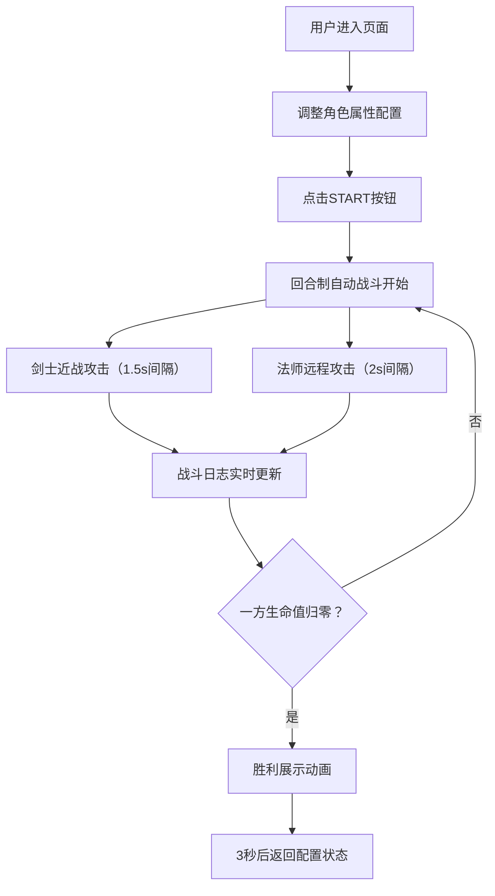

## 1. 产品概述

基于2D物理引擎的决斗场模拟器，用户可自定义剑士和法师两个角色的属性与技能，在竞技场中观察回合制自动战斗的胜负结果。

- 核心价值：提供策略性战斗模拟体验，让用户通过调整参数观察不同配置下的战斗结果
- 目标用户：游戏爱好者、策略模拟玩家

## 2. 核心功能

### 2.1 功能模块

1. **战斗舞台**：800x600 Canvas渲染区域，展示角色、攻击动画、粒子效果
2. **角色配置面板**：左右两栏分别配置剑士和法师的生命值、攻击力、技能
3. **战斗控制系统**：START按钮启动/重置战斗，回合制自动战斗逻辑
4. **战斗日志面板**：实时记录战斗过程，虚拟列表优化性能
5. **胜利展示**：战斗结束后胜利者放大旋转动画，闪烁彩色文案

### 2.2 页面详情

| 页面名称 | 模块名称 | 功能描述 |
|-----------|-------------|---------------------|
| 主页面 | 战斗舞台 | 800x600深灰背景，浅灰双线网格，左右角色站位点带脉动光环 |
| 主页面 | 控制面板 | 200px高度，左右分栏配置角色属性，中央START按钮 |
| 主页面 | 战斗日志 | 280px宽度右侧面板，实时记录战斗回合，虚拟列表渲染 |
| 主页面 | 胜利展示 | 战斗结束后胜利者放大1.5倍旋转，闪烁彩色胜利文案 |

## 3. 核心流程

用户进入页面 → 调整剑士和法师的属性配置（生命值、攻击力、技能） → 点击START按钮开始战斗 → 回合制自动战斗（剑士近战/法师远程） → 战斗日志实时更新 → 一方生命值归零 → 胜利展示动画 → 3秒后自动返回配置状态

## 4. 用户界面设计

### 4.1 设计风格
- **整体风格**：暗色赛博朋克风格
- **主色调**：深灰#2C2C2C、#1E1E1E，蓝色#00BFFF，红色#FF4080
- **按钮样式**：渐变绿色按钮，圆角8px，悬停亮度提升，按下内阴影
- **字体**：白色#FFFFFF（数值显示）、#E0E0E0（日志），12-14px
- **布局风格**：三栏布局（战斗舞台+右侧日志），下方控制面板
- **动画效果**：脉动光环、扫描线、粒子爆炸、角色前冲、胜利旋转

### 4.2 页面设计概述

| 页面名称 | 模块名称 | UI元素 |
|-----------|-------------|-------------|
| 主页面 | 战斗舞台 | 800x600 Canvas，#2C2C2C背景，#A0A0A0双线网格（40px间距），左右角色站位带蓝/红脉动光环（0.5s周期），扫描线效果（0.8Hz） |
| 主页面 | 控制面板 | #1E1E1E背景，20px内边距，左右分栏配置，滑块（#444轨道，蓝/红手柄），技能下拉，中央START按钮（#4CAF50→#388E3C渐变） |
| 主页面 | 战斗日志 | 280px宽度，#252525背景，backdrop-filter: blur(8px)，#E0E0E0字体12px，虚拟列表20条，攻击红#FF5252/防御绿#69F0AE/特殊紫#CE93D8高亮 |
| 主页面 | 胜利展示 | 胜利者放大1.5倍缓慢旋转，闪烁彩色文案，3秒持续 |

### 4.3 性能要求
- 帧率保持50FPS以上
- 粒子数量不超过100个同时绘制
- 战斗日志使用虚拟列表只渲染可见20条
- 所有交互元素0.2s平滑过渡动画

### 4.4 响应式
- 桌面端优先，固定尺寸布局（舞台800x600）
- 整体容器居中显示
