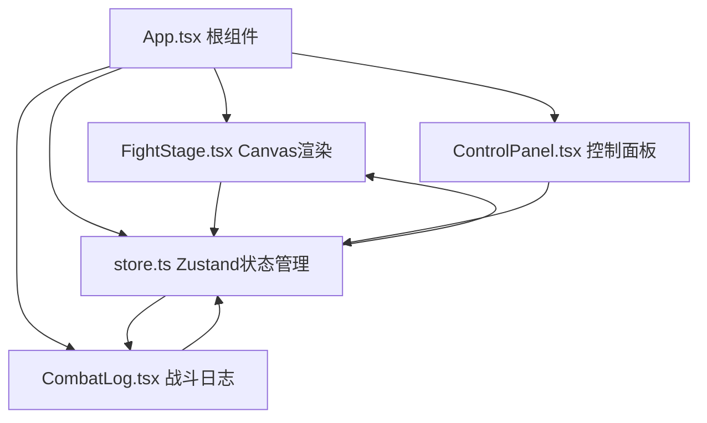

## 1. 架构设计



## 2. 技术描述

- **前端框架**：React@18 + TypeScript@5
- **构建工具**：Vite@5 + @vitejs/plugin-react@4
- **状态管理**：Zustand@4
- **渲染引擎**：Canvas 2D API
- **工具库**：uuid@9

## 3. 项目结构

```
auto28/
├── package.json
├── vite.config.js
├── tsconfig.json
├── index.html
└── src/
    ├── App.tsx          # 根组件，布局容器，初始化store
    ├── FightStage.tsx   # Canvas战斗舞台，渲染动画和粒子
    ├── ControlPanel.tsx # 控制面板，属性配置，START按钮
    ├── CombatLog.tsx    # 战斗日志，虚拟列表优化
    └── store.ts         # Zustand状态管理
```

## 4. 数据模型

### 4.1 角色状态

```typescript
interface Character {
  id: string;
  type: 'swordsman' | 'mage';
  name: string;
  maxHp: number;
  currentHp: number;
  attack: number;
  skill: string;
  position: { x: number; y: number };
  color: string;
}
```

### 4.2 战斗状态

```typescript
interface CombatState {
  isFighting: boolean;
  round: number;
  winner: 'swordsman' | 'mage' | null;
  showVictory: boolean;
  swordsman: Character;
  mage: Character;
  logs: LogEntry[];
}
```

### 4.3 日志条目

```typescript
interface LogEntry {
  id: string;
  round: number;
  type: 'attack' | 'defense' | 'special';
  message: string;
  timestamp: number;
}
```

## 5. Store Actions

```typescript
interface StoreActions {
  updateSwordsman: (config: Partial<Character>) => void;
  updateMage: (config: Partial<Character>) => void;
  startFight: () => void;
  endFight: (winner: 'swordsman' | 'mage') => void;
  recordLog: (entry: Omit<LogEntry, 'id' | 'timestamp'>) => void;
  resetFight: () => void;
  nextRound: () => void;
}
```

## 6. 性能优化要点

1. **Canvas渲染**：使用requestAnimationFrame，保持50+FPS
2. **粒子系统**：对象池复用，限制最大100个粒子
3. **战斗日志**：虚拟列表只渲染可见20条，超过30条自动清理
4. **状态更新**：Zustand按需订阅，避免不必要重渲染
5. **动画优化**：CSS transform硬件加速，避免layout thrash
