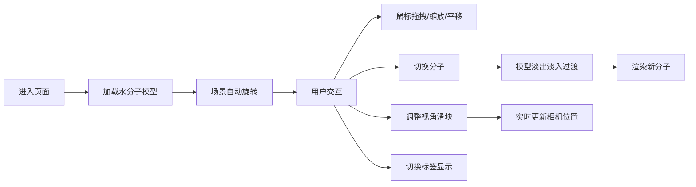

## 1. 产品概述

交互式分子结构3D查看器，用于展示常用分子（水、咖啡因、葡萄糖）的球棍模型。用户可通过3D旋转、缩放、切换视角来观察分子结构，支持原子标签显示/隐藏，适用于化学教育、科研可视化场景。

### 产品目标
- 提供直观的3D分子可视化体验
- 支持多种常见分子的快速切换查看
- 提供精细的视角控制和交互体验
- 采用暗色科幻风格，提升视觉体验

---

## 2. 核心功能

### 2.1 功能模块

| 模块名称 | 核心功能 |
|---------|---------|
| **3D分子渲染** | 球棍模型渲染、CPK原子配色、化学键绘制、自动旋转 |
| **分子切换** | 下拉选择分子、平滑过渡动画、分子信息展示 |
| **视角控制** | 距离滑块、水平旋转滑块、垂直倾斜滑块、实时更新 |
| **交互控制** | 鼠标拖拽旋转、滚轮缩放、平移、标签显示切换 |

### 2.2 页面详情

| 页面名称 | 模块名称 | 功能描述 |
|---------|---------|----------|
| 主页面 | 3D场景区域 | 占屏幕65%，展示分子球棍模型，支持OrbitControls交互 |
| 主页面 | 控制面板 | 占屏幕35%，包含分子选择、视角滑块、标签开关、分子信息 |
| 主页面 | 原子标签 | 悬浮显示元素符号，可开关，随缩放自动调整大小 |

---

## 3. 核心流程

### 用户操作流程
1. 用户进入页面，默认展示水分子3D模型，场景缓慢自动旋转
2. 用户可通过鼠标拖拽旋转模型、滚轮缩放、右键平移
3. 在右侧控制面板选择不同分子（水、咖啡因、葡萄糖），模型平滑过渡
4. 调整视角滑块（距离、水平旋转、垂直倾斜）实时更新场景
5. 点击"显示/隐藏标签"按钮切换原子标签显示状态

---

## 4. 用户界面设计

### 4.1 设计风格

**整体风格：暗色科幻风格**

| 设计元素 | 规格 |
|---------|------|
| **主色调** | 亮蓝色 #00d4ff（用于交互元素、文字高亮） |
| **背景色** | 3D场景 #1a1a2e，控制面板 #2d2d44，卡片 #3a3a54 |
| **辅助色** | #4a4a6a（滑块轨道、边框）、#6a6a8a（滑块轨道渐变） |
| **原子配色（CPK）** | 碳 #555555，氧 #ff0d0d，氮 #3050f8，氢 #ffffff |
| **按钮样式** | Ant Design primary 按钮，水波纹点击反馈 |
| **字体** | 现代无衬线字体，主标题18px亮蓝色，正文14px白色 |
| **布局** | 左右分栏（65%/35%），卡片式布局，圆角8px |
| **动画** | 分子切换0.6秒淡入淡出，滑块实时响应，场景缓慢自转 |
| **阴影** | 控制面板顶部2px亮蓝色阴影 |

### 4.2 页面设计概述

| 区域 | UI元素 | 设计规格 |
|------|--------|----------|
| **3D场景区域** | Canvas画布 | 背景 #1a1a2e，居中展示分子，半透明原子（opacity 0.85），实心化学键 |
| **控制面板** | 分子信息卡片 | 显示分子名称和原子数量，亮蓝色文字18px |
| **控制面板** | 分子选择下拉框 | Ant Design Select组件，暗色主题 |
| **控制面板** | 视角滑块组 | 三个滑块（距离5-20、水平旋转0-360°、垂直倾斜-90°~90°），渐变轨道，亮蓝色手柄 |
| **控制面板** | 标签开关按钮 | Primary按钮，显示/隐藏原子标签 |
| **原子标签** | 悬浮标签 | 半透明黑色圆角背景，白色文字16px，显示元素符号 |

### 4.3 响应式设计

- **桌面端**：左右分栏布局，3D场景65%，控制面板35%（固定宽度320px）
- **交互优化**：鼠标拖拽旋转流畅，无卡顿，帧率稳定30fps以上
- **性能优化**：分子切换响应时间≤200ms，滑块拖动实时更新

### 4.4 3D场景设计

| 场景元素 | 参数设置 |
|---------|----------|
| **背景** | 纯色 #1a1a2e |
| **光照** | 环境光 + 方向光，确保原子明暗层次清晰 |
| **相机** | PerspectiveCamera，初始距离10，fov合适 |
| **自动旋转** | 绕Y轴，速度0.005 rad/s，用户交互时暂停 |
| **交互控制** | OrbitControls，支持旋转、平移、缩放 |
| **模型渲染** | 原子为球体（半透明），化学键为圆柱体（实心） |
| **过渡动画** | 使用drei的Transition组件，0.6秒淡入淡出 |
| **标签渲染** | HTML标签，随相机距离自动缩放，避免遮挡 |

---

## 5. 性能要求

| 指标 | 要求 |
|------|------|
| 分子切换响应时间 | ≤ 200ms |
| 滑块拖动帧率 | ≥ 30fps |
| 场景渲染帧率 | ≥ 60fps（空闲时） |
| 内存占用 | 正常使用 ≤ 200MB |
