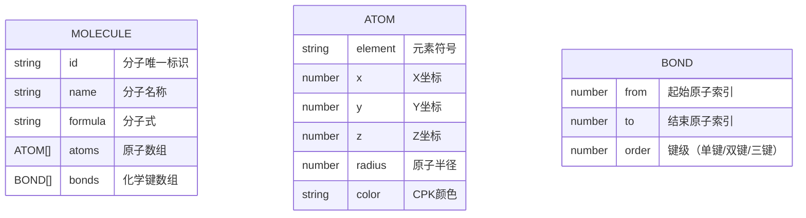

## 1. 架构设计

```mermaid
graph TD
    A["用户界面层 (React + Ant Design)"] --> B["状态管理层 (Zustand)"]
    B --> C["3D渲染层 (@react-three/fiber + drei)"]
    C --> D["Three.js 3D引擎"]
    E["数据层 (JSON分子数据)"] --> C
    F["工具函数层"] --> C
    
    style A fill:#4a4a6a,stroke:#00d4ff,stroke-width:2px
    style B fill:#3a3a54,stroke:#00d4ff,stroke-width:2px
    style C fill:#2d2d44,stroke:#00d4ff,stroke-width:2px
    style D fill:#1a1a2e,stroke:#00d4ff,stroke-width:2px
    style E fill:#3a3a54,stroke:#00d4ff,stroke-width:2px
    style F fill:#4a4a6a,stroke:#00d4ff,stroke-width:2px
```



### 架构说明
- **用户界面层**：React + TypeScript + Ant Design，负责控制面板UI和用户交互
- **状态管理层**：Zustand，集中管理分子选择、视角参数、标签可见性
- **3D渲染层**：@react-three/fiber 作为声明式Three.js包装，@react-three/drei提供高级组件
- **数据层**：JSON格式存储分子数据，包含原子坐标、半径、颜色、化学键信息
- **工具函数层**：提供分子数据到3D几何体的转换逻辑

---

## 2. 技术描述

| 技术栈 | 版本/说明 |
|-------|----------|
| **前端框架** | React 18 + TypeScript 5 |
| **构建工具** | Vite 5 + @vitejs/plugin-react |
| **UI组件库** | Ant Design 5 + @ant-design/icons |
| **3D渲染** | Three.js 0.160 + @react-three/fiber 8 + @react-three/drei 9 |
| **状态管理** | Zustand 4 |
| **开发语言** | TypeScript（严格模式） |

### 项目初始化
- 使用 `npm create vite@latest` 初始化 React + TypeScript 项目
- 手动安装依赖：antd、@react-three/fiber、@react-three/drei、three、zustand
- 配置路径别名 `@` 指向 `src` 目录

---

## 3. 文件结构

```
d:\Pro\tasks\auto3\
├── package.json              # 项目依赖和脚本
├── vite.config.js            # Vite构建配置，含路径别名
├── tsconfig.json             # TypeScript配置（严格模式）
├── index.html                # 入口页面，全屏黑色背景
└── src/
    ├── main.tsx              # React挂载点，全局样式和App组件
    ├── App.tsx               # 主应用组件，Canvas+UI组合
    ├── store/
    │   └── index.ts          # Zustand状态管理
    ├── components/
    │   ├── MoleculeViewer.tsx # 3D场景组件
    │   └── ControlPanel.tsx   # 控制面板组件
    ├── data/
    │   └── molecules.json    # 分子数据
    └── utils/
        └── renderAtoms.ts    # 几何体生成工具函数
```

---

## 4. 路由定义

| 路由 | 页面 | 说明 |
|------|------|------|
| `/` | 主页面 | 分子3D查看器主界面，左侧3D场景，右侧控制面板 |

---

## 5. 数据模型

### 5.1 分子数据结构



### 5.2 Zustand 状态模型

```typescript
interface MoleculeState {
  // 当前分子ID
  currentMoleculeId: string;
  // 视角距离 (5-20)
  cameraDistance: number;
  // 水平旋转角度 (0-360度)
  rotationY: number;
  // 垂直倾斜角度 (-90到90度)
  rotationX: number;
  // 原子标签可见性
  showLabels: boolean;
  // 自动旋转开关
  autoRotate: boolean;
  
  // Actions
  setCurrentMolecule: (id: string) => void;
  setCameraDistance: (distance: number) => void;
  setRotationY: (angle: number) => void;
  setRotationX: (angle: number) => void;
  toggleLabels: () => void;
  toggleAutoRotate: () => void;
  resetView: () => void;
}
```

---

## 6. 核心组件设计

### 6.1 MoleculeViewer (3D场景组件)

| 属性 | 类型 | 说明 |
|------|------|------|
| molecule | Molecule | 当前显示的分子数据 |
| cameraDistance | number | 相机距离 |
| rotationY | number | 水平旋转角度 |
| rotationX | number | 垂直倾斜角度 |
| showLabels | boolean | 是否显示原子标签 |
| autoRotate | boolean | 是否自动旋转 |

**核心功能：**
- 使用 `<Canvas>` 创建Three.js场景
- `<OrbitControls>` 处理鼠标交互
- `<Transition>` 实现分子切换淡入淡出动画
- `renderAtoms` 工具函数生成原子和键的3D对象
- `<Html>` 组件渲染原子标签，支持自动缩放

### 6.2 ControlPanel (控制面板组件)

| 属性 | 类型 | 说明 |
|------|------|------|
| moleculeName | string | 当前分子名称 |
| atomCount | number | 原子数量 |
| currentMoleculeId | string | 当前分子ID |
| cameraDistance | number | 相机距离 |
| rotationY | number | 水平旋转角度 |
| rotationX | number | 垂直倾斜角度 |
| showLabels | boolean | 标签可见性 |
| onMoleculeChange | (id: string) => void | 分子切换回调 |
| onDistanceChange | (value: number) => void | 距离变化回调 |
| onRotationYChange | (value: number) => void | 水平旋转回调 |
| onRotationXChange | (value: number) => void | 垂直倾斜回调 |
| onToggleLabels | () => void | 标签切换回调 |
| onResetView | () => void | 重置视角回调 |

**核心功能：**
- Ant Design `<Card>` 组件实现卡片式布局
- `<Select>` 下拉框选择分子
- `<Slider>` 组件实现三个视角控制滑块
- `<Button>` 组件实现标签开关和重置按钮
- 自定义CSS实现渐变滑块轨道和亮蓝色手柄

### 6.3 renderAtoms 工具函数

```typescript
interface RenderResult {
  atoms: React.ReactNode[];      // 原子球体组件数组
  bonds: React.ReactNode[];      // 化学键圆柱体组件数组
  labels: React.ReactNode[];     // 原子标签组件数组
}

function renderAtoms(
  molecule: Molecule, 
  showLabels: boolean
): RenderResult;
```

**功能说明：**
- 遍历分子数据中的原子，生成 `<mesh>` 球体组件
- 遍历化学键数据，计算两个原子间的中点和旋转角度，生成 `<mesh>` 圆柱体组件
- 为每个原子生成 `<Html>` 标签组件，显示元素符号
- 应用CPK配色和半透明材质

---

## 7. 性能优化策略

| 优化点 | 策略 |
|--------|------|
| **分子切换性能** | 使用 `<Transition>` 组件的 `keys` 属性实现对象复用，避免全量重建 |
| **滑块响应性能** | Zustand 状态更新采用原子化更新，避免不必要的重渲染 |
| **3D渲染性能** | 几何体使用 `useMemo` 缓存，材质复用，减少GC压力 |
| **标签性能** | 标签使用 `position: absolute` 和CSS transform，避免重排 |
| **帧率稳定** | 滑块值变化时使用 `requestAnimationFrame` 批量更新相机位置 |
| **内存管理** | 组件卸载时清理Three.js资源，避免内存泄漏 |

---

## 8. 开发规范

### 8.1 TypeScript 规范
- 启用严格模式（`strict: true`）
- 禁止使用 `any` 类型，必要时使用 `unknown`
- 所有组件Props使用 `interface` 定义
- 分子数据使用类型断言导入JSON

### 8.2 React 规范
- 使用函数组件 + Hooks
- 避免不必要的重渲染，合理使用 `useMemo`、`useCallback`
- 3D相关逻辑封装在自定义Hooks中

### 8.3 样式规范
- 使用CSS Modules或styled-components（优先使用Ant Design主题定制）
- 颜色值统一使用CSS变量定义
- 暗色主题全局配置
