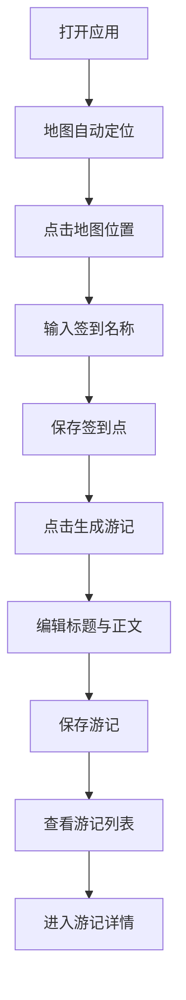

## 1. 产品概述

基于位置的在线签到与游记生成器应用，让用户能在地图上标记签到点并自动生成图文游记记录旅行足迹。

- 主要功能：地图定位签到、游记编辑与生成、签到点与游记管理
- 目标用户：旅行爱好者、城市探索者
- 产品价值：帮助用户记录旅行轨迹，快速生成精美的图文游记

## 2. 核心功能

### 2.1 用户角色
| 角色 | 注册方式 | 核心权限 |
|------|----------|----------|
| 普通用户 | 无需注册，直接使用 | 签到、创建/编辑/删除游记、查看历史记录 |

### 2.2 功能模块
1. **地图签到页面**：地图展示、位置定位、签到点添加、签到点列表、游记生成入口
2. **游记列表页面**：游记卡片展示、响应式网格布局、游记详情入口
3. **游记详情页面**：封面大图、正文内容、签到点照片画廊、地图缩略图

### 2.3 页面详情
| 页面名称 | 模块名称 | 功能描述 |
|-----------|-------------|---------------------|
| 地图签到页面 | 地图视图 | 展示 OpenStreetMap 瓦片地图，支持点击添加签到点，显示当前位置蓝色圆点 |
| 地图签到页面 | 签到点列表面板 | 右侧320px宽度面板，展示签到点列表（倒序），支持一键生成游记 |
| 地图签到页面 | 游记编辑模态框 | 640x480居中弹窗，输入标题与正文，支持预览与保存 |
| 游记列表页面 | 游记卡片网格 | 每行3张卡片，响应式布局，卡片悬停动效 |
| 游记详情页面 | 照片画廊 | 签到点照片左右翻页展示 |
| 游记详情页面 | 地图缩略图 | 不可交互的标记地图，点击可展开全屏 |
| 通用 | 顶部导航栏 | 56px高度，深蓝背景，Tab切换两个主页面 |

## 3. 核心流程

用户打开应用 → 地图自动定位到当前城市 → 点击地图任意位置 → 弹出输入框输入签到名称 → 确认后保存签到点 → 在签到点列表点击「生成游记」→ 编辑游记标题与正文 → 保存游记 → 切换到「我的游记」查看 → 点击卡片进入详情页

## 4. 用户界面设计

### 4.1 设计风格
- 主色：深蓝 #1A237E
- 辅助色：浅蓝 #BBDEFB
- 警告色：红色 #D32F2F
- 按钮圆角 4px，卡片圆角 8px
- 整体浅色主题，白色背景 + 浅灰卡片
- 过渡动画 0.2-0.3s
- 字体：优雅的无衬线字体

### 4.2 页面设计概述
| 页面名称 | 模块名称 | UI元素 |
|-----------|-------------|-------------|
| 地图签到页面 | 地图视图 | 全屏地图、蓝色水滴标记、气泡信息窗、当前位置蓝点 |
| 地图签到页面 | 右侧面板 | 320px宽、#FAFAFA背景、深蓝导航条、列表项、主色按钮 |
| 游记列表页面 | 卡片网格 | 白色圆角卡片、阴影、悬停上浮动效、淡入动画 |
| 游记详情页面 | 内容区域 | 300px封面大图、正文段落、照片翻页画廊、迷你地图 |

### 4.3 响应式
- 桌面端优先设计
- 游记列表：大屏3列、中屏2列、手机1列
- 右侧签到点面板在小屏幕可折叠
