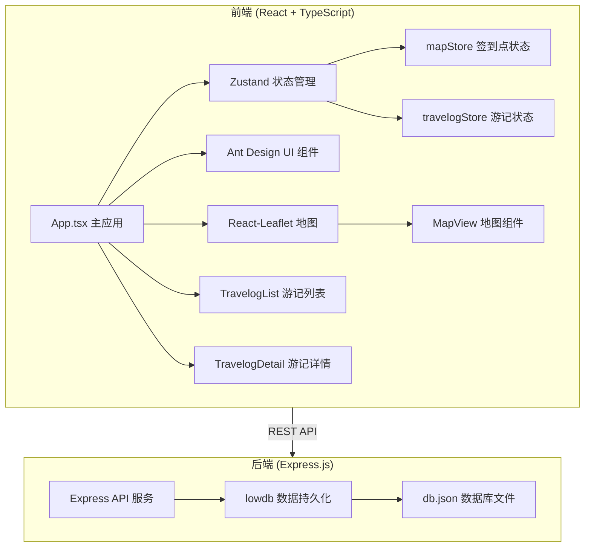
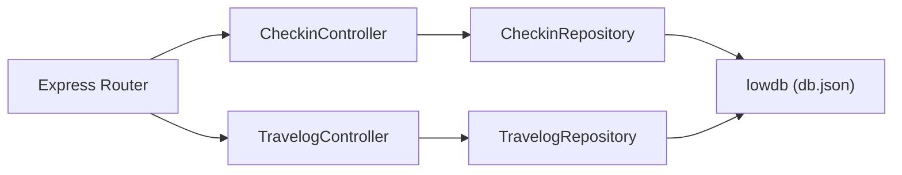
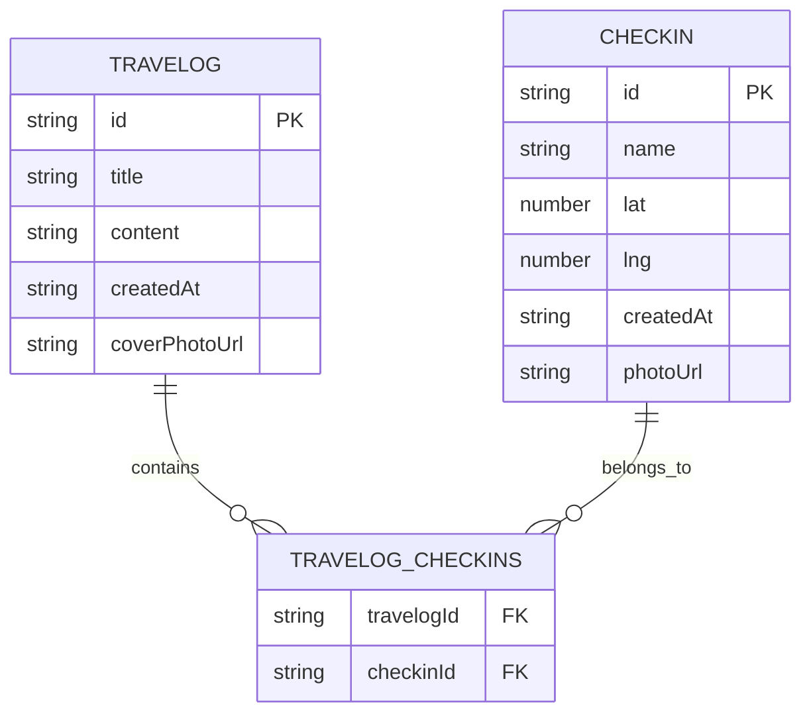

## 1. 架构设计



## 2. 技术描述

- 前端：React@18 + TypeScript@5 + Vite@5 + Ant Design@5
- 地图：Leaflet + react-leaflet（OpenStreetMap 瓦片）
- 状态管理：Zustand
- 图标：@ant-design/icons
- 后端：Express.js
- 数据库：lowdb（JSON 文件存储）
- 其他：cors、uuid

## 3. 路由定义

| 路由 | 用途 |
|-------|---------|
| / | 主应用（Tab 切换） |
| /map | 地图签到处（默认 Tab） |
| /travelogs | 我的游记列表 |
| /travelogs/:id | 游记详情页 |

## 4. API 定义

### 4.1 签到点接口

```typescript
interface Checkin {
  id: string;
  name: string;
  lat: number;
  lng: number;
  createdAt: string;
  photoUrl?: string;
}
```

**GET /api/checkins**
- 响应：`{ success: true; data: Checkin[] }`

**POST /api/checkin**
- 请求体：`{ name: string; lat: number; lng: number }`
- 响应：`{ success: true; data: Checkin }`

**DELETE /api/checkin/:id**
- 响应：`{ success: true }`

### 4.2 游记接口

```typescript
interface Travelog {
  id: string;
  title: string;
  content: string;
  checkinIds: string[];
  coverPhotoUrl?: string;
  photos: string[];
  createdAt: string;
}
```

**GET /api/travelogs**
- 响应：`{ success: true; data: Travelog[] }`

**POST /api/travelog**
- 请求体：`{ title: string; content: string; checkinIds: string[] }`
- 响应：`{ success: true; data: Travelog }`

**DELETE /api/travelog/:id**
- 响应：`{ success: true }`

## 5. 服务器架构图



## 6. 数据模型

### 6.1 数据模型定义



### 6.2 数据文件结构

db.json:
```json
{
  "checkins": [],
  "travelogs": []
}
```
