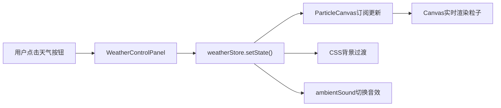

## 1. 产品概述

像素风格2D动态天气系统演示应用，为独立游戏开发者展示可集成到像素风RPG游戏中的实时天气切换系统。支持晴天、雨天、雪天、风暴四种天气模式，每种天气配有专属粒子效果、背景动画和环境音效。

- 目标用户：独立游戏开发者、像素游戏爱好者
- 产品价值：提供可复用、高性能的天气系统参考实现，降低游戏开发成本

## 2. 核心功能

### 2.1 功能模块
1. **主展示区**：全屏Canvas粒子渲染 + CSS背景动画
2. **天气控制面板**：底部居中，四个天气切换按钮
3. **音效系统**：Web Audio API实时生成环境音

### 2.2 页面详情
| 页面名称 | 模块名称 | 功能描述 |
|-----------|-------------|---------------------|
| 主页面 | 粒子渲染模块 | 根据天气类型渲染雨滴、雪花、飞沙等Canvas粒子效果 |
| 主页面 | 背景动画模块 | CSS实现太阳光晕、云层移动、闪电闪烁等背景效果 |
| 主页面 | 天气控制面板 | 晴天/雨天/雪天/风暴四个切换按钮，显示当前选中状态 |
| 主页面 | 音效管理模块 | 播放鸟鸣、雨声、雷声、风声等对应天气的环境音效 |

## 3. 核心流程

用户进入应用默认显示晴天 → 点击天气控制按钮 → Zustand更新全局天气状态 → ParticleCanvas订阅状态变化切换粒子循环 → 背景色CSS过渡渐变 → 音效管理器触发对应天气音效 → 持续实时渲染直到再次切换

## 4. 用户界面设计

### 4.1 设计风格
- **主题色**：深色游戏风，背景随天气动态变化（浅蓝#87CEEB/深灰#4A4A4A/浅灰#D3D3D3/黑色#000000）
- **按钮主题色**：太阳黄#FFD700、雨滴蓝#4682B4、雪花白#FFFFFF、风暴紫#8B008B
- **面板背景**：半透明深灰#2C2C2C，圆角12px
- **字体**：白色无衬线字体，营造像素游戏UI感
- **动效**：按钮点击缩放回弹（0.15s放大1.1倍）、背景色1秒过渡、太阳光晕呼吸动画

### 4.2 页面设计概述
| 页面名称 | 模块名称 | UI元素 |
|-----------|-------------|-------------|
| 主页面 | 粒子Canvas | 全屏覆盖，透明背景，实时绘制粒子 |
| 主页面 | 太阳/闪电层 | 绝对定位，CSS动画，晴天显示太阳光晕，风暴随机闪烁闪电 |
| 主页面 | 天气控制面板 | 底部居中，60px高，4个横向排列按钮 |
| 主页面 | 天气按钮 | 90×40px，圆角8px，白色文字，选中时填充对应主题色 |

### 4.3 响应式
- 桌面优先（≥600px）：按钮宽90px，字号16px
- 移动端（<600px）：按钮宽缩至70px，字号14px
