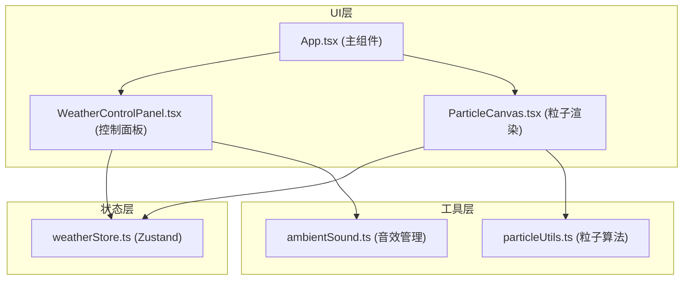

## 1. 架构设计



**数据流向**：
1. WeatherControlPanel → 调用weatherStore.setWeather() → 更新全局天气状态
2. ParticleCanvas → 订阅weatherStore → 天气变化时调用particleUtils切换粒子系统
3. WeatherControlPanel → 天气切换时调用ambientSound.playWeatherSound() → 播放对应音效
4. App.tsx → 读取weatherStore.weather → 设置CSS背景色变量

## 2. 技术描述
- **前端框架**：React 18 + TypeScript
- **构建工具**：Vite + @vitejs/plugin-react
- **状态管理**：Zustand
- **渲染技术**：Canvas 2D API（粒子）、CSS动画（背景效果）
- **音频技术**：Web Audio API（振荡器+噪声生成）

## 3. 路由定义
| 路由 | 用途 |
|-------|---------|
| / | 主页面，展示天气系统演示 |

## 4. 文件结构与职责
```
src/
├── weather-control/
│   ├── WeatherControlPanel.tsx   # 天气控制UI，展示4个按钮，触发状态切换和音效变化
│   └── weatherStore.ts           # Zustand状态管理，定义Weather枚举和setWeather方法
├── particle-renderer/
│   ├── ParticleCanvas.tsx        # Canvas组件，订阅天气状态，驱动粒子渲染循环
│   └── particleUtils.ts          # 粒子生成/更新/绘制算法（雨滴、雪花、飞沙）
├── audio-manager/
│   └── ambientSound.ts           # Web Audio API封装，暴露playWeatherSound/stopSound
├── App.tsx                        # 主组件，组合各模块，管理背景色过渡
└── main.tsx                       # React入口
```

**调用关系**：
- `WeatherControlPanel.tsx` → 引用 `weatherStore.ts`（setWeather）和 `ambientSound.ts`（playWeatherSound）
- `ParticleCanvas.tsx` → 引用 `weatherStore.ts`（订阅weather）和 `particleUtils.ts`（粒子算法）
- `App.tsx` → 引用 `WeatherControlPanel.tsx`、`ParticleCanvas.tsx`、`weatherStore.ts`
- `particleUtils.ts` 和 `ambientSound.ts` 为纯工具模块，无外部依赖

## 5. 数据模型

### 5.1 天气枚举
```typescript
enum Weather {
  Sunny = 'sunny',
  Rainy = 'rainy',
  Snowy = 'snowy',
  Stormy = 'stormy'
}
```

### 5.2 Zustand Store
```typescript
interface WeatherState {
  weather: Weather;
  setWeather: (w: Weather) => void;
}
```

### 5.3 粒子接口
```typescript
interface Particle {
  x: number;
  y: number;
  vx: number;
  vy: number;
  size: number;
  opacity: number;
}
```
