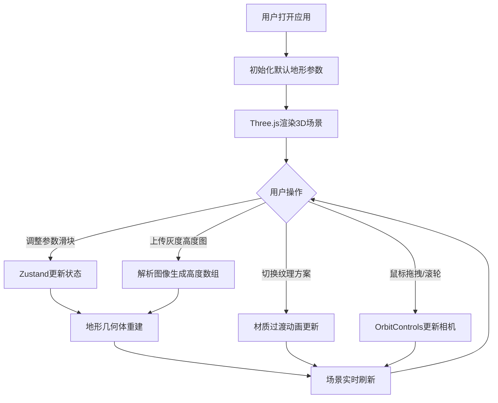

## 1. 产品概述

3D地形景观实时编辑器，为游戏开发者和地理教学者提供直观、可交互的所见即所得工具，用于创建和调整高度图、纹理贴图。通过实时参数调整、自定义高度图上传、多纹理方案切换等功能，降低地形创作门槛，提升工作效率。

- **目标用户**：游戏开发者（快速原型地形设计）、地理教师（地形地貌可视化教学）
- **产品价值**：消除传统地形编辑工具的学习曲线，提供浏览器内即时预览、参数即改即见的流畅体验

## 2. 核心功能

### 2.1 功能模块

1. **3D地形渲染模块**：基于Three.js的实时3D场景，支持鼠标交互控制视角
2. **参数控制面板**：地形尺寸、高度缩放、种子值、网格细分级别的滑块控制
3. **高度图上传与预览**：支持512x512 PNG灰度高度图上传，左侧显示原图预览
4. **纹理方案切换**：荒地/草原/雪原/熔岩四种预设纹理，平滑过渡动画
5. **参考网格系统**：半透明辅助网格线，间距随地形尺寸自动调整

### 2.2 页面详情

| 页面名称 | 模块名称 | 功能描述 |
|-----------|-------------|---------------------|
| 主编辑页 | 3D场景区域 | 全屏Three.js渲染空间，背景深邃星空蓝#0B0C10，地形居中展示 |
| 主编辑页 | 右侧控制面板 | 宽320px，暗色主题#2D2D2D，所有参数滑块科技蓝#00BFFF主题 |
| 主编辑页 | 高度图预览区 | 控制面板内左侧，宽256px，1px深灰#555555边框 |
| 主编辑页 | 参考网格 | 淡灰#666666，透明度0.3，间距自动适配地形尺寸 |

## 3. 核心流程

## 4. 用户界面设计

### 4.1 设计风格

- **主色调**：科技蓝 #00BFFF（交互元素高亮）、深邃星空蓝 #0B0C10（场景背景）
- **面板色系**：暗灰 #2D2D2D（面板主体）、稍亮灰 #3A3A3A（标题栏）、深灰 #555555（边框）
- **材质色系**：沙黄 #C2A878（荒地）、草绿 #4CAF50（草原）、纯白 #FFFFFF（雪原）、橙红 #FF5722（熔岩）
- **滑块样式**：滑轨高8px，圆形手柄直径20px，悬停时#00BFFF发光阴影半径10px
- **字体**：无衬线字体，标题18px白色，正文14px浅灰色

### 4.2 页面设计概述

| 页面名称 | 模块名称 | UI元素 |
|-----------|-------------|-------------|
| 主编辑页 | 3D场景区域 | 全屏Canvas、居中地形、半透明参考网格、环境光+方向光 |
| 主编辑页 | 控制面板标题栏 | 高48px，背景#3A3A3A，居中白色"地形编辑"文字18px |
| 主编辑页 | 参数滑块组 | 4组Slider+数值显示，科技蓝主题，平滑过渡动画 |
| 主编辑页 | 种子按钮 | 随机生成图标按钮，科技蓝边框+悬停发光 |
| 主编辑页 | 纹理方案选择 | 4个颜色方块Radio，选中态发光边框，0.6s过渡 |
| 主编辑页 | 高度图上传区 | Upload组件+256px预览图，#555555 1px边框 |
| 主编辑页 | 交互提示 | 鼠标操作说明浮层，低透明度不干扰操作 |

### 4.3 响应式

- **设计优先级**：桌面端优先（1280×720及以上分辨率最佳体验）
- **控制面板**：固定宽度320px，右边缘无缝贴合，纵向100vh铺满
- **3D场景**：自适应浏览器窗口尺寸（视口宽-320px），自动维持纵横比
- **缩放限制**：OrbitControls滚轮缩放范围1x-20x

### 4.4 3D场景指导

- **环境与氛围**：深邃星空蓝#0B0C10背景，无雾效，营造专业工具感
- **光照设置**：AmbientLight(0xffffff, 0.6) 环境光 + DirectionalLight(0xffffff, 0.8) 方向光45°俯角
- **相机设置**：PerspectiveCamera fov=60，初始位置(0, 地形尺寸×0.8, 地形尺寸×0.8)，lookAt原点
- **相机运动**：OrbitControls左键旋转（环绕原点）、右键平移、滚轮缩放（1x-20x）
- **构图焦点**：地形居中原点，参考网格略大于地形边缘向外延伸5%
- **交互与动画**：纹理切换0.6s ease-in-out材质颜色过渡；几何体重建即时刷新无过渡
- **后处理**：暂不用后处理，保持原生WebGL渲染性能
- **性能预算**：50×50地形+16细分<2s重建；交互帧率≥45FPS；单帧Draw Call≤10

