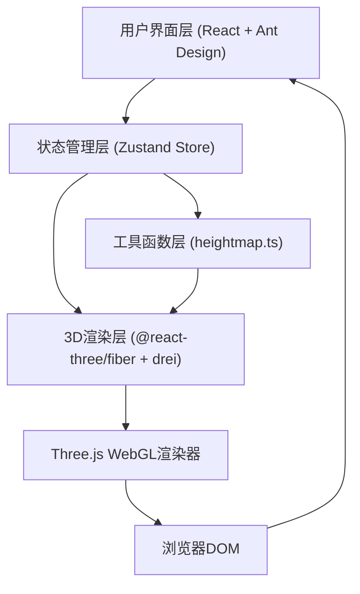

## 1. 架构设计



## 2. 技术说明

- **前端框架**：React 18 + TypeScript（严格模式）
- **构建工具**：Vite 5.x + @vitejs/plugin-react
- **3D渲染**：three.js 0.160+，@react-three/fiber 8.x，@react-three/drei 9.x
- **UI组件**：Ant Design 5.x + @ant-design/icons
- **状态管理**：Zustand 4.x（轻量全局Store）
- **样式方案**：Ant Design主题定制 + 内联样式（CSS-in-JS）

## 3. 项目文件结构

```
├── package.json
├── vite.config.js
├── tsconfig.json
├── index.html
└── src/
    ├── main.tsx                 # React入口，挂载根组件
    ├── App.tsx                  # 布局根组件（场景+控制面板）
    ├── components/
    │   ├── TerrainViewer.tsx    # 3D场景组件（Canvas、地形、网格、相机）
    │   └── ControlPanel.tsx     # 右侧控制面板（滑块、上传、纹理选择）
    ├── store/
    │   └── terrainStore.ts      # Zustand全局状态管理
    └── utils/
        └── heightmap.ts         # 高度图生成与解析工具函数
```

## 4. 状态管理设计（Zustand Store）

```typescript
// terrainStore.ts 状态接口
interface TerrainState {
  // 地形参数
  size: number           // 地形尺寸 50-200，步长10
  heightScale: number    // 高度缩放 0.5-5.0，步长0.1
  seed: number           // 种子值（随机整数）
  subdivision: number    // 网格细分 16-128，步长16

  // 纹理方案
  textureScheme: 'wasteland' | 'grassland' | 'snow' | 'lava'

  // 高度图数据
  heightmapData: Uint8ClampedArray | null  // 上传的灰度图像素
  heightmapPreview: string | null          // 预览图DataURL

  // Actions
  setSize: (n: number) => void
  setHeightScale: (n: number) => void
  setSeed: (n: number) => void
  randomizeSeed: () => void
  setSubdivision: (n: number) => void
  setTextureScheme: (s: TextureScheme) => void
  setHeightmap: (data: Uint8ClampedArray, preview: string) => void
  clearHeightmap: () => void
}
```

## 5. 纹理方案常量

```typescript
const TEXTURE_SCHEMES = {
  wasteland: { name: '荒地', baseColor: '#C2A878', gradient: null },
  grassland: { name: '草原', baseColor: '#4CAF50', gradient: null },
  snow:      { name: '雪原', baseColor: '#FFFFFF', gradient: null },
  lava:      { name: '熔岩', baseColor: '#FF5722', gradient: ['#FFEB3B', '#FF5722', '#B71C1C'] }
} as const
```

## 6. 核心算法

### 6.1 随机高度图生成（heightmap.ts）
- 使用种子化伪随机数（Mulberry32算法）确保相同seed生成相同地形
- 基于多层柏林噪声（Simplex Noise简化实现）或分形布朗运动(FBM)
- 输出：size×size归一化高度数组 Float32Array(0~1)

### 6.2 灰度图高度解析
- HTMLCanvasElement + getImageData 读取PNG像素
- 提取R通道（灰度图R=G=B）作为高度值，归一化至0~1
- 双线性重采样至当前size×size分辨率

### 6.3 地形几何体构建（TerrainViewer.tsx）
- Three.js PlaneGeometry + 修改顶点z坐标实现高度起伏
- subdivision控制widthSegments/heightSegments
- 顶点法线自动重计算（computeVertexNormals）支持光照
- useMemo依赖[size, subdivision, seed, heightmapData, heightScale]重建

### 6.4 纹理颜色过渡
- useRef持有当前材质实例
- useEffect监听textureScheme变化
- lerp线性插值（或CSS transition等价的requestAnimationFrame插值）在0.6s内平滑过渡color.uniforms.value

## 7. 性能优化策略

1. **几何体重建防抖**：滑块拖动不防抖，但useMemo浅比较避免不必要重建
2. **顶点数据复用**：同一size+subdivision复用PlaneGeometry实例，仅更新position attribute
3. **材质Shader优化**：使用MeshStandardMaterial而非自定义Shader，利用Three.js内置优化
4. **参考网格LOD**：GridHelper自动简化，大尺寸地形减少网格线数量
5. **OrbitControls阻尼**：enableDamping=true，dampingFactor=0.08减少卡顿感
6. **像素比限制**：renderer.setPixelRatio(Math.min(window.devicePixelRatio, 2))避免高DPI性能损耗

## 8. 依赖包版本锁定

```json
{
  "react": "^18.2.0",
  "react-dom": "^18.2.0",
  "@react-three/fiber": "^8.15.0",
  "@react-three/drei": "^9.92.0",
  "three": "^0.160.0",
  "@types/three": "^0.160.0",
  "antd": "^5.12.0",
  "@ant-design/icons": "^5.2.6",
  "zustand": "^4.4.7",
  "typescript": "^5.3.3",
  "vite": "^5.0.10",
  "@vitejs/plugin-react": "^4.2.1"
}
```

## 9. 启动与构建命令

| 命令 | 用途 |
|------|------|
| `npm install` | 安装所有依赖 |
| `npm run dev` | 启动Vite开发服务器（默认http://localhost:5173） |
| `npm run build` | 生产环境构建，输出至dist/ |
| `npm run preview` | 本地预览生产构建 |
| `npx tsc --noEmit` | TypeScript类型检查（无输出） |

