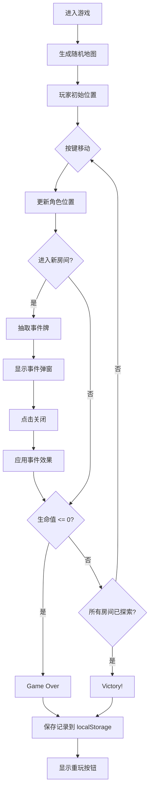

## 1. 产品概述

桌游地下城地图自动生成与探索模拟器，为桌游设计师提供数字化的规则测试工具，可快速生成随机地牢地图、模拟角色移动与遭遇事件，验证游戏平衡性。

### 核心价值
- 自动化地图生成，节省手工绘制时间
- 数字化事件系统，可快速迭代平衡参数
- 历史记录追踪，便于分析游戏体验数据

## 2. 核心功能

### 2.1 功能模块
1. **地图生成模块**：6x6 网格随机地牢生成，包含房间、走廊、墙壁
2. **角色探索模块**：键盘控制角色移动，房间/走廊不同移动速度
3. **事件系统模块**：10张事件牌库，进入房间自动抽取事件
4. **状态管理模块**：生命值、探索进度、游戏胜负判定
5. **历史记录模块**：localStorage 保存最近 5 条游戏记录
6. **控制面板模块**：显示玩家状态、事件描述、操作按钮

### 2.2 页面详情

| 页面名称 | 模块名称 | 功能描述 |
|---------|---------|----------|
| 主游戏页 | 地图画布 | Canvas 2D 渲染 6x6 地牢地图、角色、探索状态 |
| 主游戏页 | 控制面板 | 生命值进度条、事件描述、重新生成按钮 |
| 主游戏页 | 事件弹窗 | 半透明遮罩 + 深色卡片，淡入淡出动画 |
| 主游戏页 | 历史记录 | 右下角展示最近 5 条游戏结果 |
| 主游戏页 | 胜利/失败画面 | 全屏覆盖，显示游戏结果与重玩按钮 |

## 3. 核心流程

### 3.1 游戏主流程
用户进入页面 → 自动生成地图 → 玩家通过方向键移动角色 → 进入新房间触发事件弹窗 → 点击关闭继续探索 → 生命值归零/探索完所有房间 → 显示结果并保存记录

### 3.2 流程图

## 4. 用户界面设计

### 4.1 设计风格
- **整体风格**：深色地牢风格，神秘冒险氛围
- **主背景**：#1B1B1B 深黑色
- **边框装饰**：砖纹边框 #424242（CSS generated content）
- **主色调**：深金色 #D4AF37（标题）、亮蓝色 #1565C0（玩家）、红色 #E53935（生命条）
- **房间颜色**：浅灰 #D3D3D3
- **走廊颜色**：深灰 #B0B0B0
- **墙壁颜色**：深棕 #3E2723

### 4.2 字体与排版
- **标题**："地牢探索者 v1.0"，深金色 #D4AF37，28px，letter-spacing 4px，text-shadow
- **正文**：无衬线字体，白色为主
- **事件描述**：白色文字，深色卡片背景

### 4.3 组件样式
- **按钮**：深蓝 #1E88E5 背景，悬停 #1976D2，圆角 8px，内边距 10px 20px，transition 0.2s
- **生命值进度条**：红色 #E53935，高度 20px，圆角 10px，过渡动画 0.5s
- **控制面板**：背景 #2E2E2E，内边距 20px，圆角 12px，宽度 280px
- **事件弹窗**：深色卡片 #37474F，圆角 16px，宽度 320px，半透明遮罩 #000000 opacity 0.4
- **历史记录**：浅色背景 #F5F5F5，深色文字 #212121

### 4.4 页面设计概览

| 页面名称 | 模块名称 | UI 元素 |
|---------|---------|---------|
| 主游戏页 | 顶部标题 | 深金色标题字，文字阴影，居中 |
| 主游戏页 | 地图区域 | 600x600px 固定尺寸 Canvas，50px 内边距，砖纹边框 |
| 主游戏页 | 控制面板 | 地图右侧，生命条、事件描述、操作按钮 |
| 主游戏页 | 事件弹窗 | 居中弹窗，淡入淡出动画，点击任意处关闭 |
| 主游戏页 | 历史记录 | 右下角悬浮列表，最近 5 条记录 |
| 主游戏页 | 结果画面 | 全屏覆盖，Game Over / Victory 大字，重玩按钮 |

### 4.5 响应式设计
- **桌面端**（≥900px）：地图居中，控制面板在地图右侧
- **移动端**（<900px）：控制面板移至地图下方，纵向布局
- 地图视图保持固定尺寸 600x600px

### 4.6 动效设计
- 事件弹窗：淡入 0.3s，淡出动画
- 生命值变化：进度条过渡动画 0.5s
- 按钮悬停：颜色过渡 0.2s
- 角色移动：平滑格子移动（走廊 200ms/格，房间 300ms/格）
- 鼠标悬停已探索房间：显示事件触发提示（白色小字，半透明黑底）

## 5. 性能要求
- Canvas 渲染帧率稳定 ≥ 45 FPS
- 地图生成耗时 ≤ 50ms
- 事件牌抽取耗时 ≤ 50ms
- localStorage 读写不造成界面卡顿
