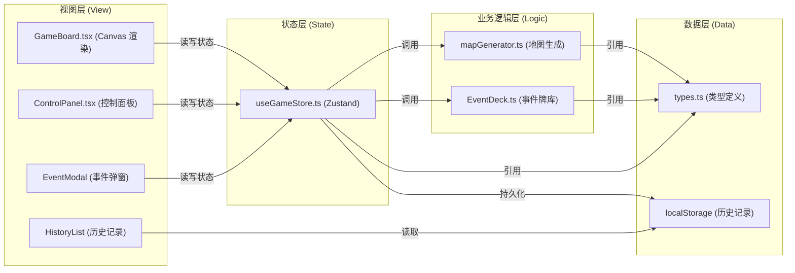

## 1. 架构设计



## 2. 技术选型

| 分类 | 技术 | 版本 | 说明 |
|-----|------|------|------|
| 框架 | React | 18.x | 前端 UI 框架 |
| 语言 | TypeScript | 5.x | 类型安全 |
| 构建工具 | Vite | 5.x | 快速开发构建 |
| 状态管理 | Zustand | 4.x | 轻量级状态管理 |
| 渲染 | Canvas 2D | - | 地图与角色渲染 |
| 唯一 ID | uuid | 9.x | 生成房间/事件 ID |
| 存储 | localStorage | - | 历史记录持久化 |

## 3. 项目结构

```
auto36/
├── index.html                 # 入口 HTML
├── package.json               # 依赖与脚本
├── vite.config.js             # Vite 配置
├── tsconfig.json              # TypeScript 严格模式配置
└── src/
    ├── main.tsx               # 应用入口
    ├── App.tsx                # 根组件
    ├── types.ts               # 全局类型定义
    ├── mapGenerator.ts        # 地图生成算法
    ├── EventDeck.ts           # 事件牌库管理
    ├── GameBoard.tsx          # 主游戏画布组件
    ├── store/
    │   └── useGameStore.ts    # Zustand 全局状态
    ├── ui/
    │   ├── ControlPanel.tsx   # 控制面板组件
    │   ├── EventModal.tsx     # 事件弹窗组件
    │   ├── GameOverScreen.tsx # 游戏结束画面
    │   ├── VictoryScreen.tsx  # 胜利画面
    │   └── HistoryList.tsx    # 历史记录列表
    └── styles/
        └── index.css          # 全局样式
```

## 4. 数据模型

### 4.1 核心类型定义

```typescript
// 格子类型
type CellType = 'wall' | 'room' | 'corridor';

// 房间
interface Room {
  id: string;
  x: number;
  y: number;
  width: number;
  height: number;
  explored: boolean;
  eventTriggered: boolean;
}

// 走廊
interface Corridor {
  id: string;
  cells: { x: number; y: number }[];
}

// 地图数据
interface DungeonMap {
  grid: CellType[][];
  rooms: Room[];
  corridors: Corridor[];
  width: number;
  height: number;
}

// 玩家
interface Player {
  x: number;
  y: number;
  targetX: number;
  targetY: number;
  health: number;
  maxHealth: number;
  isMoving: boolean;
}

// 事件类型
type EventType = 'beneficial' | 'harmful' | 'neutral';

// 事件牌
interface EventCard {
  id: string;
  type: EventType;
  name: string;
  description: string;
  effect: (state: GameState) => Partial<GameState>;
}

// 游戏状态
interface GameState {
  map: DungeonMap | null;
  player: Player;
  currentEvent: EventCard | null;
  showEventModal: boolean;
  gameStatus: 'playing' | 'won' | 'lost';
  exploredRooms: number;
  totalRooms: number;
  startTime: number;
  elapsedTime: number;
}

// 历史记录
interface GameRecord {
  id: string;
  result: 'won' | 'lost';
  time: number;
  roomsExplored: number;
  remainingHealth: number;
  timestamp: number;
}
```

## 5. 模块职责与数据流向

### 5.1 types.ts
- **职责**：定义所有核心类型和接口
- **数据流**：被所有其他模块引用

### 5.2 mapGenerator.ts
- **职责**：接收关卡参数 → 生成二维网格 → 应用随机布局算法 → 输出地图数据
- **输入**：地图宽高（默认 6x6）、房间数量（至少 4 个）
- **输出**：DungeonMap 对象
- **数据流**：被 useGameStore 调用，生成结果存入 store
- **核心算法**：
  1. 初始化全墙壁网格
  2. 随机生成 4-6 个房间（2x2 ~ 4x4）
  3. 检查房间不重叠
  4. 使用 BFS/最小生成树连接房间生成走廊
  5. 确保所有房间可达

### 5.3 EventDeck.ts
- **职责**：维护遭遇事件牌库，抽取事件，消耗牌
- **输入**：无（初始化时内置 10 张牌）
- **输出**：EventCard 对象
- **数据流**：被 GameBoard / useGameStore 在进入新房间时调用
- **事件配置**：
  - 有益事件（3种）：宝箱（+10生命）、魔法泉（地图全可见）、治疗药水（+15生命）
  - 有害事件（3种）：陷阱（-8生命）、怪物突袭（快速按键躲避）、毒雾（-5生命/秒持续3秒）
  - 中性事件（4种）：残破雕像、岔路提示、空房间、神秘符文

### 5.4 useGameStore.ts
- **职责**：全局状态管理，封装所有游戏逻辑操作
- **状态**：地图、玩家位置、事件状态、生命值、游戏状态等
- **Actions**：
  - `generateMap()`：生成新地图
  - `movePlayer(direction)`：移动玩家
  - `triggerEvent()`：触发当前房间事件
  - `closeEventModal()`：关闭事件弹窗
  - `resetGame()`：重置游戏
  - `updateElapsedTime()`：更新游戏时间
- **数据流**：被所有组件读写，调用 mapGenerator 和 EventDeck

### 5.5 GameBoard.tsx
- **职责**：主游戏组件，Canvas 渲染与交互管理
- **输入**：从 useGameStore 读取地图和玩家状态
- **输出**：Canvas 渲染，派发移动 action
- **功能**：
  - Canvas 2D 渲染地图格子、墙壁、房间
  - 渲染玩家角色（亮蓝色圆形）
  - 监听键盘事件控制移动
  - 处理房间悬停提示
  - 检测进入新房间触发事件
- **数据流**：调用 useGameStore 获取/更新状态

### 5.6 ControlPanel.tsx
- **职责**：显示玩家状态和操作按钮
- **输入**：从 useGameStore 读取生命值、事件描述等
- **输出**：用户操作派发 action 至 store
- **组件**：生命值进度条、当前事件描述、重新生成按钮

### 5.7 历史记录模块
- **职责**：游戏结束时保存记录，展示最近 5 条
- **存储**：localStorage 键名 `dungeon_history`
- **数据结构**：GameRecord[] 数组（最多 5 条）
- **时机**：游戏状态变为 won 或 lost 时写入

## 6. 性能优化策略

### 6.1 Canvas 渲染优化
- 使用 requestAnimationFrame 渲染循环
- 仅在状态变化时重绘（移动、事件触发等）
- 离屏画布预渲染静态地图层
- 角色移动插值动画

### 6.2 地图生成优化
- 使用 Fisher-Yates 洗牌算法随机化
- 预分配数组避免动态扩容
- 限制生成尝试次数防止死循环

### 6.3 状态管理优化
- Zustand 选择器（selector）避免不必要重渲染
- 浅比较优化订阅更新

### 6.4 localStorage 优化
- 异步写入（setTimeout 0）避免阻塞主线程
- 限制历史记录数量（最多 5 条）
- JSON 序列化数据量控制

## 7. 关键算法说明

### 7.1 房间生成算法
1. 在网格内随机位置尝试生成房间（宽高 2-4）
2. 检查与已有房间是否重叠（保留至少 1 格间距）
3. 成功则加入房间列表，失败则重试
4. 达到目标房间数或达到最大尝试次数停止

### 7.2 走廊生成算法
1. 以第一个房间为起点，构建已连接集合
2. 计算所有未连接房间到已连接集合的最短距离
3. 选择最近的房间，用 L 形走廊连接
4. 重复直到所有房间都连接
5. 走廊宽度 1 格

### 7.3 玩家移动算法
1. 接收方向输入，计算目标格子
2. 检查目标格子是否可通行（非墙壁）
3. 设置移动目标，计算移动时间（房间 300ms/格，走廊 200ms/格）
4. 使用 requestAnimationFrame 进行插值移动
5. 移动完成后检查是否进入新房间
