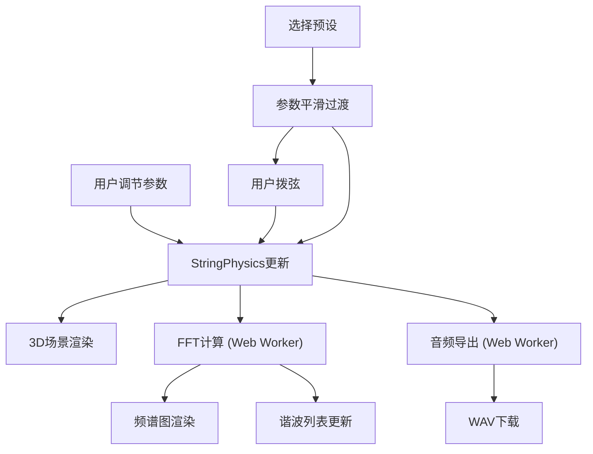

## 1. 产品概述

弦振动可视化模拟器是一款面向音乐制作人和物理教学者的交互式Web应用，通过3D可视化与实时FFT频谱分析，直观呈现弦振动物理、谐波构成与音色之间的关系。用户可调节物理参数、拨动虚拟弦、选择预设音色并导出音频，实现从物理参数到听觉感知的全链路体验。

## 2. 核心功能

### 2.1 功能模块

1. **弦振动3D场景**：中央3D场景展示金属弦与琴桥，支持鼠标拖拽拨弦，拨动后弦按物理规律衰减振动，弦周围产生粒子光晕
2. **参数控制面板**：左侧面板调节张力、线密度、弦长、阻尼系数，实时驱动振动模拟与频谱更新
3. **频谱分析面板**：右侧面板显示FFT频谱图（0-5000Hz）、基频与谐波信息，峰值脉冲光晕标记
4. **预设音色库**：6种乐器预设（吉他、大提琴、竖琴、古筝、琵琶、二胡），选择后参数平滑过渡并自动拨弦
5. **音频导出**：将当前波形合成为WAV文件（44100Hz/16bit/2秒），Web Worker后台合成，带进度指示

### 2.2 页面详情

| 页面名称 | 模块名称 | 功能描述 |
|----------|----------|----------|
| 主界面 | 左侧控制面板 | 物理参数滑块（张力/线密度/弦长/阻尼）、预设音色选择卡片、音频导出按钮 |
| 主界面 | 中央3D场景 | 3D弦振动渲染、琴桥、粒子光晕、鼠标拨弦交互 |
| 主界面 | 右侧频谱面板 | Canvas 2D频谱图、基频显示、谐波列表（前3个） |

## 3. 核心流程

1. 用户打开应用，看到默认参数下的静止弦和频谱面板
2. 用户调节左侧参数（或选择预设），弦振动与频谱实时更新
3. 用户在3D场景中鼠标拖拽拨弦，弦开始衰减振动，粒子光晕出现
4. 频谱面板实时显示FFT频谱和谐波信息
5. 用户点击导出按钮，Web Worker合成音频并下载WAV文件

## 4. 用户界面设计

### 4.1 设计风格

- **主色调**：深色科技主题（主背景#12121C），金色强调#D4AF37（边框/激活/高亮）
- **信息色**：浅灰#B0BEC5（文本）、蓝绿色#4DD0E1（数值）
- **按钮风格**：圆角8px，深色背景，金色边框高亮，0.2s过渡动画
- **字体**：标题14px白色#FFFFFF，正文12px浅灰#B0BEC5，数值14px蓝绿#4DD0E1
- **布局**：三栏固定+自适应，分组卡片（#262640/圆角12px/内边距20px）
- **图标**：使用lucide-react图标库

### 4.2 页面设计概述

| 页面名称 | 模块名称 | UI元素 |
|----------|----------|--------|
| 主界面 | 左侧控制面板 | 280px宽，#1E1E2E背景，分组卡片，参数滑块+数值，预设网格，导出按钮 |
| 主界面 | 中央3D场景 | 自适应宽度，Three.js渲染，金色弦#D4AF37，深木琴桥#5D4037，蓝色粒子#64B5F6 |
| 主界面 | 右侧频谱面板 | 360px宽，#2A2A3E背景，Canvas频谱图，峰值光晕#FF6B00，谐波列表 |

### 4.3 响应式适配

- 桌面端（≥1024px）：左右分栏固定宽度，中央3D自适应
- 移动端（<1024px）：控制面板在上，频谱面板在下，3D场景居中

### 4.4 3D场景指引

- **环境**：深色场景，微弱环境光+定向光，营造舞台聚光感
- **灯光**：AmbientLight（0x404060，强度0.5）+ DirectionalLight（0xFFFFFF，强度1.0，从上方45度）
- **相机**：PerspectiveCamera，FOV 50，距离3-5单位，略微俯视弦
- **交互**：OrbitControls限制旋转范围，鼠标拖拽弦触发拨弦
- **弦材质**：MeshStandardMaterial，metalness 0.8，roughness 0.2，颜色#D4AF37
- **琴桥**：BoxGeometry，MeshStandardMaterial，颜色#5D4037，wood纹理感
- **粒子**：PointsMaterial，颜色#64B5F6，透明度0.4，随振幅衰减
- **后处理**：可选Bloom效果增强金属光泽
