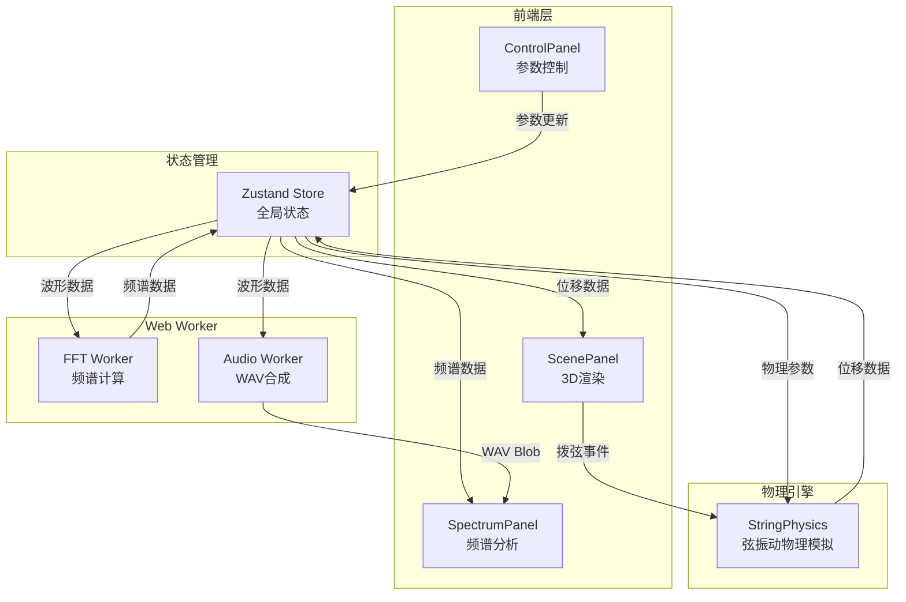

## 1. 架构设计



## 2. 技术说明

- **前端**：React 18 + TypeScript + Vite + Tailwind CSS
- **初始化工具**：vite-init (react-ts模板)
- **3D渲染**：Three.js + @react-three/fiber + @react-three/drei
- **FFT计算**：dsp.js库，在Web Worker中执行
- **音频合成**：Web Audio API + Web Worker
- **状态管理**：Zustand
- **后端**：无（纯前端应用）
- **数据库**：无

## 3. 路由定义

| 路由 | 用途 |
|------|------|
| / | 单页应用，所有功能集成在一个页面 |

## 4. 数据模型

### 4.1 Zustand Store 状态定义

```typescript
interface StringState {
  tension: number;
  linearDensity: number;
  stringLength: number;
  damping: number;
  displacements: Float32Array;
  waveformData: Float32Array;
  spectrumData: { frequencies: Float32Array; magnitudes: Float32Array };
  fundamentalFreq: number;
  harmonics: Array<{ freq: number; amplitude: number }>;
  isVibrating: boolean;
  setTension: (v: number) => void;
  setLinearDensity: (v: number) => void;
  setStringLength: (v: number) => void;
  setDamping: (v: number) => void;
  pluck: (position: number, force: number) => void;
  applyPreset: (preset: PresetType) => void;
}
```

### 4.2 预设音色数据

```typescript
interface Preset {
  name: string;
  tension: number;
  linearDensity: number;
  stringLength: number;
  damping: number;
  pluckPosition: number;
  pluckForce: number;
}
```

## 5. 模块依赖关系

| 模块 | 文件 | 职责 | 依赖 |
|------|------|------|------|
| 物理引擎 | src/physics/StringPhysics.ts | 弦振动物理模拟 | 无外部依赖 |
| 3D场景 | src/visual/ScenePanel.tsx | Three.js弦渲染与交互 | @react-three/fiber, @react-three/drei |
| 频谱面板 | src/visual/SpectrumPanel.tsx | FFT频谱图与谐波列表 | dsp.js, Web Worker |
| 音频管理 | src/audio/AudioManager.ts | WAV合成与导出 | Web Audio API, Web Worker |
| 状态管理 | src/store/useStringStore.ts | Zustand全局状态 | zustand |
| 控制面板 | src/ui/ControlPanel.tsx | 参数滑块与预设选择 | lucide-react |
