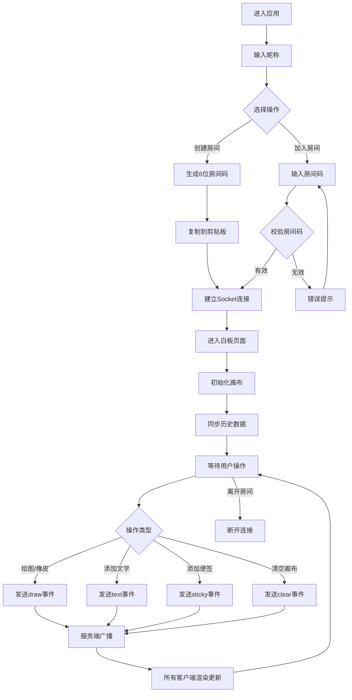

## 1. 产品概述

多人协作在线白板应用，支持用户实时共享画布进行绘图、文字标注和便签协作，通过低延迟通信实现多人同步交互。

- 主要目的：为团队提供直观的远程协作白板工具，解决线上会议、头脑风暴、教学辅导等场景的实时可视化沟通需求
- 目标用户：远程办公团队、在线教育工作者、产品设计团队、学生群体
- 市场价值：填补即时通讯与专业设计软件之间的轻量级协作白板空白，降低远程协作沟通成本

## 2. 核心功能

### 2.1 用户角色

| 角色 | 注册方式 | 核心权限 |
|------|----------|----------|
| 普通用户 | 输入昵称即可使用，无需注册 | 创建/加入房间、绘图、添加文字和便签、查看其他用户操作 |

### 2.2 功能模块

1. **房间系统**：创建房间、加入房间、房间码生成与分享、离开房间
2. **画布系统**：画笔绘图、橡皮擦、平滑曲线渲染、清空画布
3. **标注系统**：文字输入、便签添加与编辑、便签拖动
4. **协作系统**：实时同步绘图操作、用户光标位置显示、用户列表、工具状态同步
5. **工具栏**：工具切换、颜色选择、笔触宽度调整

### 2.3 页面详情

| 页面名称 | 模块名称 | 功能描述 |
|-----------|-------------|---------------------|
| 登录页 | 昵称输入 | 用户输入昵称，长度2-16字符，空值校验 |
| 登录页 | 房间操作区 | 创建房间按钮（生成6位房间码）、加入房间输入框与按钮 |
| 登录页 | 房间码提示 | 创建房间后绿色提示条，显示房间码并自动复制到剪贴板 |
| 白板页 | 顶部工具栏 | 画笔、橡皮、文字、便签、清空工具切换，颜色选择器，笔触宽度选择 |
| 白板页 | 画布区域 | 全屏Canvas，鼠标绘图、点击添加文字/便签，显示其他用户光标 |
| 白板页 | 左侧边栏 | 用户头像列表、昵称显示、当前工具图标、房间码展示、离开按钮 |
| 白板页 | 用户光标层 | 右上角在线用户彩色头像，实时跟随的半透明光标 |
| 白板页 | 弹窗组件 | 清空确认对话框、文字输入框、便签编辑框 |

## 3. 核心流程

用户首次进入应用输入昵称 → 选择创建房间或输入房间码加入 → 系统建立WebSocket连接并分配房间 → 进入白板页面 → 选择绘图工具进行操作 → 操作通过Socket实时广播 → 其他用户接收并渲染 → 完成协作后点击离开房间退出。

## 4. 用户界面设计

### 4.1 设计风格

- **主色调**：深灰 #333333（文字与图标）、白色 #FFFFFF（背景）
- **辅助色**：柔和蓝 #64B5F6（工具选中高亮）、绿色 #4CAF50（成功提示）、红色 #F44336（危险操作）、浅红 #FFCDD2/#EF9A9A（离开按钮）
- **中性色**：浅灰 #F5F5F5（侧边栏背景）、边框灰 #E0E0E0、文字灰 #757575
- **点缀色**：便签黄 #FFF9C4、用户头像随机柔和色（pastel色系）
- **按钮风格**：扁平设计，圆角0px，选中态使用颜色高亮或底部边框
- **字体**：Arial（系统字体栈），正文14px，标题16px，辅助文字12px
- **布局风格**：顶部固定工具栏，左侧可折叠边栏，主内容区自适应画布
- **图标风格**：Lucide React SVG图标，统一尺寸20px，选中态填充高亮色

### 4.2 页面设计概述

| 页面名称 | 模块名称 | UI元素 |
|-----------|-------------|-------------|
| 登录页 | 整体布局 | 居中卡片式布局，白色卡片配柔和阴影，背景使用淡灰渐变 |
| 登录页 | 昵称输入 | 带边框底部的极简输入框，聚焦时边框变蓝 |
| 登录页 | 操作按钮 | 并排两个等宽按钮：创建（蓝色填充）、加入（蓝色边框+白色背景） |
| 登录页 | 房间码提示 | 顶部绿色横幅，白色文字，右侧复制成功图标，3秒后自动消失 |
| 白板页 | 工具栏 | 高度64px，白色背景，底部4px深灰边框，内边距12px，图标水平排列 |
| 白板页 | 画布 | 纯白背景 #FFFFFF，鼠标光标随工具切换（十字/默认/文本） |
| 白板页 | 侧边栏 | 宽度240px，浅灰背景 #F5F5F5，用户列表垂直排列，头像+昵称+工具图标 |
| 白板页 | 用户光标 | 半透明彩色圆点（直径12px），平滑过渡动画跟随移动 |
| 白板页 | 用户头像 | 右上角堆叠圆形头像（直径36px），白色边框，昵称首字白色居中 |
| 白板页 | 便签 | 黄色矩形（120x80），带轻微阴影，可拖动，双击编辑，出现时弹跳动画 |
| 白板页 | 确认弹窗 | 居中模态框，半透明遮罩，确认按钮红色填充，取消按钮灰色边框 |

### 4.3 响应式

- **桌面优先（>768px）**：左侧边栏常驻展开，宽度240px，工具栏完整显示所有工具
- **平板/窄屏（<768px）**：左侧边栏自动折叠为汉堡菜单图标（左上角），点击后以抽屉形式滑出，画布自适应剩余宽度
- **触控优化**：按钮最小点击区域44x44px，支持触摸绘图（pointer events），便签拖动支持触摸手势
- **工具栏折行**：极窄屏时工具栏图标允许折行显示，保持所有工具可访问

### 4.4 动效设计

- **工具栏图标悬停**：颜色从 #757575 渐变至 #333333，0.2s ease-out 过渡
- **工具选中**：背景色变为 #64B5F6 的15%透明度，底部2px蓝色边框，0.2s过渡
- **便签创建**：scale从0.8→1.05→1.0，0.2s ease-out 弹跳动画
- **光标移动**：requestAnimationFrame 驱动位置插值更新，实现平滑跟随
- **弹窗出现**：opacity从0→1，translateY从10px→0，0.25s ease-out
- **侧边栏折叠/展开**：width过渡动画，0.3s ease-in-out
- **成功提示条**：入场从顶部滑入，出场向上滑出，各0.3s
