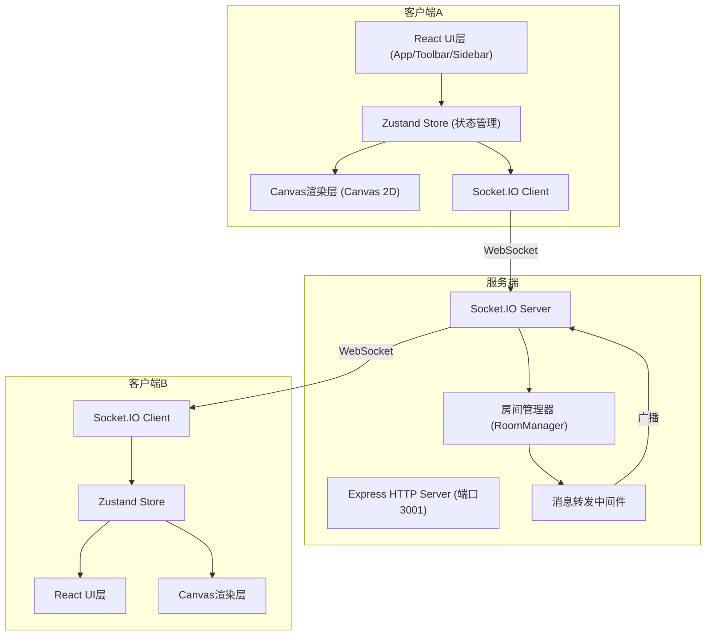
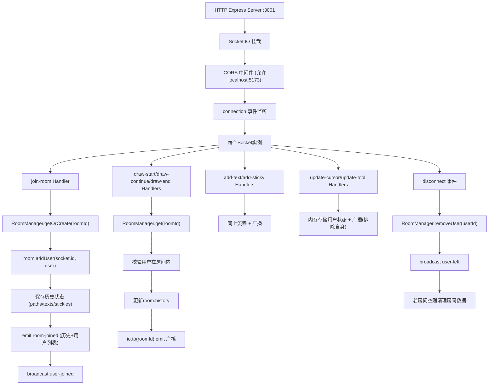
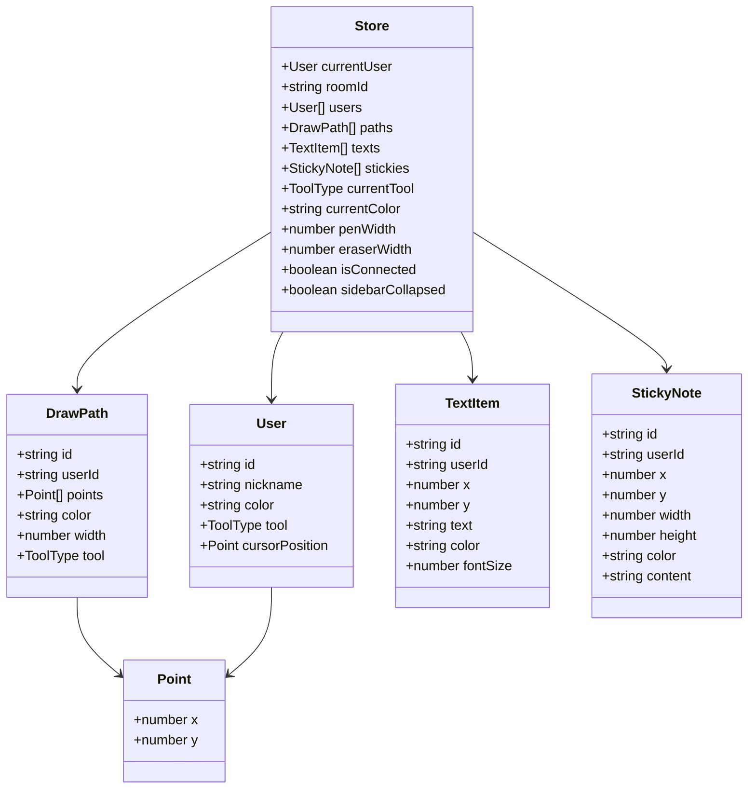

## 1. 架构设计

## 2. 技术描述

- **前端框架**：React 18 + TypeScript，严格模式编译
- **构建工具**：Vite 5，使用 @vitejs/plugin-react 支持JSX与HMR
- **后端服务**：Express 4（HTTP入口）+ Socket.IO 4（WebSocket通信）
- **状态管理**：Zustand 4，集中管理绘图数据、用户列表、连接状态、UI状态
- **通信协议**：Socket.IO Client 4，事件驱动架构，自动重连
- **渲染引擎**：HTML5 Canvas 2D API，requestAnimationFrame 循环
- **图标库**：lucide-react，SVG图标按需加载
- **工具库**：uuid（唯一标识生成）

## 3. 文件结构与路由

### 3.1 项目根目录文件

| 文件路径 | 用途 |
|---------|------|
| `package.json` | 依赖声明与启动脚本，`npm run dev` 同时启动前后端 |
| `vite.config.js` | Vite构建配置，配置后端代理 `/socket.io` 到3001端口 |
| `tsconfig.json` | TypeScript严格模式，启用 strict、noImplicitAny、strictNullChecks |
| `index.html` | SPA入口，挂载 #root 节点，设置 viewport meta |

### 3.2 后端代码 (`server/`)

| 文件路径 | 用途 |
|---------|------|
| `server/index.ts` | Express + Socket.IO 服务器入口，房间管理、消息广播、用户生命周期 |

### 3.3 前端代码 (`src/`)

| 文件路径 | 用途 |
|---------|------|
| `src/main.tsx` | React入口，挂载App，初始化全局样式 |
| `src/App.tsx` | 主布局组件，包含登录页与白板页两种视图切换逻辑 |
| `src/store.ts` | Zustand Store定义，暴露useStore hook，管理所有全局状态 |
| `src/Canvas.tsx` | 画布组件，封装Canvas 2D渲染、鼠标/触摸事件、绘图逻辑 |
| `src/Toolbar.tsx` | 工具栏组件，工具选择、颜色/宽度调整、清空操作 |

### 3.4 共享类型

定义在各文件顶部，使用 TypeScript `type` 关键字声明：

- `User`：用户信息（id, nickname, color, tool, cursorPosition）
- `DrawPath`：笔刷路径（id, userId, points[], color, width, tool）
- `TextItem`：文字对象（id, userId, x, y, text, color, fontSize）
- `StickyNote`：便签对象（id, userId, x, y, width, height, color, content）
- `ToolType`：工具枚举（'pen' | 'eraser' | 'text' | 'sticky' | 'none'）
- `SocketEvents`：Socket事件类型映射

## 4. Socket.IO 事件定义

### 4.1 客户端 → 服务端 (Emit)

| 事件名 | 负载类型 | 说明 |
|-------|---------|------|
| `join-room` | `{ roomId: string, user: User }` | 用户加入指定房间 |
| `leave-room` | `{ roomId: string, userId: string }` | 用户离开房间 |
| `draw-start` | `{ roomId: string, path: DrawPath }` | 开始绘制一条新路径 |
| `draw-continue` | `{ roomId: string, pathId: string, point: {x,y} }` | 路径追加坐标点 |
| `draw-end` | `{ roomId: string, pathId: string }` | 结束当前路径 |
| `add-text` | `{ roomId: string, text: TextItem }` | 添加文字对象 |
| `add-sticky` | `{ roomId: string, sticky: StickyNote }` | 添加便签 |
| `update-sticky` | `{ roomId: string, id: string, updates: Partial<StickyNote> }` | 更新便签位置/内容 |
| `update-cursor` | `{ roomId: string, userId: string, position: {x,y} }` | 更新光标位置 |
| `update-tool` | `{ roomId: string, userId: string, tool: ToolType }` | 切换当前工具 |
| `clear-canvas` | `{ roomId: string, userId: string }` | 请求清空画布 |

### 4.2 服务端 → 客户端 (Broadcast)

| 事件名 | 负载类型 | 说明 |
|-------|---------|------|
| `room-joined` | `{ roomId: string, users: User[], history: DrawingHistory }` | 加入成功，返回用户列表和历史数据 |
| `user-joined` | `{ user: User }` | 新用户加入通知 |
| `user-left` | `{ userId: string }` | 用户离开通知 |
| `draw-start` | `DrawPath` | 广播新路径起点 |
| `draw-continue` | `{ pathId: string, point: {x,y} }` | 广播路径追加点 |
| `draw-end` | `{ pathId: string }` | 广播路径结束 |
| `text-added` | `TextItem` | 广播新增文字 |
| `sticky-added` | `StickyNote` | 广播新增便签 |
| `sticky-updated` | `{ id: string, updates: Partial<StickyNote> }` | 广播便签更新 |
| `cursor-updated` | `{ userId: string, position: {x,y} }` | 广播光标移动 |
| `tool-updated` | `{ userId: string, tool: ToolType }` | 广播工具切换 |
| `canvas-cleared` | `{ userId: string }` | 广播画布清空 |
| `error` | `{ message: string }` | 错误通知 |

## 5. 服务端架构

### 5.1 房间管理器 (RoomManager)

- **数据结构**：`Map<string, Room>`，key为房间ID
- **Room对象**：
  - `id: string` - 房间号
  - `users: Map<string, User>` - 在线用户（socket.id为key）
  - `paths: DrawPath[]` - 历史路径
  - `texts: TextItem[]` - 历史文字
  - `stickies: StickyNote[]` - 历史便签
  - `createdAt: number` - 创建时间戳
- **核心方法**：
  - `getOrCreate(id: string): Room`
  - `addUser(roomId: string, socketId: string, user: User): void`
  - `removeUser(socketId: string): { roomId: string, userId: string } | null`
  - `getRoomByUser(socketId: string): Room | undefined`

## 6. 数据模型

### 6.1 核心数据结构

### 6.2 Zustand Store 切片

**用户与连接状态**：
- `setCurrentUser(user)` / `setRoomId(id)` / `setConnected(bool)`
- `addUser(user)` / `removeUser(userId)` / `updateUser(userId, updates)`

**绘图数据**：
- `startPath(path)` / `appendToPath(pathId, point)` / `endPath(pathId)`
- `addText(item)` / `addSticky(note)` / `updateSticky(id, updates)`
- `clearAll()` - 重置 paths/texts/stickies

**UI状态**：
- `setTool(tool)` / `setColor(color)` / `setPenWidth(w)`
- `toggleSidebar()` / `setSidebarCollapsed(bool)`

## 7. 渲染管线与性能策略

### 7.1 Canvas 渲染循环

1. **rAF驱动**：`requestAnimationFrame` 每帧调用 `render()`
2. **脏矩形优化**：仅当 `dirtyFlag` 为true时重绘整屏
3. **分层渲染**：
   - Layer 1：背景填充 #FFFFFF
   - Layer 2：遍历 paths 绘制所有路径（二次贝塞尔平滑）
   - Layer 3：遍历 texts 绘制文字（font属性拼接）
   - Layer 4：遍历 stickies 绘制便签（矩形+文字+边框）
4. **橡皮擦实现**：`globalCompositeOperation = 'destination-out'`，绘制圆形路径实现擦除

### 7.2 性能优化清单

- **光标节流**：`mousemove` 使用 rAF 去抖，确保每帧最多1次更新
- **路径分块**：大路径拆分为独立 DrawPath，避免单条路径数组过大
- **离屏Canvas**：历史静态数据预渲染到离屏Canvas，减少每帧绘制量
- **shouldComponentUpdate**：React组件使用 memo 包裹，避免不必要重渲染
- **Selector模式**：Zustand使用 selector 订阅局部状态，减少订阅触发次数
- **对象池**：Point对象复用，减少GC压力（高性能场景可选）

### 7.3 绘图精度

- **二次贝塞尔插值**：鼠标移动路径点 `p1 → p2` 以中点为控制点绘制 `quadraticCurveTo`，保证曲线平滑无棱角
- **DPR适配**：`canvas.width = cssWidth * window.devicePixelRatio`，配合 `scale(dpr, dpr)` 实现高清绘制
