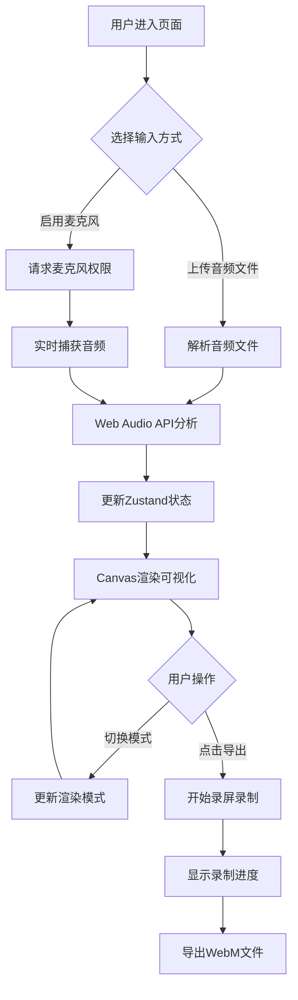

## 1. 产品概述

动态音乐可视化频谱分析仪是一款基于Web的音频可视化应用，让用户通过上传本地音频文件或使用麦克风实时输入，将音频数据以炫酷的动态视觉效果呈现出来。

- 主要目的：为音乐爱好者、创作者提供直观、美观的音频可视化工具
- 解决问题：传统音频播放器缺乏丰富的视觉表现，难以直观感受音频频谱特征
- 目标用户：音乐爱好者、视频创作者、DJ、音乐教师
- 产品价值：将抽象的音频信号转化为具象的视觉艺术，支持录屏导出方便二次创作

## 2. 核心功能

### 2.1 功能模块

1. **主可视化画布区域**：全屏动态频谱渲染，支持多种可视化模式
2. **控制栏**：音频上传、麦克风输入、播放控制、模式切换
3. **实时数据面板**：显示音频峰值、平均振幅、BPM、频率能量分布
4. **历史轨道**：时间-频率热力图，记录最近10秒频谱快照
5. **导出功能**：录制画布内容并导出为WebM视频

### 2.2 页面详情

| 页面名称 | 模块名称 | 功能描述 |
|---------|---------|---------|
| 主页面 | 可视化画布 | 全屏Canvas渲染，自适应尺寸，渐变边框，支持4种可视化模式 |
| 主页面 | 控制栏 | 上传音频、麦克风开关、播放/暂停、模式切换下拉菜单 |
| 主页面 | 数据面板 | 实时显示峰值、平均振幅、BPM、频率区间能量分布 |
| 主页面 | 历史轨道 | 右侧竖向时间-频率热力图，滚动展示历史频谱 |
| 主页面 | 导出对话框 | 录制画布、进度显示、WebM格式导出 |

## 3. 核心流程

### 用户主流程

用户进入页面后，可以选择上传本地音频文件或启用麦克风实时输入，系统自动解析音频数据并在画布上渲染可视化效果。用户可切换不同的可视化模式，查看实时音频指标，最终将满意的效果录屏导出为视频文件。

## 4. 用户界面设计

### 4.1 设计风格

- **主色调**：深色主题背景 #0D0D1A
- **强调色**：紫色渐变 #4A00E0 → #8E2DE2，绿色 #00FF87，青色 #60EFFF
- **辅助色**：红色 #FF3366（麦克风激活），橙色 #FF6B35（导出按钮），粉色 #FF69B4（BPM）
- **按钮风格**：圆角按钮，毛玻璃效果背景，悬停发光阴影
- **字体**：现代无衬线字体，数字使用等宽字体
- **布局风格**：全屏沉浸式布局，浮动控制面板，毛玻璃质感
- **动效**：脉冲动画、渐变过渡、粒子飞散、心跳动画

### 4.2 页面设计概述

| 页面名称 | 模块名称 | UI元素 |
|---------|---------|---------|
| 主页面 | 可视化画布 | 深色背景、渐变边框、64+频谱柱条、颜色渐变、粒子特效 |
| 主页面 | 控制栏 | 半透明背景 #1A1A2E、blur(12px)、圆角16px、内边距12px |
| 主页面 | 数据面板 | 尺寸240x160、圆角12px、毛玻璃效果、彩色数字、心形BPM图标 |
| 主页面 | 历史轨道 | 宽度80px、背景#1A1A2E、竖向热力图、深蓝→亮黄色映射 |
| 主页面 | 导出按钮 | 背景#FF6B35、60px圆角、悬停闪烁、红色录制指示灯 |

### 4.3 响应式设计

- 桌面端优先设计，画布最小尺寸800x600
- 控制栏、数据面板采用绝对定位浮动布局
- 小屏幕下自动调整元素位置，保证核心功能可用
- 画布宽高自适应窗口大小变化

### 4.4 性能要求

- 可视化帧率稳定在60FPS
- 音频解析延迟不超过50ms
- 支持上传最大200MB音频文件
- 录制导出时界面不卡顿
