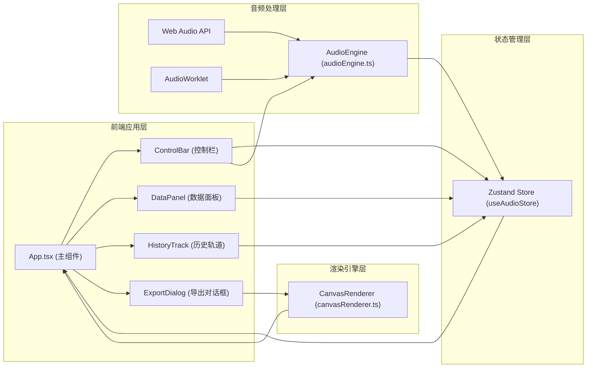

## 1. 架构设计



## 2. 技术描述

- **前端框架**: React 18 + TypeScript
- **构建工具**: Vite 5（支持React HMR和路径别名@/）
- **状态管理**: Zustand
- **音频处理**: Web Audio API (AudioContext, AnalyserNode, BiquadFilterNode, AudioWorklet)
- **图形渲染**: Canvas 2D API
- **视频录制**: MediaRecorder API
- **UI样式**: 原生CSS（配合CSS变量）
- **工具库**: uuid

## 3. 项目结构

```
d:\Pro\tasks\auto39\
├── index.html
├── package.json
├── vite.config.js
├── tsconfig.json
└── src/
    ├── main.tsx                 # React入口
    ├── App.tsx                  # 主组件
    ├── audio/
    │   └── audioEngine.ts       # 音频处理模块
    ├── state/
    │   └── useAudioStore.ts     # Zustand状态管理
    ├── visualizer/
    │   └── canvasRenderer.ts    # Canvas渲染引擎
    └── components/
        ├── ControlBar.tsx       # 控制栏组件
        ├── DataPanel.tsx        # 数据面板组件
        ├── HistoryTrack.tsx     # 历史轨道组件
        └── ExportDialog.tsx     # 导出对话框组件
```

## 4. 模块职责

### 4.1 audioEngine.ts
- 创建和管理AudioContext
- 封装AnalyserNode进行频谱分析
- 实现BiquadFilterNode进行频率过滤
- 支持文件上传音频和麦克风输入
- 提供AudioWorklet进行高性能实时处理
- 提供start、stop、upload、mic等控制方法

### 4.2 useAudioStore.ts
- 存放全局音频状态：audioFile、isPlaying、isMicOn、mode
- 存放实时分析数据：peak、averageAmplitude、bpm、frequencyData数组
- 存放历史数据：timeHistory数组（最近10秒频谱快照）
- 定义更新状态的actions

### 4.3 canvasRenderer.ts
- drawSpectrum：频谱柱状图渲染
- drawWaveform：波形曲线渲染
- drawParticles：粒子星空特效
- drawCombined：组合模式渲染
- 粒子系统管理（创建、更新、回收粒子）
- requestAnimationFrame渲染循环
- 从Zustand store读取数据进行绘制

### 4.4 ControlBar.tsx
- 上传按钮：图标+文字，触发文件选择
- 麦克风开关：圆形按钮，脉冲动画
- 播放/暂停按钮：三角形/方块图标切换
- 模式切换下拉菜单：四种模式选择

### 4.5 DataPanel.tsx
- 显示峰值（绿色）、平均振幅（蓝色）、BPM（粉色+心形图标）
- 频率区间能量分布水平微型条状图

### 4.6 HistoryTrack.tsx
- 渲染右侧竖向时间-频率热力图
- 实时滚动显示最近10秒频谱快照
- 颜色映射：深蓝→亮黄

### 4.7 ExportDialog.tsx
- 调用MediaRecorder API录制canvas内容
- 显示录制状态和进度条
- 导出WebM格式视频文件

## 5. 关键数据模型

```typescript
// 可视化模式
type VisualizerMode = 'spectrum' | 'waveform' | 'particles' | 'combined';

// 音频状态Store
interface AudioState {
  audioFile: File | null;
  isPlaying: boolean;
  isMicOn: boolean;
  mode: VisualizerMode;
  peak: number;
  averageAmplitude: number;
  bpm: number;
  frequencyData: Uint8Array;
  timeData: Uint8Array;
  timeHistory: number[][];
  isRecording: boolean;
  recordingProgress: number;
  // actions
  setAudioFile: (file: File | null) => void;
  setIsPlaying: (playing: boolean) => void;
  setIsMicOn: (on: boolean) => void;
  setMode: (mode: VisualizerMode) => void;
  updateAudioData: (freq: Uint8Array, time: Uint8Array) => void;
  setPeak: (peak: number) => void;
  setAverageAmplitude: (avg: number) => void;
  setBpm: (bpm: number) => void;
  pushHistoryFrame: (data: number[]) => void;
  startRecording: () => void;
  stopRecording: () => void;
  setRecordingProgress: (progress: number) => void;
}

// 粒子对象
interface Particle {
  x: number;
  y: number;
  vx: number;
  vy: number;
  life: number;
  maxLife: number;
  color: string;
  size: number;
}
```

## 6. 性能优化策略

- **AudioWorklet**：在独立线程进行音频处理，不阻塞UI渲染
- **TypedArray**：使用Uint8Array/Float32Array存储音频数据，减少GC压力
- **对象池**：粒子系统使用对象池复用粒子对象
- **requestAnimationFrame**：与浏览器刷新率同步渲染，稳定60FPS
- **节流更新**：历史轨道数据每100ms更新一帧，而非每帧
- **CSS硬件加速**：控制面板使用transform和backdrop-filter启用GPU加速
- **避免重排**：所有动态元素使用Canvas渲染，不触发DOM重排
