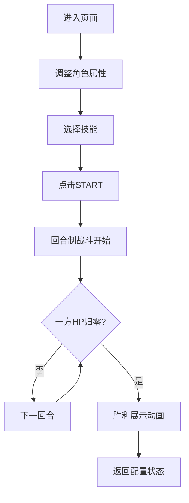

## 1. 产品概述

基于2D物理引擎的回合制决斗场模拟器，用户可自定义剑士和法师的属性与技能，在竞技场内观看自动战斗，分析不同策略下的胜负结果。

- 面向喜欢策略模拟和战斗数据分析的用户，提供可视化的角色对战实验平台
- 核心价值在于让用户通过直观的动画和数据日志，理解不同属性配置和技能组合的战斗效果

## 2. 核心功能

### 2.2 功能模块

1. **竞技舞台**：800x600 Canvas渲染区域，包含网格地面、角色站位点、战斗动画、粒子特效、扫描线效果
2. **控制面板**：双角色属性配置（生命值、攻击力、技能选择）、START战斗启动按钮
3. **战斗日志**：实时记录战斗过程，虚拟列表优化，彩色条目高亮不同行为类型
4. **状态管理**：Zustand统一管理角色状态、战斗状态、回合数、日志数组

### 2.3 页面详情

| 页面名称 | 模块名称 | 功能描述 |
|-----------|-------------|---------------------|
| 主页面 | 竞技舞台 | Canvas 2D渲染800x600竞技场，深灰背景#2C2C2C，浅灰双线网格#A0A0A0，间距40px；左右角色站位点带脉动光环（剑士蓝#00BFFF，法师红#FF4080，周期0.5s透明度0.3-0.8循环）；战斗过程中舞台边缘扫描线效果（0.8Hz从左到右） |
| 主页面 | 控制面板 | 高度200px，背景#1E1E1E，内边距20px；左栏剑士配置（生命值100-300滑块，攻击力10-50滑块，技能下拉：重斩/旋风斩/格挡）；右栏法师配置（生命值80-200，攻击力20-60，技能下拉：火球/冰锥/护盾）；中央START按钮（120x44px，#4CAF50→#388E3C渐变，圆角8px，悬停亮度+20%，按下内阴影）；所有滑块带实时数值显示（#FFFFFF，14px），滑块轨道#444，手柄角色色，霓虹悬停效果（0.2s过渡） |
| 主页面 | 战斗日志 | 右侧280px宽，背景#252526，字体#E0E0E0 12px；条目从上到下滚动，最新在顶部，旧条目渐隐；攻击行为#FF5252，防御#69F0AE，特殊技能#CE93D8；超过30条自动清理最旧；虚拟列表仅渲染可见20条；磨砂玻璃效果backdrop-filter: blur(8px) |
| 主页面 | 战斗系统 | 回合制自动战斗，双方同时行动；剑士近战（攻击间隔1.5s，前冲动画，白色剑光弧线0.3s）；法师远程（攻击间隔2s，法杖蓄力0.5s，弹丸飞行0.8s，爆炸粒子：火球橙色碎片、冰锥蓝色尖刺）；胜利展示（角色放大1.5倍缓慢旋转，闪烁彩色文案，持续3s后重置） |

## 3. 核心流程

用户进入页面 → 调整剑士和法师的生命值、攻击力、选择技能 → 点击START按钮 → 战斗开始，回合制自动进行 → 实时观看战斗动画和日志 → 一方生命值归零 → 胜利展示动画 → 自动返回配置状态

## 4. 用户界面设计

### 4.1 设计风格

- **整体风格**：暗色赛博朋克，深灰底色，蓝红霓虹对比色
- **主色调**：深灰#1E1E1E / #2C2C2C / #252526
- **强调色**：剑士蓝#00BFFF / #4A90D9，法师红#FF4080 / #FF5252
- **功能色**：攻击#FF5252，防御#69F0AE，特殊#CE93D8，成功#4CAF50
- **按钮风格**：渐变圆角，悬停亮度提升，按下内阴影
- **字体**：等宽编程字体 + 现代无衬线字体组合，营造科技感
- **装饰元素**：网格线、扫描线、脉动光环、磨砂玻璃、霓虹光晕
- **动效原则**：所有交互0.2s平滑过渡，战斗动画流畅自然，粒子效果克制（≤100个）

### 4.2 页面设计概述

| 页面名称 | 模块名称 | UI元素 |
|-----------|-------------|-------------|
| 主页面 | 竞技舞台 | 800x600 Canvas，#2C2C2C背景，#A0A0A0双线网格，蓝红脉动光环，扫描线动效，角色精灵，剑光弧线，弹丸飞行，粒子爆炸，胜利放大旋转，闪烁胜利文案 |
| 主页面 | 控制面板 | #1E1E1E背景，两栏布局，半透明技能图标背景装饰（32x32px），自定义滑块（轨道#444，手柄角色色，数值显示），下拉菜单，START渐变按钮，霓虹悬停效果，0.2s过渡 |
| 主页面 | 战斗日志 | 280px右侧面板，#252526半透明背景，磨砂玻璃blur(8px)，#E0E0E0 12px字体，彩色高亮条目，行内图标，渐隐滚动，虚拟列表优化 |

### 4.3 响应性

- 桌面端优先设计，固定布局确保800x600舞台完整显示
- 整体容器居中，控制面板和日志面板自适应周围空间
- 不做移动端适配，专注桌面端性能表现

### 4.4 性能要求

- 帧率保持50FPS以上
- 粒子数量≤100个同时绘制
- 战斗日志虚拟列表只渲染可见20条
- Canvas使用requestAnimationFrame驱动绘制
- DOM更新最小化，状态变更仅触发必要重绘
