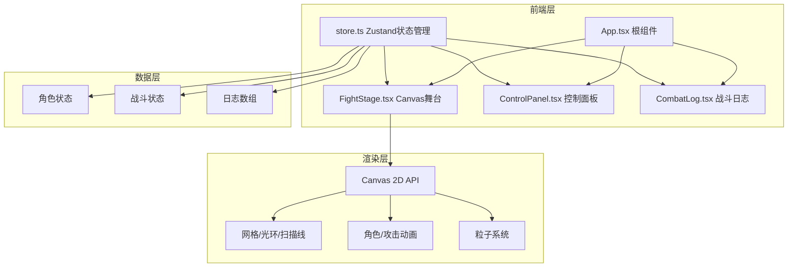

## 1. 架构设计



## 2. 技术描述

- **前端框架**：React@18 + TypeScript@5
- **构建工具**：Vite@5 + @vitejs/plugin-react@4
- **状态管理**：Zustand@4
- **渲染技术**：HTML5 Canvas 2D API
- **工具库**：uuid@9（唯一ID生成）
- **初始化方式**：Vite React TypeScript 模板

## 3. 目录结构

```
src/
├── App.tsx          # 根组件，布局容器，初始化store
├── FightStage.tsx   # Canvas组件，舞台渲染
├── ControlPanel.tsx # 控制面板，属性配置
├── CombatLog.tsx    # 战斗日志，虚拟列表
└── store.ts         # Zustand状态管理
```

## 4. 文件说明

| 文件 | 职责 | 核心技术点 |
|------|------|------------|
| package.json | 项目依赖配置 | react, react-dom, typescript, vite, @vitejs/plugin-react, zustand, uuid |
| vite.config.js | Vite构建配置 | React插件，端口配置，构建优化 |
| tsconfig.json | TypeScript配置 | 严格模式，target ES2020，模块解析 |
| index.html | 入口页面 | meta viewport，挂载点，字体引入 |
| src/App.tsx | 根组件 | Flex布局，舞台/控制面板/日志面板组合，store初始化 |
| src/FightStage.tsx | Canvas舞台 | useRef获取canvas，requestAnimationFrame循环，网格/光环/角色/粒子绘制，动画状态机 |
| src/ControlPanel.tsx | 控制面板 | 受控滑块组件，下拉选择，START按钮，实时更新store |
| src/CombatLog.tsx | 战斗日志 | 虚拟列表实现（只渲染可见20条），CSS渐隐，条目颜色映射 |
| src/store.ts | Zustand store | 角色状态（hp, maxHp, attack, skill），战斗状态（fighting, round, winner），日志数组，startFight/recordLog/resetFight action，战斗逻辑tick |

## 5. 数据模型

### 5.1 类型定义

```typescript
type CharacterType = 'swordsman' | 'mage';
type SwordsmanSkill = 'heavy_slash' | 'whirlwind' | 'block';
type MageSkill = 'fireball' | 'ice_spike' | 'shield';
type LogType = 'attack' | 'defense' | 'special';

interface Character {
  id: string;
  type: CharacterType;
  hp: number;
  maxHp: number;
  attack: number;
  skill: SwordsmanSkill | MageSkill;
  position: { x: number; y: number };
  attackCooldown: number;
  isAttacking: boolean;
  animationState: string;
}

interface LogEntry {
  id: string;
  round: number;
  message: string;
  type: LogType;
  timestamp: number;
}

interface CombatState {
  swordsman: Character;
  mage: Character;
  fighting: boolean;
  round: number;
  winner: CharacterType | null;
  logs: LogEntry[];
  particles: Particle[];
  projectiles: Projectile[];
}
```

### 5.2 核心Actions

- `updateCharacter(type, field, value)`: 更新角色属性
- `startFight()`: 重置状态，开始战斗
- `recordLog(message, type)`: 记录战斗日志
- `processTurn()`: 处理一回合战斗逻辑
- `resetFight()`: 重置到配置状态

## 6. 性能优化点

1. **Canvas渲染优化**：
   - requestAnimationFrame循环，与浏览器刷新率同步
   - 分层绘制：静态元素（网格）缓存，动态元素每帧重绘
   - 离屏canvas预渲染网格背景

2. **粒子系统限制**：
   - 最大同时100个粒子
   - 粒子池复用，避免频繁GC
   - 超出生命周期自动回收

3. **战斗日志虚拟列表**：
   - 只渲染视口内20条
   - 滚动位置计算偏移量
   - 使用CSS transform提升滚动性能

4. **状态更新优化**：
   - Zustand selectors避免不必要重渲染
   - 战斗逻辑与UI渲染分离
   - 日志数组超过30条自动清理

5. **动画性能**：
   - CSS transitions处理UI交互
   - Canvas处理战斗动画
   - 避免频繁DOM操作
