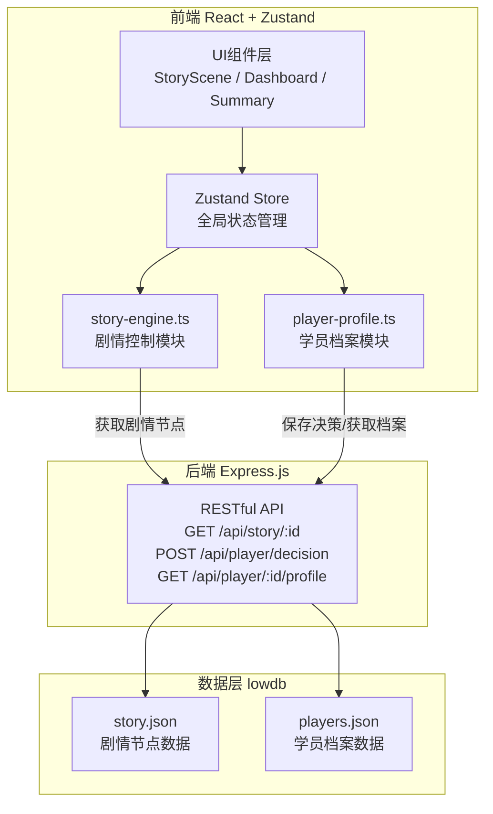
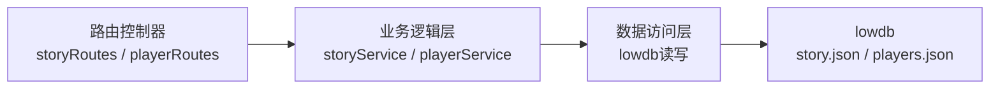
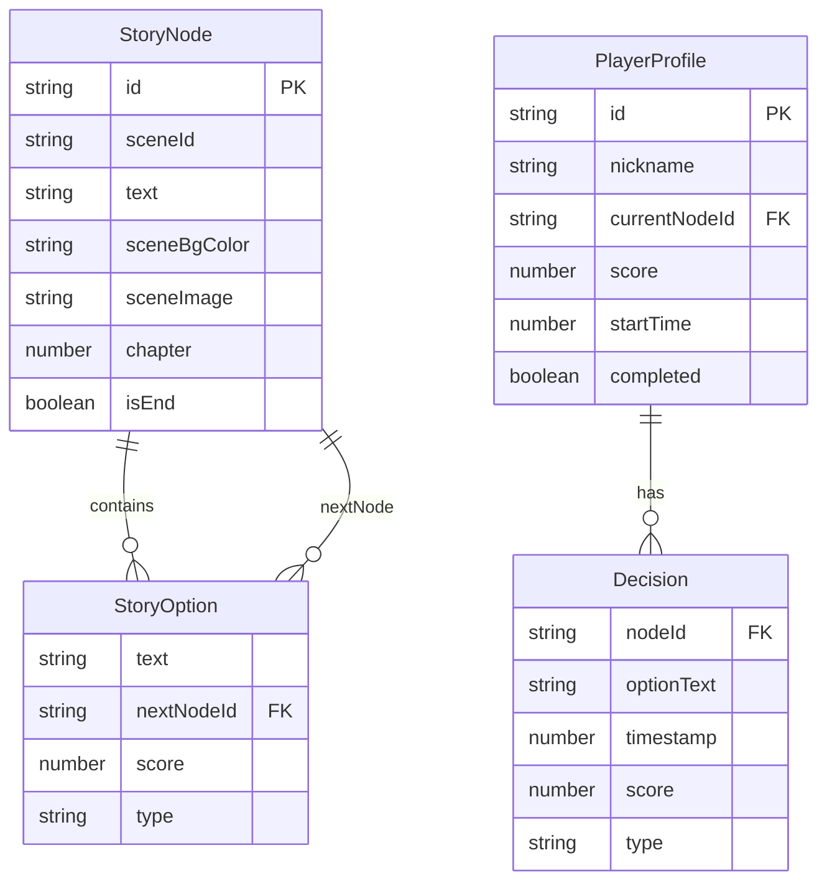

## 1. 架构设计



**数据流向说明**：
- 剧情流：lowdb加载剧情 → Express API → story-engine解析节点 → Zustand Store → UI渲染
- 决策流：UI选择事件 → player-profile记录决策 → 10秒内异步同步至Express API → lowdb持久化
- 档案流：player-profile从Express API获取数据 → Zustand Store → Dashboard/Summary渲染

## 2. 技术说明

- **前端**：React@18 + TypeScript + Zustand + Tailwind CSS + Vite
- **初始化工具**：vite-init（react-express-ts模板）
- **后端**：Express.js + cors
- **数据库**：lowdb（JSON文件存储）
- **UUID生成**：uuid库
- **状态管理**：Zustand（前端全局状态）

## 3. 路由定义

| 路由 | 用途 |
|------|------|
| `/` | 剧情入口页：昵称输入、创建档案 |
| `/game` | 剧情场景页：场景渲染、对话选择、进度显示 |
| `/dashboard` | 学员仪表盘：进度、得分、历史决策 |
| `/summary` | 总结页面：得分、用时、决策列表、分支树状图 |

## 4. API定义

### 4.1 TypeScript类型定义

```typescript
interface StoryNode {
  id: string;
  sceneId: string;
  text: string;
  sceneBgColor: string;
  sceneImage: string;
  options: StoryOption[];
  isEnd?: boolean;
  chapter: number;
}

interface StoryOption {
  text: string;
  nextNodeId: string;
  score: number;
  type: "critical" | "normal" | "score";
}

interface PlayerProfile {
  id: string;
  nickname: string;
  currentNodeId: string;
  score: number;
  startTime: number;
  decisions: Decision[];
  completed: boolean;
}

interface Decision {
  nodeId: string;
  optionText: string;
  timestamp: number;
  score: number;
  type: "critical" | "normal" | "score";
}
```

### 4.2 API端点

| 方法 | 路径 | 请求体 | 响应 |
|------|------|--------|------|
| GET | `/api/story/:id` | - | `StoryNode` |
| POST | `/api/player/create` | `{ nickname: string }` | `{ id: string, nickname: string }` |
| POST | `/api/player/decision` | `{ playerId: string, decision: Decision, currentNodeId: string, score: number }` | `{ success: boolean }` |
| GET | `/api/player/:id/profile` | - | `PlayerProfile` |

## 5. 服务端架构图



## 6. 数据模型

### 6.1 数据模型定义



### 6.2 初始数据

- `initial-data.json`：3个完整章节，至少10个分支节点
  - 第一章"消失的证据"：4个节点，2个分支
  - 第二章"暗夜追踪"：4个节点，3个分支
  - 第三章"真相大白"：3个节点，2个分支
  - 包含1个最终结局节点

## 7. 文件结构与调用关系

```
project/
├── package.json
├── vite.config.ts
├── tsconfig.json
├── index.html
├── server.js                    # Express后端入口
├── src/
│   ├── main.tsx                 # React入口
│   ├── App.tsx                  # 路由配置
│   ├── story-engine.ts          # 剧情控制模块（调用API→解析节点→返回当前对话与选项给UI）
│   ├── player-profile.ts        # 学员档案模块（接收UI决策事件→更新档案→保存至lowdb）
│   ├── store.ts                 # Zustand全局状态
│   ├── ui/
│   │   ├── StoryScene.tsx       # 剧情展示（调用story-engine获取节点，调用player-profile记录决策）
│   │   ├── Dashboard.tsx        # 学员仪表盘（调用player-profile获取数据渲染）
│   │   ├── Summary.tsx          # 总结页面（Canvas树状图+得分+决策列表）
│   │   ├── EntryPage.tsx        # 入口页（昵称输入+创建档案）
│   │   ├── NavBar.tsx           # 导航栏（Logo+昵称+进度环）
│   │   ├── DecisionPanel.tsx    # 决策面板（右侧滑出，时间线）
│   │   └── ProgressRing.tsx     # 进度环组件
│   ├── data/
│   │   └── initial-data.json    # 初始剧情数据
│   ├── styles/
│   │   └── global.css           # 全局样式+玻璃拟态+动画
│   └── types.ts                 # TypeScript类型定义
├── api/
│   ├── db/
│   │   ├── story.json           # lowdb剧情数据文件
│   │   └── players.json         # lowdb学员档案数据文件
│   └── index.js                 # Express路由与lowdb初始化
```
