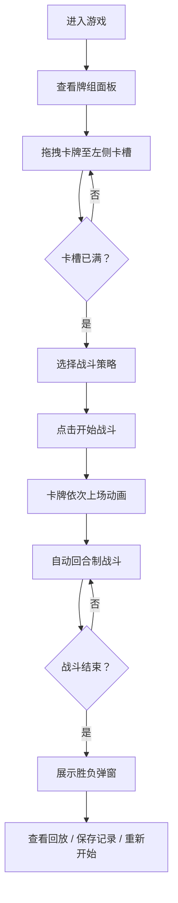

## 1. 产品概述

虚空回声（Void Echoes）是一款基于能量驱动的1v1卡牌对战小游戏。玩家通过拖拽布置卡牌、选择出牌策略，观看自动战斗过程，体验策略卡牌游戏的乐趣。

- 核心玩法：玩家在底部牌组中选择卡牌拖拽至左侧卡槽，选择战斗策略后开始自动战斗
- 目标用户：喜欢策略卡牌游戏的休闲玩家
- 产品价值：轻量化的策略对战体验，低操作门槛，高观赏性

## 2. 核心特性

### 2.1 用户角色

| 角色 | 注册方式 | 核心权限 |
|------|----------|----------|
| 玩家 | 无需注册 | 布置卡牌、选择策略、观看战斗、查看回放、保存记录 |

### 2.2 功能模块

1. **对战区域**：Canvas渲染的虚空背景、流动紫色粒子、左右卡槽、战斗动画
2. **牌组面板**：底部卡牌展示区、拖拽交互、卡牌信息展示
3. **战斗系统**：回合制自动战斗、三连击判定、伤害计算、生命条显示
4. **结果展示**：胜负弹窗、战斗回放、对局记录保存下载

### 2.3 页面详情

| 页面名称 | 模块名称 | 功能描述 |
|----------|----------|----------|
| 主对战页 | 对战区域 | 1200x700深色背景、紫色粒子特效、左右各3个六边形卡槽 |
| 主对战页 | 牌组面板 | 底部220px高度面板、展示所有卡牌、支持拖拽至卡槽 |
| 主对战页 | 战斗控制 | 开始战斗按钮、策略选择（进攻/防守/囤积） |
| 主对战页 | 结果弹窗 | 胜负展示、回放按钮、保存记录按钮 |

## 3. 核心流程

## 4. 用户界面设计

### 4.1 设计风格

- **主色调**：深空黑 #0B0C10、深灰蓝 #1F2833
- **强调色**：青绿 #66FCF1（按钮）、青绿色 #45A29E（卡槽边框）
- **卡牌主题色**：进攻红 #C62828→#E53935、防守蓝 #1565C0→#1E88E5、能量紫 #6A1B9A→#AB47BC
- **金色文字**：#FFD700（数值显示）
- **按钮风格**：胶囊形状圆角24px、悬停时光晕扩散
- **字体**：现代无衬线字体，标题16px白色，数值14px金色
- **布局风格**：居中主战斗区，上下分层（战斗区在上、牌组在下）
- **图标风格**：简约16x16技能图标

### 4.2 页面设计概述

| 页面名称 | 模块名称 | UI元素 |
|----------|----------|--------|
| 主对战页 | 对战区域 | 1200x700虚空背景Canvas、流动紫色粒子(60FPS)、六边形卡槽(发光过渡0.3s)、卡牌上下浮动(5px/2s周期) |
| 主对战页 | 牌组面板 | 高220px深色面板、淡入动画、120x170圆角卡牌、渐变背景、拖拽跟随(0.7透明度) |
| 主对战页 | 战斗控制 | 160x48青绿色按钮、深灰文字、悬停光晕(扩散至220px)、策略选择区 |
| 主对战页 | 战斗动画 | 卡牌飞行入场(0.5s缩放0.5→1.0)、三连击攻击动画、盾牌特效、生命条实时减少(25FPS+) |
| 主对战页 | 结果弹窗 | 半透明毛玻璃(blur 8px)、圆角16px、宽400px居中、回放按钮、保存按钮 |

### 4.3 响应式

- 桌面端优先设计，最小支持1280px宽度
- 核心战斗区域固定1200x700，居中显示
- 不考虑移动端适配

### 4.4 Canvas渲染指引

- 背景：深色虚空 #0B0C10
- 粒子：紫色流动粒子，60FPS，随机生成位置和速度
- 战斗特效：攻击轨迹、盾牌闪光、伤害数字
- 卡牌飞行：补间动画，缩放过渡
