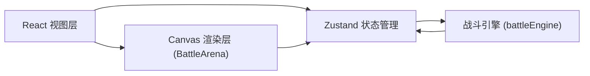

## 1. 架构设计



## 2. 技术描述

- **前端框架**：React 18 + TypeScript
- **构建工具**：Vite
- **状态管理**：Zustand
- **UI渲染**：React DOM + CSS
- **动画渲染**：Canvas 2D API
- **项目结构**：
  - `src/App.tsx` - 主组件，布局与状态分发
  - `src/stores/gameStore.ts` - Zustand全局状态
  - `src/utils/battleEngine.ts` - 战斗逻辑引擎
  - `src/components/CardComponent.tsx` - 卡牌组件
  - `src/components/BattleArena.tsx` - Canvas战斗场景

## 3. 路由定义

| 路由 | 用途 |
|------|------|
| / | 主对战页面（单页应用，无额外路由） |

## 4. 数据模型

### 4.1 核心类型定义

```typescript
// 卡牌类型
type CardType = 'attack' | 'defense' | 'energy';

interface Card {
  id: string;
  name: string;
  type: CardType;
  attack: number;
  defense: number;
  skill: string;      // 技能名称/图标标识
  hp: number;
  maxHp: number;
}

// 卡槽位置
type SlotPosition = 'left' | 'right';

interface CardSlot {
  position: SlotPosition;
  index: number;      // 0-2
  card: Card | null;
}

// 战斗策略
type BattleStrategy = 'aggressive' | 'defensive' | 'energy';

// 战斗阶段
type BattlePhase = 'idle' | 'entering' | 'fighting' | 'finished';

// 战斗状态
interface BattleState {
  phase: BattlePhase;
  strategy: BattleStrategy;
  currentTurn: number;
  playerCards: Card[];
  enemyCards: Card[];
  activePlayerCard: Card | null;
  activeEnemyCard: Card | null;
  battleLog: BattleAction[];
  winner: 'player' | 'enemy' | null;
}

// 战斗动作记录
interface BattleAction {
  turn: number;
  attacker: 'player' | 'enemy';
  attackIndex: number;  // 1-3连击
  damage: number;
  defenderHpAfter: number;
  timestamp: number;
}
```

### 4.2 Zustand Store 结构

```typescript
interface GameStore {
  // 牌组
  deck: Card[];
  // 左侧卡槽（玩家）
  leftSlots: CardSlot[];
  // 右侧卡槽（敌方）
  rightSlots: CardSlot[];
  // 拖拽状态
  draggedCard: Card | null;
  // 战斗状态
  battle: BattleState;
  // 弹窗显示
  showResult: boolean;
  
  // Actions
  setDraggedCard: (card: Card | null) => void;
  placeCardToSlot: (card: Card, slotIndex: number) => void;
  removeCardFromSlot: (slotIndex: number) => void;
  setStrategy: (strategy: BattleStrategy) => void;
  startBattle: () => void;
  processBattleTurn: () => void;
  resetBattle: () => void;
  replayBattle: () => void;
  saveBattleRecord: () => void;
}
```

## 5. 项目文件结构

```
auto43/
├── package.json
├── vite.config.js
├── tsconfig.json
├── index.html
└── src/
    ├── App.tsx
    ├── stores/
    │   └── gameStore.ts
    ├── utils/
    │   └── battleEngine.ts
    └── components/
        ├── CardComponent.tsx
        └── BattleArena.tsx
```
