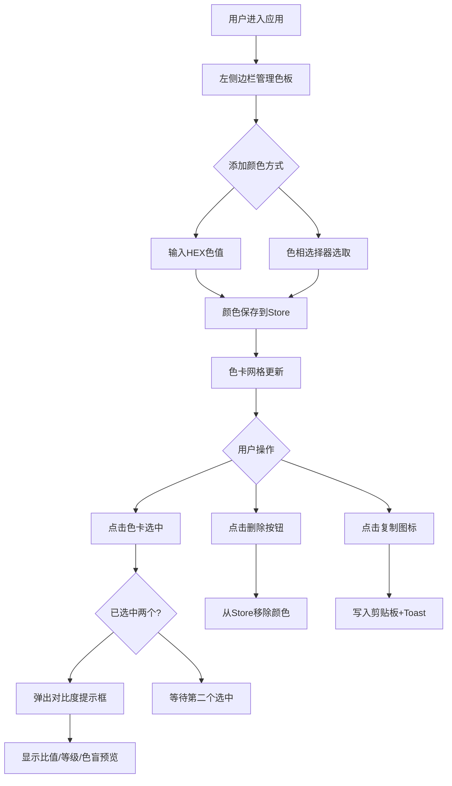

## 1. 产品概述

品牌色板管理与无障碍对比度检测应用——面向平面设计师和设计团队的在线工具，用于在不同设备上预览、调整品牌色板，并通过 WCAG 2.1 标准检测颜色对比度和色盲无障碍性，确保品牌颜色在多种屏幕和光照条件下的视觉一致性。

## 2. 核心功能

### 2.1 用户角色

| 角色 | 注册方式 | 核心权限 |
|------|----------|----------|
| 设计师 | 无需注册，直接使用 | 管理色板、对比度测试、无障碍模拟、颜色复制 |

### 2.2 功能模块

1. **色板管理页**：色板添加（十六进制输入 + 色相选择器）、色卡网格展示、色卡删除
2. **对比度测试**：双色卡选中对比、浮动提示框显示比值与等级、色盲模拟预览小方块
3. **无障碍模拟**：红色盲/绿色盲/蓝色盲切换、实时重绘、模拟说明文本
4. **颜色复制**：剪贴板写入、复制反馈动画、toast 提示
5. **响应式布局**：移动端侧边栏折叠、下拉面板、单列色卡

### 2.3 页面详情

| 页面名称 | 模块名称 | 功能描述 |
|----------|----------|----------|
| 主页面 | 左侧边栏 | 色板管理：添加颜色（HEX输入 + 色相选择器），色卡网格展示，删除色卡 |
| 主页面 | 右侧主面板 | 无障碍模拟：CSS Grid 色卡排列，Tab切换色盲模拟视图，模拟说明文本 |
| 主页面 | 浮动提示框 | 对比度测试：选中两色卡后弹出，显示对比度比值/等级，色盲模拟预览小方块 |
| 主页面 | Toast提示 | 颜色复制：右下角固定toast，3秒自动消失 |

## 3. 核心流程

### 3.1 色板管理流程

用户在左侧边栏输入十六进制色值或使用色相选择器选取颜色 → 颜色立即新增到色卡网格并保存到 Zustand store → 可点击色卡右上角删除按钮移除颜色。

### 3.2 对比度测试流程

用户点击第一个色卡选中 → 点击第二个色卡 → 弹出浮动提示框显示两色对比度比值和等级（AA通过/A通过/未通过）→ 同时显示正常视力与三种色盲模拟下的预览小方块。

### 3.3 无障碍模拟流程

用户在右侧面板通过选项卡切换模拟类型 → 色卡颜色按对应算法实时重绘（过渡0.3s）→ 视图顶部显示模拟类型说明文本。

### 3.4 颜色复制流程

用户点击色卡右下角复制图标 → 十六进制值写入剪贴板 → 图标变绿0.5秒 → toast提示3秒自动消失。

## 4. 用户界面设计

### 4.1 设计风格

- **主色**：靛蓝 #3F51B5（按钮、链接、选中状态）
- **辅助色**：暖灰 #F5F5F5（背景和分割线）
- **文字颜色**：深灰 #212121（主文字）、中灰 #757575（辅助文字）
- **按钮**：高度36px，内边距12px 24px，圆角8px，背景主色，文字白色，hover亮度+10%，active缩放0.95
- **字体**：Google Fonts Inter，14px基础，行高1.6
- **布局**：左右分栏，左320px固定侧边栏，右自适应主内容
- **圆角体系**：8px（按钮、浮动提示框）、12px（色卡卡片）
- **阴影体系**：2px（默认）、6-12px（悬浮）
- **过渡**：0.2s ease 统一

### 4.2 页面设计概览

| 页面名称 | 模块名称 | UI元素 |
|----------|----------|--------|
| 主页面 | 左侧边栏 | 320px宽，#FAFAFA背景，24px内边距，HEX输入框，色相渐变条（0-360度），16px圆点滑块，色卡网格，24px圆形删除按钮 |
| 主页面 | 右侧主面板 | flex:1，#EEEEEE背景，最小高度600px，CSS Grid（最小列宽160px，间距16px），白色卡片圆角12px，Tab选项卡高36px |
| 主页面 | 浮动提示框 | #FFFFFF背景，8px圆角，8px阴影，对比度比值（18.5:1格式），等级色标（绿/黄/红），24x24色盲预览方块 |
| 主页面 | Toast提示 | 固定右下角，#323232背景，白色文字，4px圆角，8px 16px内边距，3秒消失 |
| 主页面 | 分割线 | 1px实线 #E0E0E0 |

### 4.3 响应式设计

- **≥768px**：左右分栏布局，侧边栏320px固定宽度
- **<768px**：侧边栏收起为顶部导航栏（56px高，白色背景，阴影），右上角菜单按钮（三横线24px），点击弹出100vw下拉面板（z-index 1000），模拟区域满屏
- **<480px**：色卡网格变为单列

### 4.4 无3D场景
