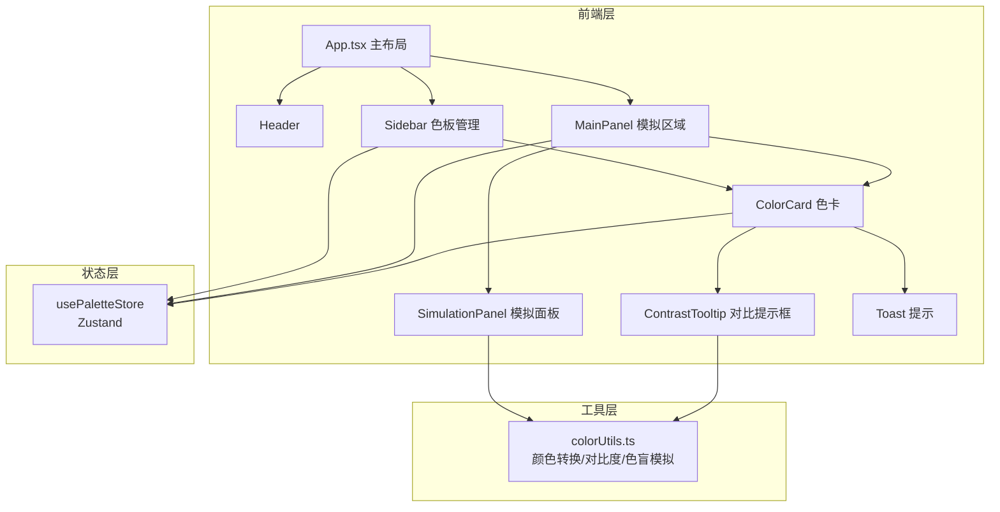
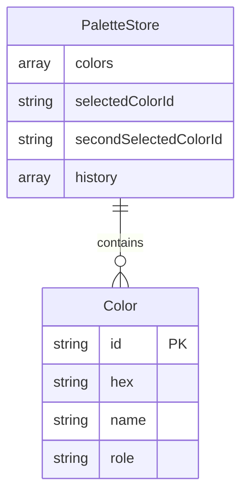

## 1. 架构设计



## 2. 技术说明

- **前端框架**：React 18 + TypeScript（严格模式，ES2020目标，jsx: react-jsx）
- **构建工具**：Vite（开启CSS Modules和TypeScript严格模式）
- **状态管理**：Zustand（色板列表、选中色板ID、调整历史、undo操作）
- **样式方案**：CSS Modules（无外部UI库，自定义按钮、滑块、色卡、提示框组件）
- **颜色算法**：纯JavaScript实现WCAG 2.1对比度计算、色盲模拟
- **剪贴板**：Clipboard API
- **唯一标识**：uuid
- **字体**：Google Fonts Inter
- **无后端**：纯前端应用，所有数据存储在Zustand store（内存中）

## 3. 路由定义

| 路由 | 用途 |
|------|------|
| / | 单页应用，所有功能在同一页面 |

## 4. API定义

无后端API。所有数据和计算在前端完成。

## 5. 数据模型

### 5.1 数据模型定义



### 5.2 数据定义

```typescript
interface Color {
  id: string;
  hex: string;
  name: string;
  role: string;
}

interface PaletteState {
  colors: Color[];
  selectedColorId: string | null;
  secondSelectedColorId: string | null;
  history: Color[][];
  addColor: (hex: string, name: string, role: string) => void;
  removeColor: (id: string) => void;
  updateColor: (id: string, updates: Partial<Color>) => void;
  selectColor: (id: string) => void;
  clearSelection: () => void;
  undo: () => void;
}
```

## 6. 文件结构与调用关系

```
project/
├── index.html                    # 入口HTML，引用Inter字体
├── package.json                  # 依赖配置
├── vite.config.js                # Vite构建配置
├── tsconfig.json                 # TypeScript配置
└── src/
    ├── App.tsx                   # 主布局 ← 读取 usePaletteStore
    │   ├── Header.tsx            # 顶部标题栏
    │   ├── Sidebar.tsx           # 左侧边栏 ← 读取/写入 usePaletteStore
    │   │   ├── ColorCard.tsx     # 色卡组件 ← 接收color对象props
    │   │   └── HueSlider.tsx     # 色相选择器 ← 输出hex到Sidebar
    │   ├── MainPanel.tsx         # 右侧主面板 ← 读取 usePaletteStore
    │   │   ├── SimulationPanel.tsx # 模拟面板 ← 读取store色板 + 调用colorUtils
    │   │   └── ColorCard.tsx     # 色卡组件（复用）
    │   ├── ContrastTooltip.tsx   # 对比度浮动提示框 ← 调用colorUtils
    │   └── Toast.tsx             # Toast提示组件
    ├── stores/
    │   └── usePaletteStore.ts    # Zustand状态仓库
    ├── utils/
    │   └── colorUtils.ts         # 纯函数工具集
    └── types/
        └── index.ts              # TypeScript类型定义
```

### 数据流向

1. **用户操作 → Store**：Sidebar中添加/删除颜色 → 调用usePaletteStore的addColor/removeColor
2. **Store → UI**：Store中colors列表变更 → Sidebar色卡网格和MainPanel色卡网格自动重渲染
3. **Store → 对比度**：选中两个色卡 → ContrastTooltip从store获取两色 → 调用colorUtils计算对比度
4. **Store → 模拟**：MainPanel切换Tab → SimulationPanel从store获取色板 → 调用colorUtils.simulateColorBlindness转换颜色
5. **复制操作 → Clipboard API**：ColorCard复制按钮 → navigator.clipboard.writeText + Toast显示
6. **Undo流程**：用户触发undo → Store恢复history中上一状态 → UI自动更新
